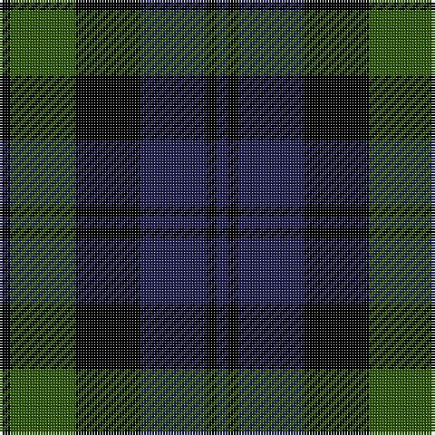

This page is one **sett** — a single exact thread-count. It belongs to the [tartan](/tartans/k1dg6k6db6k1db1/)
(the same proportion at any scale), whose colour order is pattern [BKBKGK](/stripes/bkbkgk/).

Sourced from register-of-tartans.  It is a [6 stripe tartan](/stripes/stripes6/).

Original link https://www.tartanregister.gov.uk/tartanDetails.aspx?ref=5376

## Register references

External register numbers recorded for this tartan.

- Scottish Register of Tartans: [5376](https://www.tartanregister.gov.uk/tartanDetails.aspx?ref=5376)
- Scottish Tartans Authority (ITI): 3695

## Thread count
K/4 Ga24 K24 DBa24 K4 DBa/4

## Palette

Palette: <strong>Tartan Register</strong>
<table><thead><tr><th>Colour</th><th>Threads</th><th>Shade</th><th>Base</th><th>OKLCh</th></tr></thead><tbody><tr><td>K/</td><td style="text-align:right;font-variant-numeric:tabular-nums">4</td><td><code style="background-color:#000000;">#000000</code> <small style="color:#888">#000000</small></td><td>K <code style="background-color:#000000;">#000000</code></td><td><small style="color:#888">oklch(0.0% 0.000 0.0)</small></td></tr><tr><td>Ga</td><td style="text-align:right;font-variant-numeric:tabular-nums">24</td><td><code style="background-color:#285800;">#285800</code> <small style="color:#888">#285800</small></td><td>G <code style="background-color:#006100;">#006100</code></td><td><small style="color:#888">oklch(41.0% 0.122 135.8)</small></td></tr><tr><td>K</td><td style="text-align:right;font-variant-numeric:tabular-nums">24</td><td><code style="background-color:#000000;">#000000</code> <small style="color:#888">#000000</small></td><td>K <code style="background-color:#000000;">#000000</code></td><td><small style="color:#888">oklch(0.0% 0.000 0.0)</small></td></tr><tr><td>DBa</td><td style="text-align:right;font-variant-numeric:tabular-nums">24</td><td><code style="background-color:#1C1C50;">#1C1C50</code> <small style="color:#888">#1C1C50</small></td><td>B <code style="background-color:#2A418A;">#2A418A</code></td><td><small style="color:#888">oklch(26.2% 0.093 277.9)</small></td></tr><tr><td>K</td><td style="text-align:right;font-variant-numeric:tabular-nums">4</td><td><code style="background-color:#000000;">#000000</code> <small style="color:#888">#000000</small></td><td>K <code style="background-color:#000000;">#000000</code></td><td><small style="color:#888">oklch(0.0% 0.000 0.0)</small></td></tr><tr><td>DBa/</td><td style="text-align:right;font-variant-numeric:tabular-nums">4</td><td><code style="background-color:#1C1C50;">#1C1C50</code> <small style="color:#888">#1C1C50</small></td><td>B <code style="background-color:#2A418A;">#2A418A</code></td><td><small style="color:#888">oklch(26.2% 0.093 277.9)</small></td></tr></tbody></table>

# Sample pattern

## Nearest tartans

The nearest existing variants by ΔTartan distance, with this tartan at the top so the swatches line up against it.

ΔTartan

Tartan

Sett

—

<a href="/ttd/edit/#slug=k1dg6k6db6k1db1~x4">Black Watch (smallest sett)</a> <a class="nn-out" href="/setts/s6/k1dg6k6db6k1db1~x4/" title="open its dictionary page">↗</a>

0.56

<a href="/ttd/edit/#slug=k3dg14k14dg2db14dg3">MacKay</a> <a class="nn-out" href="/setts/s6/k3dg14k14dg2db14dg3/" title="open its dictionary page">↗</a>

0.67

<a href="/ttd/edit/#slug=k3dg14k14dg2db14dg3~x2">MacKay</a> <a class="nn-out" href="/setts/s6/k3dg14k14dg2db14dg3~x2/" title="open its dictionary page">↗</a>

1.03

<a href="/ttd/edit/#slug=k3dg14k14dg2db14r3~x2">Morrison</a> <a class="nn-out" href="/setts/s6/k3dg14k14dg2db14r3~x2/" title="open its dictionary page">↗</a>

1.07

<a href="/ttd/edit/#slug=k3dg14k14dg2db14r3">Morrison</a> <a class="nn-out" href="/setts/s6/k3dg14k14dg2db14r3/" title="open its dictionary page">↗</a>

1.18

<a href="/ttd/edit/#slug=db6k1db6k8r1dg8k2">Fletcher</a> <a class="nn-out" href="/setts/s7/db6k1db6k8r1dg8k2/" title="open its dictionary page">↗</a>

1.18

<a href="/ttd/edit/#slug=dg8k2b1dg4k6db6k1~x2">MacCallum</a> <a class="nn-out" href="/setts/s7/dg8k2b1dg4k6db6k1~x2/" title="open its dictionary page">↗</a>

1.24

<a href="/ttd/edit/#slug=db6k1db6k8r1dg8r2~x2">Fletcher C</a> <a class="nn-out" href="/setts/s7/db6k1db6k8r1dg8r2~x2/" title="open its dictionary page">↗</a>

1.26

<a href="/ttd/edit/#slug=db4k4db4dg9k2">Austin</a> <a class="nn-out" href="/setts/s5/db4k4db4dg9k2/" title="open its dictionary page">↗</a>

1.26

<a href="/ttd/edit/#slug=db2g6db6dp5db1dp2~x2">Unnamed, No 54</a> <a class="nn-out" href="/setts/s6/db2g6db6dp5db1dp2~x2/" title="open its dictionary page">↗</a>

1.27

<a href="/ttd/edit/#slug=dt4g18dt3k17dt18dp4~x2">Scottish Airports</a> <a class="nn-out" href="/setts/s6/dt4g18dt3k17dt18dp4~x2/" title="open its dictionary page">↗</a>

## Neighbour map

Every grey dot is one of 14359 variants placed by the first two principal components of the ΔTartan feature space (44% of its variance). Red is this tartan; blue dots are its nearest — click one to open its page.

<svg viewBox="0 0 640 380" role="img" style="max-width:100%;height:auto;border:1px solid #e0e0e0;border-radius:4px;display:block" xmlns="http://www.w3.org/2000/svg"><image href="/nn/cloud.v1.png" width="640" height="380"/><a href="/setts/s6/k3dg14k14dg2db14dg3/"><circle cx="217.9" cy="279.1" r="4" fill="#3465a4"><title>MacKay</title></circle></a><a href="/setts/s6/k3dg14k14dg2db14dg3~x2/"><circle cx="231.6" cy="285.6" r="4" fill="#3465a4"><title>MacKay</title></circle></a><a href="/setts/s6/k3dg14k14dg2db14r3~x2/"><circle cx="178.6" cy="261.4" r="4" fill="#3465a4"><title>Morrison</title></circle></a><a href="/setts/s6/k3dg14k14dg2db14r3/"><circle cx="164.4" cy="254.2" r="4" fill="#3465a4"><title>Morrison</title></circle></a><a href="/setts/s7/db6k1db6k8r1dg8k2/"><circle cx="197.5" cy="258.5" r="4" fill="#3465a4"><title>Fletcher</title></circle></a><a href="/setts/s7/dg8k2b1dg4k6db6k1~x2/"><circle cx="216.6" cy="257.5" r="4" fill="#3465a4"><title>MacCallum</title></circle></a><a href="/setts/s7/db6k1db6k8r1dg8r2~x2/"><circle cx="183.5" cy="252.5" r="4" fill="#3465a4"><title>Fletcher C</title></circle></a><a href="/setts/s5/db4k4db4dg9k2/"><circle cx="199.9" cy="326.4" r="4" fill="#3465a4"><title>Austin</title></circle></a><a href="/setts/s6/db2g6db6dp5db1dp2~x2/"><circle cx="207.7" cy="290.0" r="4" fill="#3465a4"><title>Unnamed, No 54</title></circle></a><a href="/setts/s6/dt4g18dt3k17dt18dp4~x2/"><circle cx="162.3" cy="254.2" r="4" fill="#3465a4"><title>Scottish Airports</title></circle></a><circle cx="216.3" cy="277.2" r="5" fill="#c00000"/></svg>

ID: /setts/s6/k1dg6k6db6k1db1~x4/
