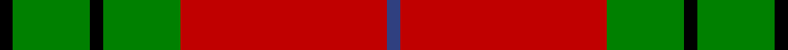
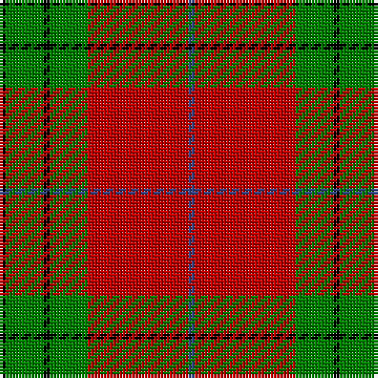

In pattern [BRGKGK](/stripes/brgkgk/).

This was sourced from weddslist.  It is a [6 stripe tartan](/stripes/stripes6/).

Original link http://www.weddslist.com/cgi-bin/tartans/pg.pl?source=sts

## Also known as

This cloth is also recorded under:

- Denny, hunting

## Attestations

This cloth appears in 2 source records; the oldest owns this page.

- undated — Denny, hunting (weddslist, [record](http://www.weddslist.com/cgi-bin/tartans/pg.pl?source=sts))
- undated — Denny Hunting Clan Tartan Tartan Number: 518. Earliest known date: pre 2003 This tartan is remarkably similar to the Durham sett designed by Wilson's of Bannockburn around 1819. The variation in proportions may point to a deliberate modification suggested by the links between the names. See products available Copyright © Blair Urquhart, Comrie, 2015 (house-of-tartan, [record](http://www.house-of-tartan.scotland.net/house/TartanViewjs.asp?colr=Def&tnam=518))

## Thread count
K/2 G12 K2 G12 R32 B/2

## Palette
Each colour and the base-6 reference it is a variant of.

| Colour | Shade | Base |
|---|---|---|
| B | <code style="background-color:#304080;">#304080</code> `oklch(39.4% 0.109 270.2)` <small>#304080</small> | B <code style="background-color:#2A418A;">#2A418A</code> |
| G | <code style="background-color:#008000;">#008000</code> `oklch(52.0% 0.177 142.5)` <small>#008000</small> | G <code style="background-color:#006100;">#006100</code> |
| K | <code style="background-color:#000000;">#000000</code> `oklch(0.0% 0.000 0.0)` <small>#000000</small> | K <code style="background-color:#000000;">#000000</code> |
| R | <code style="background-color:#C00000;">#C00000</code> `oklch(50.7% 0.208 29.2)` <small>#C00000</small> | R <code style="background-color:#CC0000;">#CC0000</code> |

# Sample pattern

## Nearest tartans

The nearest existing variants by ΔTartan distance.

1. [MacAulay](/setts/s6/k2r16g6r3g8w1~x2/) — ΔT 0.63
1. [MacAulay (Clan)](/setts/s6/k2r16g6r3g8w1~x4/) — ΔT 0.80
1. [MacAulay](/setts/s6/k2r16dg6r3dg8lb1/) — ΔT 0.82
1. [MacAulay](/setts/s6/k2r16g6r3g8lb1~x2/) — ΔT 0.87
1. [Wilson's, No 5](/setts/s6/r32t5g17r4g5w2~x2/) — ΔT 0.90
1. [MacGregor of Balquidder (Logan)](/setts/s6/g9r2g9r14k1w2~x2/) — ΔT 0.99
1. [McInally (Name)](/setts/s7/r3g16r4k6r28g2lo3~x2/) — ΔT 1.03
1. [MacNab 6](/setts/s7/g28r7m7g14m7r48k4~x2/) — ΔT 1.04
1. [Starr (1978) (Name)](/setts/s7/k2r4w1r10g12r2w2~x4/) — ΔT 1.05
1. [Scrymgeour](/setts/s7/r15k1ly2db3r2k1ly15~x6/) — ΔT 1.05

## Neighbour map

Every grey dot is one of 14299 variants placed by the first two principal components of the ΔTartan feature space (44% of its variance). Red is this tartan; blue dots are its nearest — click one to open its page.

<svg viewBox="0 0 640 380" role="img" style="max-width:100%;height:auto;border:1px solid #e0e0e0;border-radius:4px;display:block" xmlns="http://www.w3.org/2000/svg"><image href="/nn/cloud.v1.png" width="640" height="380"/><a href="/setts/s6/k2r16g6r3g8w1~x2/"><circle cx="315.2" cy="181.0" r="4" fill="#3465a4"><title>MacAulay</title></circle></a><a href="/setts/s6/k2r16g6r3g8w1~x4/"><circle cx="331.6" cy="187.7" r="4" fill="#3465a4"><title>MacAulay (Clan)</title></circle></a><a href="/setts/s6/k2r16dg6r3dg8lb1/"><circle cx="322.2" cy="183.6" r="4" fill="#3465a4"><title>MacAulay</title></circle></a><a href="/setts/s6/k2r16g6r3g8lb1~x2/"><circle cx="335.7" cy="189.8" r="4" fill="#3465a4"><title>MacAulay</title></circle></a><a href="/setts/s6/r32t5g17r4g5w2~x2/"><circle cx="352.5" cy="177.7" r="4" fill="#3465a4"><title>Wilson's, No 5</title></circle></a><a href="/setts/s6/g9r2g9r14k1w2~x2/"><circle cx="298.1" cy="198.9" r="4" fill="#3465a4"><title>MacGregor of Balquidder (Logan)</title></circle></a><a href="/setts/s7/r3g16r4k6r28g2lo3~x2/"><circle cx="345.5" cy="171.4" r="4" fill="#3465a4"><title>McInally (Name)</title></circle></a><a href="/setts/s7/g28r7m7g14m7r48k4~x2/"><circle cx="289.3" cy="186.9" r="4" fill="#3465a4"><title>MacNab 6</title></circle></a><a href="/setts/s7/k2r4w1r10g12r2w2~x4/"><circle cx="264.8" cy="177.1" r="4" fill="#3465a4"><title>Starr (1978) (Name)</title></circle></a><a href="/setts/s7/r15k1ly2db3r2k1ly15~x6/"><circle cx="267.0" cy="149.1" r="4" fill="#3465a4"><title>Scrymgeour</title></circle></a><circle cx="323.7" cy="169.3" r="5" fill="#c00000"/></svg>

ID: /setts/s6/k1g6k1g6r16db1~x2/
