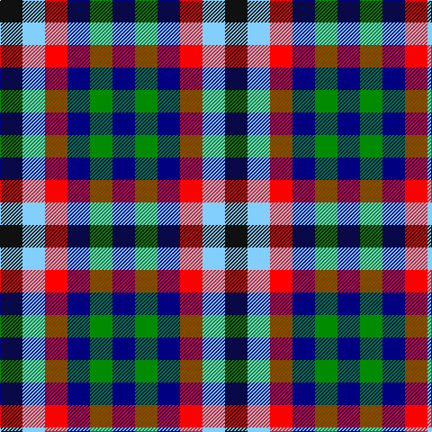

This page is one **sett** — a single exact thread-count. It belongs to the [tartan](/tartans/k1lt1r1db1g1db1/)
(the same proportion at any scale), whose colour order is pattern [BGBRWK](/stripes/bgbrwk/).

Sourced from register-of-tartans.  It is a [6 stripe tartan](/stripes/stripes6/).

Original link https://www.tartanregister.gov.uk/tartanDetails.aspx?ref=10453

## Register references

External register numbers recorded for this tartan.

- Scottish Register of Tartans: [10453](https://www.tartanregister.gov.uk/tartanDetails.aspx?ref=10453)

## Thread count
K/25 LB25 R25 DB25 G25 DB/25

## Palette

Palette: <strong>Tartan Register</strong> <small style="color:#888">(4 of 5 colours)</small>
<table><thead><tr><th>Colour</th><th>Threads</th><th>Shade</th><th>Base</th><th>OKLCh</th></tr></thead><tbody><tr><td>K/</td><td style="text-align:right;font-variant-numeric:tabular-nums">25</td><td><code style="background-color:#101010;">#101010</code> <small style="color:#888">#101010</small></td><td>K <code style="background-color:#000000;">#000000</code></td><td><small style="color:#888">oklch(17.3% 0.000 89.9)</small></td></tr><tr><td>LB</td><td style="text-align:right;font-variant-numeric:tabular-nums">25</td><td><code style="background-color:#82CFFD;">#82CFFD</code> <small style="color:#888">#82CFFD</small></td><td>W <code style="background-color:#F7F7F7;">#F7F7F7</code></td><td><small style="color:#888">oklch(82.2% 0.100 236.0)</small></td></tr><tr><td>R</td><td style="text-align:right;font-variant-numeric:tabular-nums">25</td><td><code style="background-color:#FF0000;">#FF0000</code> <small style="color:#888">#FF0000</small></td><td>R <code style="background-color:#CC0000;">#CC0000</code></td><td><small style="color:#888">oklch(62.8% 0.258 29.2)</small></td></tr><tr><td>DB</td><td style="text-align:right;font-variant-numeric:tabular-nums">25</td><td><code style="background-color:#000080;">#000080</code> <small style="color:#888">#000080</small></td><td>B <code style="background-color:#2A418A;">#2A418A</code></td><td><small style="color:#888">oklch(27.1% 0.188 264.1)</small></td></tr><tr><td>G</td><td style="text-align:right;font-variant-numeric:tabular-nums">25</td><td><code style="background-color:#008B00;">#008B00</code> <small style="color:#888">#008B00</small></td><td>G <code style="background-color:#006100;">#006100</code></td><td><small style="color:#888">oklch(55.2% 0.188 142.5)</small></td></tr><tr><td>DB/</td><td style="text-align:right;font-variant-numeric:tabular-nums">25</td><td><code style="background-color:#000080;">#000080</code> <small style="color:#888">#000080</small></td><td>B <code style="background-color:#2A418A;">#2A418A</code></td><td><small style="color:#888">oklch(27.1% 0.188 264.1)</small></td></tr></tbody></table>

# Sample pattern

## Nearest tartans

The nearest existing variants by ΔTartan distance, with this tartan at the top so the swatches line up against it.

ΔTartan

Tartan

Sett

—

<a href="/ttd/edit/#slug=k1lt1r1db1g1db1~x25">Antonelli (Oklahoma), John (Personal)</a> <a class="nn-out" href="/setts/s6/k1lt1r1db1g1db1~x25/" title="open its dictionary page">↗</a>

1.42

<a href="/ttd/edit/#slug=k1t1r1db1g1db1~x24">Antonello (Personal)</a> <a class="nn-out" href="/setts/s6/k1t1r1db1g1db1~x24/" title="open its dictionary page">↗</a>

1.76

<a href="/ttd/edit/#slug=k1r1w1k1w1k1db1~x16">Border Bell</a> <a class="nn-out" href="/setts/s7/k1r1w1k1w1k1db1~x16/" title="open its dictionary page">↗</a>

1.76

<a href="/ttd/edit/#slug=k1r1w1k1w1k1db1~x14">Bell, Border (Name)</a> <a class="nn-out" href="/setts/s7/k1r1w1k1w1k1db1~x14/" title="open its dictionary page">↗</a>

1.85

<a href="/ttd/edit/#slug=k1r1w1k1w1k1db1~x8">Bell, South.</a> <a class="nn-out" href="/setts/s7/k1r1w1k1w1k1db1~x8/" title="open its dictionary page">↗</a>

2.03

<a href="/ttd/edit/#slug=dg1r1w1db1~x20">Algarve</a> <a class="nn-out" href="/setts/s4/dg1r1w1db1~x20/" title="open its dictionary page">↗</a>

2.19

<a href="/ttd/edit/#slug=do1lb1k1lb1do1lb1k1lb1r1~x6">Dupplin Check</a> <a class="nn-out" href="/setts/s9/do1lb1k1lb1do1lb1k1lb1r1~x6/" title="open its dictionary page">↗</a>

2.22

<a href="/ttd/edit/#slug=do1w1k1w1do1w1k1w1dt1~x6">Strathspey (Estate Check)</a> <a class="nn-out" href="/setts/s9/do1w1k1w1do1w1k1w1dt1~x6/" title="open its dictionary page">↗</a>

2.68

<a href="/ttd/edit/#slug=k1r1g1db1k1db1k1db1k1dp1~x10">Bell, Siobhan (Personal)</a> <a class="nn-out" href="/setts/s10/k1r1g1db1k1db1k1db1k1dp1~x10/" title="open its dictionary page">↗</a>

2.71

<a href="/ttd/edit/#slug=db1y1r1y1db1y1r1y1db1y1r1t1y1w1~x8">Spey</a> <a class="nn-out" href="/setts/s14/db1y1r1y1db1y1r1y1db1y1r1t1y1w1~x8/" title="open its dictionary page">↗</a>

2.75

<a href="/ttd/edit/#slug=db1lr1r1~x4">Usa</a> <a class="nn-out" href="/setts/s3/db1lr1r1~x4/" title="open its dictionary page">↗</a>

## Neighbour map

Every grey dot is one of 14299 variants placed by the first two principal components of the ΔTartan feature space (44% of its variance). Red is this tartan; blue dots are its nearest — click one to open its page.

<svg viewBox="0 0 640 380" role="img" style="max-width:100%;height:auto;border:1px solid #e0e0e0;border-radius:4px;display:block" xmlns="http://www.w3.org/2000/svg"><image href="/nn/cloud.v1.png" width="640" height="380"/><a href="/setts/s6/k1t1r1db1g1db1~x24/"><circle cx="14.0" cy="366.0" r="4" fill="#3465a4"><title>Antonello (Personal)</title></circle></a><a href="/setts/s7/k1r1w1k1w1k1db1~x16/"><circle cx="14.0" cy="366.0" r="4" fill="#3465a4"><title>Border Bell</title></circle></a><a href="/setts/s7/k1r1w1k1w1k1db1~x14/"><circle cx="14.0" cy="366.0" r="4" fill="#3465a4"><title>Bell, Border (Name)</title></circle></a><a href="/setts/s7/k1r1w1k1w1k1db1~x8/"><circle cx="14.0" cy="366.0" r="4" fill="#3465a4"><title>Bell, South.</title></circle></a><a href="/setts/s4/dg1r1w1db1~x20/"><circle cx="14.0" cy="366.0" r="4" fill="#3465a4"><title>Algarve</title></circle></a><a href="/setts/s9/do1lb1k1lb1do1lb1k1lb1r1~x6/"><circle cx="14.0" cy="366.0" r="4" fill="#3465a4"><title>Dupplin Check</title></circle></a><a href="/setts/s9/do1w1k1w1do1w1k1w1dt1~x6/"><circle cx="14.0" cy="366.0" r="4" fill="#3465a4"><title>Strathspey (Estate Check)</title></circle></a><a href="/setts/s10/k1r1g1db1k1db1k1db1k1dp1~x10/"><circle cx="14.0" cy="366.0" r="4" fill="#3465a4"><title>Bell, Siobhan (Personal)</title></circle></a><a href="/setts/s14/db1y1r1y1db1y1r1y1db1y1r1t1y1w1~x8/"><circle cx="14.0" cy="360.0" r="4" fill="#3465a4"><title>Spey</title></circle></a><a href="/setts/s3/db1lr1r1~x4/"><circle cx="14.0" cy="366.0" r="4" fill="#3465a4"><title>Usa</title></circle></a><circle cx="14.0" cy="366.0" r="5" fill="#c00000"/></svg>

ID: /setts/s6/k1lt1r1db1g1db1~x25/
