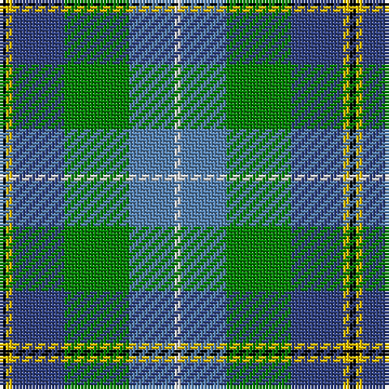

This page is one **sett** — a single exact thread-count. It belongs to the [tartan](/tartans/k1y1b8g10ba7ln1/)
(the same proportion at any scale), whose colour order is pattern [KYBGBW](/stripes/kybgbw/).

Sourced from weddslist.  It is a [6 stripe tartan](/stripes/stripes6/).

Original link http://www.weddslist.com/cgi-bin/tartans/pg.pl?source=sts

## Thread count
K/2 Y2 B16 G20 Ba14 LN/2

## Palette
Each colour and the base-6 reference it is a variant of.

| Colour | Shade | Base |
|---|---|---|
| B | <code style="background-color:#304080;">#304080</code> `oklch(39.4% 0.109 270.2)` <small>#304080</small> | B <code style="background-color:#2A418A;">#2A418A</code> |
| Ba | <code style="background-color:#5480B0;">#5480B0</code> `oklch(58.8% 0.089 251.5)` <small>#5480B0</small> | B <code style="background-color:#2A418A;">#2A418A</code> |
| G | <code style="background-color:#008000;">#008000</code> `oklch(52.0% 0.177 142.5)` <small>#008000</small> | G <code style="background-color:#006100;">#006100</code> |
| K | <code style="background-color:#000000;">#000000</code> `oklch(0.0% 0.000 0.0)` <small>#000000</small> | K <code style="background-color:#000000;">#000000</code> |
| LN | <code style="background-color:#E0E0E0;">#E0E0E0</code> `oklch(90.7% 0.000 89.9)` <small>#E0E0E0</small> | W <code style="background-color:#F7F7F7;">#F7F7F7</code> |
| Y | <code style="background-color:#F0C000;">#F0C000</code> `oklch(82.7% 0.169 90.5)` <small>#F0C000</small> | Y <code style="background-color:#F2BF00;">#F2BF00</code> |

# Sample pattern

## Nearest tartans

The nearest existing variants by ΔTartan distance, with this tartan at the top so the swatches line up against it.

ΔTartan

Tartan

Sett

—

<a href="/ttd/edit/#slug=k1ly1db8g10t7w1~x2">Porteous</a> <a class="nn-out" href="/setts/s6/k1ly1db8g10t7w1~x2/" title="open its dictionary page">↗</a>

0.93

<a href="/ttd/edit/#slug=lb2k2g8g8r1g1w1~x4">Lundy (Personal)</a> <a class="nn-out" href="/setts/s7/lb2k2g8g8r1g1w1~x4/" title="open its dictionary page">↗</a>

1.02

<a href="/ttd/edit/#slug=k6r3g30ly10db30w3~x2">Turnbull of Thornton (Personal)</a> <a class="nn-out" href="/setts/s6/k6r3g30ly10db30w3~x2/" title="open its dictionary page">↗</a>

1.06

<a href="/ttd/edit/#slug=r3k2g20k10b20ly2~x2">MacLeod of Assynt</a> <a class="nn-out" href="/setts/s6/r3k2g20k10b20ly2~x2/" title="open its dictionary page">↗</a>

1.07

<a href="/ttd/edit/#slug=g36dg24b18ly4b18k2w5~x2">Hughes (Inverbervie) (Personal)</a> <a class="nn-out" href="/setts/s7/g36dg24b18ly4b18k2w5~x2/" title="open its dictionary page">↗</a>

1.08

<a href="/ttd/edit/#slug=k3ly3db20g25lb18w3~x2">Porteous (Clan)</a> <a class="nn-out" href="/setts/s6/k3ly3db20g25lb18w3~x2/" title="open its dictionary page">↗</a>

1.09

<a href="/ttd/edit/#slug=k1ly1db8g10db7w1~x2">Porteous Family Tartan Tartan Number: 1264. Earliest known date: 1978 Designed for the Porteous Family Association, and submitted to the Monitoring Committee of the Scottish Tartan Society by Captain Barry Porteous who was president of the association at that time. See products available Copyright © Blair Urquhart, Comrie, 2015</a> <a class="nn-out" href="/setts/s6/k1ly1db8g10db7w1~x2/" title="open its dictionary page">↗</a>

1.10

<a href="/ttd/edit/#slug=db2r1db10w1o4g8ly1g2~x4">Ayrshire</a> <a class="nn-out" href="/setts/s8/db2r1db10w1o4g8ly1g2~x4/" title="open its dictionary page">↗</a>

1.16

<a href="/ttd/edit/#slug=db20r2g9w6ly4k2g8~x2">Crofters (Personal)</a> <a class="nn-out" href="/setts/s7/db20r2g9w6ly4k2g8~x2/" title="open its dictionary page">↗</a>

1.18

<a href="/ttd/edit/#slug=k5g30ly3b15k15b7w3~x2">Dick (Personal)</a> <a class="nn-out" href="/setts/s7/k5g30ly3b15k15b7w3~x2/" title="open its dictionary page">↗</a>

1.18

<a href="/ttd/edit/#slug=o3db1o11w1k5n14lo3~x4">Glen Lyon (Fashion)</a> <a class="nn-out" href="/setts/s7/o3db1o11w1k5n14lo3~x4/" title="open its dictionary page">↗</a>

## Neighbour map

Every grey dot is one of 14299 variants placed by the first two principal components of the ΔTartan feature space (44% of its variance). Red is this tartan; blue dots are its nearest — click one to open its page.

<svg viewBox="0 0 640 380" role="img" style="max-width:100%;height:auto;border:1px solid #e0e0e0;border-radius:4px;display:block" xmlns="http://www.w3.org/2000/svg"><image href="/nn/cloud.v1.png" width="640" height="380"/><a href="/setts/s7/lb2k2g8g8r1g1w1~x4/"><circle cx="157.9" cy="181.2" r="4" fill="#3465a4"><title>Lundy (Personal)</title></circle></a><a href="/setts/s6/k6r3g30ly10db30w3~x2/"><circle cx="143.9" cy="173.0" r="4" fill="#3465a4"><title>Turnbull of Thornton (Personal)</title></circle></a><a href="/setts/s6/r3k2g20k10b20ly2~x2/"><circle cx="169.5" cy="202.8" r="4" fill="#3465a4"><title>MacLeod of Assynt</title></circle></a><a href="/setts/s7/g36dg24b18ly4b18k2w5~x2/"><circle cx="153.2" cy="169.6" r="4" fill="#3465a4"><title>Hughes (Inverbervie) (Personal)</title></circle></a><a href="/setts/s6/k3ly3db20g25lb18w3~x2/"><circle cx="99.1" cy="179.0" r="4" fill="#3465a4"><title>Porteous (Clan)</title></circle></a><a href="/setts/s6/k1ly1db8g10db7w1~x2/"><circle cx="165.0" cy="201.5" r="4" fill="#3465a4"><title>Porteous Family Tartan Tartan Number: 1264. Earliest known date: 1978 Designed for the Porteous Family Association, and submitted to the Monitoring Committee of the Scottish Tartan Society by Captain Barry Porteous who was president of the association at that time. See products available Copyright © Blair Urquhart, Comrie, 2015</title></circle></a><a href="/setts/s8/db2r1db10w1o4g8ly1g2~x4/"><circle cx="192.0" cy="172.5" r="4" fill="#3465a4"><title>Ayrshire</title></circle></a><a href="/setts/s7/db20r2g9w6ly4k2g8~x2/"><circle cx="130.5" cy="163.7" r="4" fill="#3465a4"><title>Crofters (Personal)</title></circle></a><a href="/setts/s7/k5g30ly3b15k15b7w3~x2/"><circle cx="160.2" cy="190.6" r="4" fill="#3465a4"><title>Dick (Personal)</title></circle></a><a href="/setts/s7/o3db1o11w1k5n14lo3~x4/"><circle cx="181.5" cy="164.0" r="4" fill="#3465a4"><title>Glen Lyon (Fashion)</title></circle></a><circle cx="142.5" cy="186.8" r="5" fill="#c00000"/></svg>

ID: /setts/s6/k1ly1db8g10t7w1~x2/
