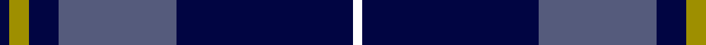

**Bands:** [KYKBKW](/stripes/kykbkw/) · **Stripes:** [K LY K N K W](/stripes/stripes6/) K LY K N K W

This was sourced from register-of-tartans.  It is a [6 band tartan](/bands/bands6/).

Original link https://www.tartanregister.gov.uk/tartanDetails.aspx?ref=10642

## Attestations

This cloth appears in 2 source records; the oldest owns this page.

- 17/04/2012 — Jon's Theme (register-of-tartans, [record](https://www.tartanregister.gov.uk/tartanDetails.aspx?ref=10642))
- undated — Jon's Theme Fashion Tartan Tartan Number: 10642. Earliest known date: 17/04/2012 This tartan was created for Jon Pittard as a thank-you for helping the designer recover from two reconstructive surgeries, one in 2006 and one in 2007. See products available Copyright © Blair Urquhart, Comrie, 2015 (house-of-tartan, [record](http://www.house-of-tartan.scotland.net/house/TartanViewjs.asp?colr=Def&tnam=10642))

## Register references

External register numbers recorded for this tartan.

- Scottish Register of Tartans: [10642](https://www.tartanregister.gov.uk/tartanDetails.aspx?ref=10642)

## Thread count
DB/2 LG4 DB6 N24 DB36 W/2

## Palette
Each colour and its ΔE from the base-6 reference it is a variant of.

| Colour | Shade | Base | ΔE (OKLab) |
|---|---|---|---|
| DB | <code style="background-color:#010542;">#010542</code> `#010542` | K <code style="background-color:#000000;">#000000</code> | 0.21 |
| LG | <code style="background-color:#9E8F00;">#9E8F00</code> `#9E8F00` | Y <code style="background-color:#F2BF00;">#F2BF00</code> | 0.19 |
| N | <code style="background-color:#555B7C;">#555B7C</code> `#555B7C` | B <code style="background-color:#2A418A;">#2A418A</code> | 0.11 |
| W | <code style="background-color:#FFFFFF;">#FFFFFF</code> `#FFFFFF` | W <code style="background-color:#F7F7F7;">#F7F7F7</code> | 0.02 |

# Sample pattern

## Nearest tartans

The nearest existing variants by ΔTartan distance.

1. [Hannah (Personal)](/setts/s6/ly2k9w3k9db35w2~x2/) — ΔT 0.69
1. [Jon's Theme (Fashion)](/setts/s6/k1lo2k3db12k18w1~x2/) — ΔT 0.72
1. [Roxburgh, Green (District)](/setts/s8/db23w1db1w1db8g22r1db3~x4/) — ΔT 1.01
1. [Pride of Nova Scotia (Corporate)](/setts/s7/k3lo2k36dt16k5dt2w3~x2/) — ΔT 1.08
1. [Prince George's Police Pipe Band](/setts/s8/db42r2y16r2db6r2y8lo3~x2/) — ΔT 1.13
1. [Wolverine Corporate Tartan Tartan Number: 10748. Earliest known date: 03/12/2012 Created by the designer to celebrate an exclusive group of work colleagues known affectionately as the 'Wolverines'. Many within this close group share a proud Scottish heritage and wished to acknowledge this strong affiliation by commissioning a tartan. Yes. The Wolverine tartan has been created for the exclusive use of the 'Wolverines'. No commercial use of this tartan is permitted without expressed permission from the designer, and any party wishing to use or reproduce this tartan should first seek permission by email from the designer. See products available Copyright © Blair Urquhart, Comrie, 2015](/setts/s6/ly8k3b40k12k3ly3~x2/) — ΔT 1.15
1. [Warren Wilson College (Corporate)](/setts/s8/g20lr6db20ly3db48r6db4r6~x2/) — ΔT 1.16
1. [McNiff, Kevin (Personal)](/setts/s4/g20r7db40w2~x2/) — ΔT 1.16
1. [Tern House](/setts/s7/g23db3k8db4g4db56ly8/) — ΔT 1.17
1. [Micron](/setts/s6/k30b40ly3b5w2b6~x2/) — ΔT 1.18

## Neighbour map

Every grey dot is one of 14313 variants placed by the first two principal components of the ΔTartan feature space (44% of its variance). Red is this tartan; blue dots are its nearest — click one to open its page.

<svg viewBox="0 0 640 380" role="img" style="max-width:100%;height:auto;border:1px solid #e0e0e0;border-radius:4px;display:block" xmlns="http://www.w3.org/2000/svg"><image href="/nn/cloud.v1.png" width="640" height="380"/><a href="/setts/s6/ly2k9w3k9db35w2~x2/"><circle cx="349.9" cy="171.7" r="4" fill="#3465a4"><title>Hannah (Personal)</title></circle></a><a href="/setts/s6/k1lo2k3db12k18w1~x2/"><circle cx="374.1" cy="194.2" r="4" fill="#3465a4"><title>Jon's Theme (Fashion)</title></circle></a><a href="/setts/s8/db23w1db1w1db8g22r1db3~x4/"><circle cx="375.1" cy="158.0" r="4" fill="#3465a4"><title>Roxburgh, Green (District)</title></circle></a><a href="/setts/s7/k3lo2k36dt16k5dt2w3~x2/"><circle cx="414.1" cy="177.5" r="4" fill="#3465a4"><title>Pride of Nova Scotia (Corporate)</title></circle></a><a href="/setts/s8/db42r2y16r2db6r2y8lo3~x2/"><circle cx="365.9" cy="146.4" r="4" fill="#3465a4"><title>Prince George's Police Pipe Band</title></circle></a><a href="/setts/s6/ly8k3b40k12k3ly3~x2/"><circle cx="314.5" cy="180.7" r="4" fill="#3465a4"><title>Wolverine Corporate Tartan Tartan Number: 10748. Earliest known date: 03/12/2012 Created by the designer to celebrate an exclusive group of work colleagues known affectionately as the 'Wolverines'. Many within this close group share a proud Scottish heritage and wished to acknowledge this strong affiliation by commissioning a tartan. Yes. The Wolverine tartan has been created for the exclusive use of the 'Wolverines'. No commercial use of this tartan is permitted without expressed permission from the designer, and any party wishing to use or reproduce this tartan should first seek permission by email from the designer. See products available Copyright © Blair Urquhart, Comrie, 2015</title></circle></a><a href="/setts/s8/g20lr6db20ly3db48r6db4r6~x2/"><circle cx="351.1" cy="165.3" r="4" fill="#3465a4"><title>Warren Wilson College (Corporate)</title></circle></a><a href="/setts/s4/g20r7db40w2~x2/"><circle cx="346.2" cy="211.7" r="4" fill="#3465a4"><title>McNiff, Kevin (Personal)</title></circle></a><a href="/setts/s7/g23db3k8db4g4db56ly8/"><circle cx="371.3" cy="175.0" r="4" fill="#3465a4"><title>Tern House</title></circle></a><a href="/setts/s6/k30b40ly3b5w2b6~x2/"><circle cx="355.6" cy="175.2" r="4" fill="#3465a4"><title>Micron</title></circle></a><circle cx="366.4" cy="186.8" r="5" fill="#c00000"/></svg>

ID: /setts/s6/k1ly2k3n12k18w1~x2/
