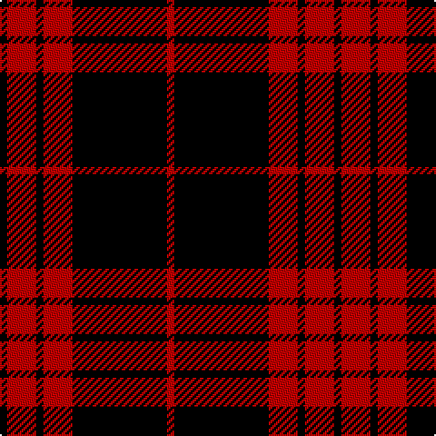

This page is one **sett** — a single exact thread-count. It belongs to the [tartan](/tartans/k1r4k1r4k13r1/)
(the same proportion at any scale), whose colour order is pattern [KRKRKR](/stripes/krkrkr/).

Sourced from weddslist.  It is a [6 stripe tartan](/stripes/stripes6/).

Original link http://www.weddslist.com/cgi-bin/tartans/pg.pl?source=sts

## Thread count
K/4 R16 K4 R16 K52 R/4

## Palette
Each colour and the base-6 reference it is a variant of.

| Colour | Shade | Base |
|---|---|---|
| K | <code style="background-color:#000000;">#000000</code> `oklch(0.0% 0.000 0.0)` <small>#000000</small> | K <code style="background-color:#000000;">#000000</code> |
| R | <code style="background-color:#C00000;">#C00000</code> `oklch(50.7% 0.208 29.2)` <small>#C00000</small> | R <code style="background-color:#CC0000;">#CC0000</code> |

# Sample pattern

## Nearest tartans

The nearest existing variants by ΔTartan distance, with this tartan at the top so the swatches line up against it.

ΔTartan

Tartan

Sett

—

<a href="/ttd/edit/#slug=k1r4k1r4k13r1~x4">Cameron, Black &amp; Red (dress)</a> <a class="nn-out" href="/setts/s6/k1r4k1r4k13r1~x4/" title="open its dictionary page">↗</a>

1.44

<a href="/ttd/edit/#slug=k30r3k2r3k2r27k30r4~x2">Murray of Ochtertyre #2</a> <a class="nn-out" href="/setts/s8/k30r3k2r3k2r27k30r4~x2/" title="open its dictionary page">↗</a>

1.55

<a href="/ttd/edit/#slug=k6r1k6r9k1~x4">MacLeod of Raasay</a> <a class="nn-out" href="/setts/s5/k6r1k6r9k1~x4/" title="open its dictionary page">↗</a>

1.56

<a href="/ttd/edit/#slug=k2r6k2r6k12ly1~x2">MacQueen</a> <a class="nn-out" href="/setts/s6/k2r6k2r6k12ly1~x2/" title="open its dictionary page">↗</a>

1.60

<a href="/ttd/edit/#slug=k2r1k6r6k1r1k1~x4">Campbell of Lochlane</a> <a class="nn-out" href="/setts/s7/k2r1k6r6k1r1k1~x4/" title="open its dictionary page">↗</a>

1.67

<a href="/setts/s6/k23r3k1r12~x4/">Ewing</a>

1.69

<a href="/ttd/edit/#slug=r20k3r4w2k7~x2">Loevenstein Castle 1 (Artefact)</a> <a class="nn-out" href="/setts/s5/r20k3r4w2k7~x2/" title="open its dictionary page">↗</a>

1.73

<a href="/ttd/edit/#slug=k18r2k2r5w2r2w2r2k2~x2">Tweedside</a> <a class="nn-out" href="/setts/s9/k18r2k2r5w2r2w2r2k2~x2/" title="open its dictionary page">↗</a>

1.73

<a href="/ttd/edit/#slug=r20k3r4lb2k7~x2">Loevenstein Castle</a> <a class="nn-out" href="/setts/s5/r20k3r4lb2k7~x2/" title="open its dictionary page">↗</a>

1.73

<a href="/ttd/edit/#slug=r4k1r12k12r2~x2">Campbell of Armaddie</a> <a class="nn-out" href="/setts/s5/r4k1r12k12r2~x2/" title="open its dictionary page">↗</a>

1.81

<a href="/ttd/edit/#slug=k3r1k16r16k1r3~x4">The Mary Erskine</a> <a class="nn-out" href="/setts/s6/k3r1k16r16k1r3~x4/" title="open its dictionary page">↗</a>

## Neighbour map

Every grey dot is one of 14299 variants placed by the first two principal components of the ΔTartan feature space (44% of its variance). Red is this tartan; blue dots are its nearest — click one to open its page.

<svg viewBox="0 0 640 380" role="img" style="max-width:100%;height:auto;border:1px solid #e0e0e0;border-radius:4px;display:block" xmlns="http://www.w3.org/2000/svg"><image href="/nn/cloud.v1.png" width="640" height="380"/><a href="/setts/s8/k30r3k2r3k2r27k30r4~x2/"><circle cx="438.1" cy="204.6" r="4" fill="#3465a4"><title>Murray of Ochtertyre #2</title></circle></a><a href="/setts/s5/k6r1k6r9k1~x4/"><circle cx="348.3" cy="259.3" r="4" fill="#3465a4"><title>MacLeod of Raasay</title></circle></a><a href="/setts/s6/k2r6k2r6k12ly1~x2/"><circle cx="324.5" cy="212.7" r="4" fill="#3465a4"><title>MacQueen</title></circle></a><a href="/setts/s7/k2r1k6r6k1r1k1~x4/"><circle cx="355.8" cy="257.4" r="4" fill="#3465a4"><title>Campbell of Lochlane</title></circle></a><a href="/setts/s6/k23r3k1r12~x4/"><circle cx="431.0" cy="183.7" r="4" fill="#3465a4"><title>Ewing</title></circle></a><a href="/setts/s5/r20k3r4w2k7~x2/"><circle cx="397.8" cy="214.6" r="4" fill="#3465a4"><title>Loevenstein Castle 1 (Artefact)</title></circle></a><a href="/setts/s9/k18r2k2r5w2r2w2r2k2~x2/"><circle cx="331.7" cy="174.0" r="4" fill="#3465a4"><title>Tweedside</title></circle></a><a href="/setts/s5/r20k3r4lb2k7~x2/"><circle cx="404.5" cy="217.4" r="4" fill="#3465a4"><title>Loevenstein Castle</title></circle></a><a href="/setts/s5/r4k1r12k12r2~x2/"><circle cx="373.8" cy="229.8" r="4" fill="#3465a4"><title>Campbell of Armaddie</title></circle></a><a href="/setts/s6/k3r1k16r16k1r3~x4/"><circle cx="376.1" cy="205.0" r="4" fill="#3465a4"><title>The Mary Erskine</title></circle></a><circle cx="417.0" cy="213.1" r="5" fill="#c00000"/></svg>

ID: /setts/s6/k1r4k1r4k13r1~x4/
