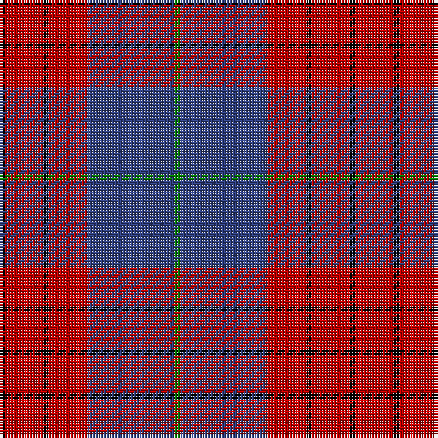

This page is one **sett** — a single exact thread-count. It belongs to the [tartan](/tartans/k1r7k1r7b16g1/)
(the same proportion at any scale), whose colour order is pattern [GBRKRK](/stripes/gbrkrk/).

Sourced from weddslist.  It is a [6 stripe tartan](/stripes/stripes6/).

Original link http://www.weddslist.com/cgi-bin/tartans/pg.pl?source=sts

## Also known as

This cloth is also recorded under:

- Robinson, dress

2 attestations — the source records this cloth was collapsed from (oldest owns this page)

<ul>
<li>undated — Robinson, dress (weddslist, <a href="http://www.weddslist.com/cgi-bin/tartans/pg.pl?source=sts">record</a>)</li>
<li>undated — Robinson Dress Dress Clan Tartan Tartan Number: 739. Earliest known date: pre 2003 Colour variation of 'MacQueen' See products available Copyright © Blair Urquhart, Comrie, 2015 (house-of-tartan, <a href="http://www.house-of-tartan.scotland.net/house/TartanViewjs.asp?colr=Def&tnam=739">record</a>)</li>
</ul>

## Thread count
K/2 R14 K2 R14 B32 G/2

## Palette
Each colour and the base-6 reference it is a variant of.

| Colour | Shade | Base |
|---|---|---|
| B | <code style="background-color:#304080;">#304080</code> `oklch(39.4% 0.109 270.2)` <small>#304080</small> | B <code style="background-color:#2A418A;">#2A418A</code> |
| G | <code style="background-color:#008000;">#008000</code> `oklch(52.0% 0.177 142.5)` <small>#008000</small> | G <code style="background-color:#006100;">#006100</code> |
| K | <code style="background-color:#000000;">#000000</code> `oklch(0.0% 0.000 0.0)` <small>#000000</small> | K <code style="background-color:#000000;">#000000</code> |
| R | <code style="background-color:#C00000;">#C00000</code> `oklch(50.7% 0.208 29.2)` <small>#C00000</small> | R <code style="background-color:#CC0000;">#CC0000</code> |

# Sample pattern

## Nearest tartans

The nearest existing variants by ΔTartan distance, with this tartan at the top so the swatches line up against it.

ΔTartan

Tartan

Sett

—

<a href="/ttd/edit/#slug=k1r7k1r7db16g1~x2">Robinson, dress</a> <a class="nn-out" href="/setts/s6/k1r7k1r7db16g1~x2/" title="open its dictionary page">↗</a>

0.37

<a href="/ttd/edit/#slug=k1r7k1r7db16g1~x4">Robinson Dress (Pendleton) #1</a> <a class="nn-out" href="/setts/s6/k1r7k1r7db16g1~x4/" title="open its dictionary page">↗</a>

0.63

<a href="/ttd/edit/#slug=dg2r1db16r16db1ly2~x2">Galloway Dress (Yellow Line)</a> <a class="nn-out" href="/setts/s6/dg2r1db16r16db1ly2~x2/" title="open its dictionary page">↗</a>

0.72

<a href="/ttd/edit/#slug=g2r1db16r16db1ly2~x2">Galloway dress</a> <a class="nn-out" href="/setts/s6/g2r1db16r16db1ly2~x2/" title="open its dictionary page">↗</a>

0.81

<a href="/ttd/edit/#slug=g1r1db16r16db1w1~x2">Galloway, dress</a> <a class="nn-out" href="/setts/s6/g1r1db16r16db1w1~x2/" title="open its dictionary page">↗</a>

0.99

<a href="/ttd/edit/#slug=g3r2db22r22db2w3~x2">Galloway Red</a> <a class="nn-out" href="/setts/s6/g3r2db22r22db2w3~x2/" title="open its dictionary page">↗</a>

1.09

<a href="/ttd/edit/#slug=db2r2db28k11r27w2r2~x2">Americana - 1978 #2 (Fashion)</a> <a class="nn-out" href="/setts/s7/db2r2db28k11r27w2r2~x2/" title="open its dictionary page">↗</a>

1.13

<a href="/ttd/edit/#slug=r1db6r1dg6r12lr1~x2">Fraser VS</a> <a class="nn-out" href="/setts/s6/r1db6r1dg6r12lr1~x2/" title="open its dictionary page">↗</a>

1.14

<a href="/ttd/edit/#slug=dr2dg14lb3dr13ly1dr2~x4">Swedish Para Whisky Club (Corporate</a> <a class="nn-out" href="/setts/s6/dr2dg14lb3dr13ly1dr2~x4/" title="open its dictionary page">↗</a>

1.15

<a href="/ttd/edit/#slug=db18r9db2r3k1o1~x4">MacGregor, Modern</a> <a class="nn-out" href="/setts/s6/db18r9db2r3k1o1~x4/" title="open its dictionary page">↗</a>

1.17

<a href="/ttd/edit/#slug=ly3dg8o20dp30ly2~x2">Wicks (Personal)</a> <a class="nn-out" href="/setts/s5/ly3dg8o20dp30ly2~x2/" title="open its dictionary page">↗</a>

## Neighbour map

Every grey dot is one of 14299 variants placed by the first two principal components of the ΔTartan feature space (44% of its variance). Red is this tartan; blue dots are its nearest — click one to open its page.

<svg viewBox="0 0 640 380" role="img" style="max-width:100%;height:auto;border:1px solid #e0e0e0;border-radius:4px;display:block" xmlns="http://www.w3.org/2000/svg"><image href="/nn/cloud.v1.png" width="640" height="380"/><a href="/setts/s6/k1r7k1r7db16g1~x4/"><circle cx="329.1" cy="182.1" r="4" fill="#3465a4"><title>Robinson Dress (Pendleton) #1</title></circle></a><a href="/setts/s6/dg2r1db16r16db1ly2~x2/"><circle cx="308.4" cy="166.9" r="4" fill="#3465a4"><title>Galloway Dress (Yellow Line)</title></circle></a><a href="/setts/s6/g2r1db16r16db1ly2~x2/"><circle cx="316.6" cy="172.0" r="4" fill="#3465a4"><title>Galloway dress</title></circle></a><a href="/setts/s6/g1r1db16r16db1w1~x2/"><circle cx="353.6" cy="170.4" r="4" fill="#3465a4"><title>Galloway, dress</title></circle></a><a href="/setts/s6/g3r2db22r22db2w3~x2/"><circle cx="277.4" cy="178.6" r="4" fill="#3465a4"><title>Galloway Red</title></circle></a><a href="/setts/s7/db2r2db28k11r27w2r2~x2/"><circle cx="270.5" cy="168.0" r="4" fill="#3465a4"><title>Americana - 1978 #2 (Fashion)</title></circle></a><a href="/setts/s6/r1db6r1dg6r12lr1~x2/"><circle cx="298.9" cy="196.9" r="4" fill="#3465a4"><title>Fraser VS</title></circle></a><a href="/setts/s6/dr2dg14lb3dr13ly1dr2~x4/"><circle cx="312.8" cy="199.0" r="4" fill="#3465a4"><title>Swedish Para Whisky Club (Corporate</title></circle></a><a href="/setts/s6/db18r9db2r3k1o1~x4/"><circle cx="390.5" cy="175.4" r="4" fill="#3465a4"><title>MacGregor, Modern</title></circle></a><a href="/setts/s5/ly3dg8o20dp30ly2~x2/"><circle cx="280.6" cy="194.5" r="4" fill="#3465a4"><title>Wicks (Personal)</title></circle></a><circle cx="324.9" cy="181.2" r="5" fill="#c00000"/></svg>

ID: /setts/s6/k1r7k1r7db16g1~x2/
