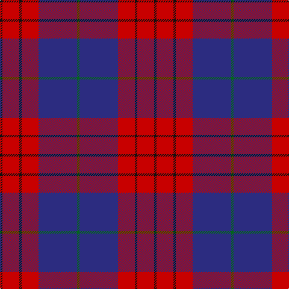

In pattern [GBRKRK](/stripes/gbrkrk/).

This was sourced from register-of-tartans.  It is a [6 stripe tartan](/stripes/stripes6/).

Original link https://www.tartanregister.gov.uk/tartanDetails.aspx?ref=3538

## Also known as

This cloth is also recorded under:

- Robinson Dress #1

## Attestations

This cloth appears in 2 source records; the oldest owns this page.

- 01/01/2002 — Robinson Dress (Pendleton) #1 (register-of-tartans, [record](https://www.tartanregister.gov.uk/tartanDetails.aspx?ref=3538))
- pre 2002 — Robinson Dress (Name) (tartans-authority, [record](http://www.tartansauthority.com/tartan-ferret/display/739/))

## Register references

External register numbers recorded for this tartan.

- Scottish Register of Tartans: [3538](https://www.tartanregister.gov.uk/tartanDetails.aspx?ref=3538)
- Scottish Tartans Authority (ITI): 739
- Scottish Tartans World Register: 739

## Thread count
K/4 R28 K4 R28 DB64 G/4

## Palette
Each colour and the base-6 reference it is a variant of.

| Colour | Shade | Base |
|---|---|---|
| DB | <code style="background-color:#2C2C80;">#2C2C80</code> `oklch(35.0% 0.138 276.6)` <small>#2C2C80</small> | B <code style="background-color:#2A418A;">#2A418A</code> |
| G | <code style="background-color:#006818;">#006818</code> `oklch(45.0% 0.142 145.0)` <small>#006818</small> | G <code style="background-color:#006100;">#006100</code> |
| K | <code style="background-color:#101010;">#101010</code> `oklch(17.3% 0.000 89.9)` <small>#101010</small> | K <code style="background-color:#000000;">#000000</code> |
| R | <code style="background-color:#C80000;">#C80000</code> `oklch(52.3% 0.215 29.2)` <small>#C80000</small> | R <code style="background-color:#CC0000;">#CC0000</code> |

# Sample pattern

## Nearest tartans

The nearest existing variants by ΔTartan distance.

1. [Robinson, dress](/setts/s6/k1r7k1r7db16g1~x2/) — ΔT 0.37
1. [Galloway Dress (Yellow Line)](/setts/s6/dg2r1db16r16db1ly2~x2/) — ΔT 0.73
1. [Galloway, dress](/setts/s6/g1r1db16r16db1w1~x2/) — ΔT 0.85
1. [Galloway dress](/setts/s6/g2r1db16r16db1ly2~x2/) — ΔT 0.93
1. [Galloway Red](/setts/s6/g3r2db22r22db2w3~x2/) — ΔT 1.05
1. [Masai Shuka 17 (Artefact)](/setts/s6/k4b32r30b2w5k2~x2/) — ΔT 1.13
1. [MacGregor, Modern](/setts/s6/db18r9db2r3k1o1~x4/) — ΔT 1.13
1. [Wicks (Personal)](/setts/s5/ly3dg8o20dp30ly2~x2/) — ΔT 1.18
1. [Americana - 1978 #2 (Fashion)](/setts/s7/db2r2db28k11r27w2r2~x2/) — ΔT 1.18
1. [Discover Islay (District)](/setts/s6/dp6ly1dp20db6g19dp2~x4/) — ΔT 1.20

## Neighbour map

Every grey dot is one of 14299 variants placed by the first two principal components of the ΔTartan feature space (44% of its variance). Red is this tartan; blue dots are its nearest — click one to open its page.

<svg viewBox="0 0 640 380" role="img" style="max-width:100%;height:auto;border:1px solid #e0e0e0;border-radius:4px;display:block" xmlns="http://www.w3.org/2000/svg"><image href="/nn/cloud.v1.png" width="640" height="380"/><a href="/setts/s6/k1r7k1r7db16g1~x2/"><circle cx="324.9" cy="181.2" r="4" fill="#3465a4"><title>Robinson, dress</title></circle></a><a href="/setts/s6/dg2r1db16r16db1ly2~x2/"><circle cx="308.4" cy="166.9" r="4" fill="#3465a4"><title>Galloway Dress (Yellow Line)</title></circle></a><a href="/setts/s6/g1r1db16r16db1w1~x2/"><circle cx="353.6" cy="170.4" r="4" fill="#3465a4"><title>Galloway, dress</title></circle></a><a href="/setts/s6/g2r1db16r16db1ly2~x2/"><circle cx="316.6" cy="172.0" r="4" fill="#3465a4"><title>Galloway dress</title></circle></a><a href="/setts/s6/g3r2db22r22db2w3~x2/"><circle cx="277.4" cy="178.6" r="4" fill="#3465a4"><title>Galloway Red</title></circle></a><a href="/setts/s6/k4b32r30b2w5k2~x2/"><circle cx="284.9" cy="162.3" r="4" fill="#3465a4"><title>Masai Shuka 17 (Artefact)</title></circle></a><a href="/setts/s6/db18r9db2r3k1o1~x4/"><circle cx="390.5" cy="175.4" r="4" fill="#3465a4"><title>MacGregor, Modern</title></circle></a><a href="/setts/s5/ly3dg8o20dp30ly2~x2/"><circle cx="280.6" cy="194.5" r="4" fill="#3465a4"><title>Wicks (Personal)</title></circle></a><a href="/setts/s7/db2r2db28k11r27w2r2~x2/"><circle cx="270.5" cy="168.0" r="4" fill="#3465a4"><title>Americana - 1978 #2 (Fashion)</title></circle></a><a href="/setts/s6/dp6ly1dp20db6g19dp2~x4/"><circle cx="337.3" cy="195.3" r="4" fill="#3465a4"><title>Discover Islay (District)</title></circle></a><circle cx="329.1" cy="182.1" r="5" fill="#c00000"/></svg>

ID: /setts/s6/k1r7k1r7db16g1~x4/
