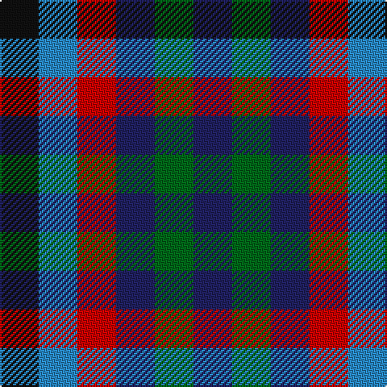

In pattern [BGBRBK](/stripes/bgbrbk/).

This was sourced from tartans-authority.  It is a [6 stripe tartan](/stripes/stripes6/).

Original link http://www.tartansauthority.com/tartan-ferret/display/10453/

## Thread count
K/24 B24 R24 DB24 G24 DB/24

## Palette
Each colour and its ΔE from the base-6 reference it is a variant of.

| Colour | Shade | Base | ΔE (OKLab) |
|---|---|---|---|
| B | <code style="background-color:#2888C4;">#2888C4</code> `#2888C4` | B <code style="background-color:#2A418A;">#2A418A</code> | 0.21 |
| DB | <code style="background-color:#202060;">#202060</code> `#202060` | B <code style="background-color:#2A418A;">#2A418A</code> | 0.11 |
| G | <code style="background-color:#006818;">#006818</code> `#006818` | G <code style="background-color:#006100;">#006100</code> | 0.02 |
| K | <code style="background-color:#101010;">#101010</code> `#101010` | K <code style="background-color:#000000;">#000000</code> | 0.17 |
| R | <code style="background-color:#C80000;">#C80000</code> `#C80000` | R <code style="background-color:#CC0000;">#CC0000</code> | 0.01 |

# Sample pattern

## Nearest tartans

The nearest existing variants by ΔTartan distance.

1. [Antonelli (Oklahoma), John (Personal)](/setts/s6/k1lt1r1db1g1db1~x25/) — ΔT 1.42
1. [Bell, Siobhan (Personal)](/setts/s10/k1r1g1db1k1db1k1db1k1dp1~x10/) — ΔT 1.65
1. [Bell, South.](/setts/s7/k1r1w1k1w1k1db1~x8/) — ΔT 2.33
1. [Algarve](/setts/s4/dg1r1w1db1~x20/) — ΔT 2.35
1. [Border Bell](/setts/s7/k1r1w1k1w1k1db1~x16/) — ΔT 2.39
1. [Bell, Border (Name)](/setts/s7/k1r1w1k1w1k1db1~x14/) — ΔT 2.39
1. [Spey](/setts/s14/db1y1r1y1db1y1r1y1db1y1r1t1y1w1~x8/) — ΔT 2.46
1. [Bowater (Estate Check)](/setts/s4/dp1k1dy1r1~x4/) — ΔT 2.59
1. [Dupplin Check](/setts/s9/do1lb1k1lb1do1lb1k1lb1r1~x6/) — ΔT 2.68
1. [Wilson's No.185](/setts/s3/k11g9dp10~x2/) — ΔT 2.71

## Neighbour map

Every grey dot is one of 14299 variants placed by the first two principal components of the ΔTartan feature space (44% of its variance). Red is this tartan; blue dots are its nearest — click one to open its page.

<svg viewBox="0 0 640 380" role="img" style="max-width:100%;height:auto;border:1px solid #e0e0e0;border-radius:4px;display:block" xmlns="http://www.w3.org/2000/svg"><image href="/nn/cloud.v1.png" width="640" height="380"/><a href="/setts/s6/k1lt1r1db1g1db1~x25/"><circle cx="14.0" cy="366.0" r="4" fill="#3465a4"><title>Antonelli (Oklahoma), John (Personal)</title></circle></a><a href="/setts/s10/k1r1g1db1k1db1k1db1k1dp1~x10/"><circle cx="14.0" cy="366.0" r="4" fill="#3465a4"><title>Bell, Siobhan (Personal)</title></circle></a><a href="/setts/s7/k1r1w1k1w1k1db1~x8/"><circle cx="14.0" cy="366.0" r="4" fill="#3465a4"><title>Bell, South.</title></circle></a><a href="/setts/s4/dg1r1w1db1~x20/"><circle cx="14.0" cy="366.0" r="4" fill="#3465a4"><title>Algarve</title></circle></a><a href="/setts/s7/k1r1w1k1w1k1db1~x16/"><circle cx="14.0" cy="366.0" r="4" fill="#3465a4"><title>Border Bell</title></circle></a><a href="/setts/s7/k1r1w1k1w1k1db1~x14/"><circle cx="14.0" cy="366.0" r="4" fill="#3465a4"><title>Bell, Border (Name)</title></circle></a><a href="/setts/s14/db1y1r1y1db1y1r1y1db1y1r1t1y1w1~x8/"><circle cx="14.0" cy="360.0" r="4" fill="#3465a4"><title>Spey</title></circle></a><a href="/setts/s4/dp1k1dy1r1~x4/"><circle cx="14.0" cy="366.0" r="4" fill="#3465a4"><title>Bowater (Estate Check)</title></circle></a><a href="/setts/s9/do1lb1k1lb1do1lb1k1lb1r1~x6/"><circle cx="14.0" cy="366.0" r="4" fill="#3465a4"><title>Dupplin Check</title></circle></a><a href="/setts/s3/k11g9dp10~x2/"><circle cx="78.1" cy="366.0" r="4" fill="#3465a4"><title>Wilson's No.185</title></circle></a><circle cx="14.0" cy="366.0" r="5" fill="#c00000"/></svg>

ID: /setts/s6/k1t1r1db1g1db1~x24/
