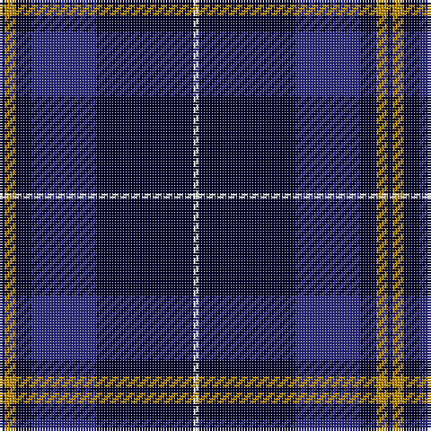

In pattern [KYKBKW](/patterns/kykbkw/).

This was sourced from tartans-authority.  It is a [6 stripes tartan](/stripes/stripes6/).

Original link http://www.tartansauthority.com/tartan-ferret/display/10642/

## Thread count
DBa/2 DY4 DBa6 DB24 DBa36 W/2

## Palette
Each colour and its ΔE from the base-6 reference it is a variant of.

| Colour | Shade | Base | ΔE (OKLab) |
|---|---|---|---|
| DB | <code style="background-color:#2C2C80;">#2C2C80</code> `#2C2C80` | B <code style="background-color:#2A418A;">#2A418A</code> | 0.06 |
| DBa | <code style="background-color:#00002C;">#00002C</code> `#00002C` | K <code style="background-color:#000000;">#000000</code> | 0.16 |
| DY | <code style="background-color:#BC8C00;">#BC8C00</code> `#BC8C00` | Y <code style="background-color:#F2BF00;">#F2BF00</code> | 0.16 |
| W | <code style="background-color:#FCFCFC;">#FCFCFC</code> `#FCFCFC` | W <code style="background-color:#F7F7F7;">#F7F7F7</code> | 0.01 |

# Sample pattern

## Nearest tartans

The nearest existing variants by ΔTartan distance.

1. [Jon's Theme](/setts/s6/k1y2k3b12k18w1x2~b555b7c-k010542-wffffff-y9e8f00/) — ΔT 0.72
1. [Pride of Nova Scotia (Corporate)](/setts/s7/k3y2k36b16k5b2w3x2~b344454-k00002c-we0e0e0-ybc8c00/) — ΔT 1.03
1. [St. Georges, Edgbaston](/setts/s7/r4k21w2k20b21k2b2x2~b304080-k000030-rc00000-we0e0e0/) — ΔT 1.07
1. [Hannah (Personal)](/setts/s6/w2b35k9w3k9y2x2~b30308c-k101010-we0e0e0-ye8c000/) — ΔT 1.18
1. [MacKay](/setts/s6/b2k6b2k6b16r1x2~b304080-k000000-rc00000/) — ΔT 1.25
1. [St Andrews, Earl of](/setts/s6/b52k28w5k3w2k10~b304080-k000030-we0e0e0/) — ΔT 1.33
1. [Warren Wilson College (Corporate)](/setts/s8/g20y6b20ya3b48r6b4r6x2~b1c0070-g006818-r880000-ya0a0a0-yae8c000/) — ΔT 1.41
1. [Indigo Blue Works](/setts/s11/b9k1ba4k1b18bb5k1bb1k1bb5b4x2~b000050-ba304080-bb8080d0-k000000/) — ΔT 1.42
1. [Bacon, Blue](/setts/s4/b14k3r3w1x2~b1c0070-k101010-r880000-we0e0e0/) — ΔT 1.42
1. [Wcwm 9275-1395](/setts/s7/b6ba3b56k24g6r6g6~b1c0070-ba440044-g006818-k101010-re87878/) — ΔT 1.44

## Neighbour map

Every grey dot is one of 15726 variants placed by the first two principal components of the ΔTartan feature space (44% of its variance). Red is this tartan; blue dots are its nearest — click one to open its page.

<svg viewBox="0 0 640 380" role="img" style="max-width:100%;height:auto;border:1px solid #e0e0e0;border-radius:4px;display:block" xmlns="http://www.w3.org/2000/svg"><image href="/nn/cloud.v1.png" width="640" height="380"/><a href="/setts/s6/k1y2k3b12k18w1x2~b555b7c-k010542-wffffff-y9e8f00/"><circle cx="363.3" cy="187.4" r="4" fill="#3465a4"><title>Jon's Theme</title></circle></a><a href="/setts/s7/k3y2k36b16k5b2w3x2~b344454-k00002c-we0e0e0-ybc8c00/"><circle cx="411.0" cy="178.0" r="4" fill="#3465a4"><title>Pride of Nova Scotia (Corporate)</title></circle></a><a href="/setts/s7/r4k21w2k20b21k2b2x2~b304080-k000030-rc00000-we0e0e0/"><circle cx="344.7" cy="221.0" r="4" fill="#3465a4"><title>St. Georges, Edgbaston</title></circle></a><a href="/setts/s6/w2b35k9w3k9y2x2~b30308c-k101010-we0e0e0-ye8c000/"><circle cx="346.8" cy="173.4" r="4" fill="#3465a4"><title>Hannah (Personal)</title></circle></a><a href="/setts/s6/b2k6b2k6b16r1x2~b304080-k000000-rc00000/"><circle cx="386.5" cy="219.6" r="4" fill="#3465a4"><title>MacKay</title></circle></a><a href="/setts/s6/b52k28w5k3w2k10~b304080-k000030-we0e0e0/"><circle cx="365.8" cy="188.7" r="4" fill="#3465a4"><title>St Andrews, Earl of</title></circle></a><a href="/setts/s8/g20y6b20ya3b48r6b4r6x2~b1c0070-g006818-r880000-ya0a0a0-yae8c000/"><circle cx="348.3" cy="165.0" r="4" fill="#3465a4"><title>Warren Wilson College (Corporate)</title></circle></a><a href="/setts/s11/b9k1ba4k1b18bb5k1bb1k1bb5b4x2~b000050-ba304080-bb8080d0-k000000/"><circle cx="354.6" cy="162.2" r="4" fill="#3465a4"><title>Indigo Blue Works</title></circle></a><a href="/setts/s4/b14k3r3w1x2~b1c0070-k101010-r880000-we0e0e0/"><circle cx="410.2" cy="225.1" r="4" fill="#3465a4"><title>Bacon, Blue</title></circle></a><a href="/setts/s7/b6ba3b56k24g6r6g6~b1c0070-ba440044-g006818-k101010-re87878/"><circle cx="355.6" cy="166.7" r="4" fill="#3465a4"><title>Wcwm 9275-1395</title></circle></a><circle cx="370.8" cy="193.6" r="5" fill="#c00000"/></svg>

ID: /setts/s6/k1y2k3b12k18w1x2~b2c2c80-k00002c-wfcfcfc-ybc8c00/
