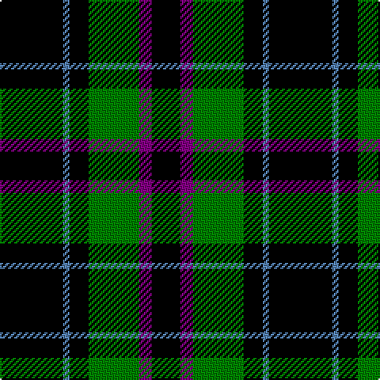

In pattern [KBGKBK](/patterns/kbgkbk/).

This was sourced from weddslist.  It is a [6 stripes tartan](/stripes/stripes6/).

Original link http://www.weddslist.com/cgi-bin/tartans/pg.pl?source=sts

## Thread count
K/40 B4 K12 G32 P8 K/18

## Palette
Each colour and its ΔE from the base-6 reference it is a variant of.

| Colour | Shade | Base | ΔE (OKLab) |
|---|---|---|---|
| B | <code style="background-color:#5480B0;">#5480B0</code> `#5480B0` | B <code style="background-color:#2A418A;">#2A418A</code> | 0.19 |
| G | <code style="background-color:#008000;">#008000</code> `#008000` | G <code style="background-color:#006100;">#006100</code> | 0.10 |
| K | <code style="background-color:#000000;">#000000</code> `#000000` | K <code style="background-color:#000000;">#000000</code> | 0.00 |
| P | <code style="background-color:#800080;">#800080</code> `#800080` | B <code style="background-color:#2A418A;">#2A418A</code> | 0.17 |

# Sample pattern

## Nearest tartans

The nearest existing variants by ΔTartan distance.

1. [Douglas, (Black)](/setts/s5/k12b3g23k23r3~b304080-g008000-k000000-rc00000~x2/) — ΔT 0.98
1. [Gunn](/setts/s6/g2k12g1k12g12r2~g008000-k000000-rc00000~x2/) — ΔT 1.14
1. [Murray](/setts/s6/b3k16g16k16ba3b3~b5480b0-ba304080-g008000-k000000~x2/) — ΔT 1.22
1. [MacAulay Hunting](/setts/s8/g6k16w1k16g8k4g12r2~g004c00-k000000-rc80000-wd0d0d0~x2/) — ΔT 1.26
1. [MacArthur](/setts/s5/k32g6k12g30y3~g004c00-k000000-yffff00/) — ΔT 1.30
1. [MacAuley, hunting](/setts/s8/g6k16w1k16g8k4g12r2~g008000-k000000-rc00000-we0e0e0~x2/) — ΔT 1.31
1. [Black Watch](/setts/s6/k5g23k18b21k33b3~b304080-g008000-k000000~x2/) — ΔT 1.32
1. [Campbell of Lochawe](/setts/s5/k2b11k26g11k2~b304080-g008000-k000000~x2/) — ΔT 1.35
1. [Wild Highlanders (Corporate)](/setts/s7/k36w3k10w3g28r6k18~g00643c-k101010-r901c38-wfcfcfc~x2/) — ΔT 1.36
1. [Frame (Edinburgh) (Personal)](/setts/s7/k16g15k4b12k22w2k6~b2888c4-g006818-k101010-wfcfcfc~x2/) — ΔT 1.38

## Neighbour map

Every grey dot is one of 15726 variants placed by the first two principal components of the ΔTartan feature space (44% of its variance). Red is this tartan; blue dots are its nearest — click one to open its page.

<svg viewBox="0 0 640 380" role="img" style="max-width:100%;height:auto;border:1px solid #e0e0e0;border-radius:4px;display:block" xmlns="http://www.w3.org/2000/svg"><image href="/nn/cloud.v1.png" width="640" height="380"/><a href="/setts/s5/k12b3g23k23r3~b304080-g008000-k000000-rc00000~x2/"><circle cx="255.6" cy="247.9" r="4" fill="#3465a4"><title>Douglas, (Black)</title></circle></a><a href="/setts/s6/g2k12g1k12g12r2~g008000-k000000-rc00000~x2/"><circle cx="320.8" cy="237.7" r="4" fill="#3465a4"><title>Gunn</title></circle></a><a href="/setts/s6/b3k16g16k16ba3b3~b5480b0-ba304080-g008000-k000000~x2/"><circle cx="230.7" cy="253.7" r="4" fill="#3465a4"><title>Murray</title></circle></a><a href="/setts/s8/g6k16w1k16g8k4g12r2~g004c00-k000000-rc80000-wd0d0d0~x2/"><circle cx="310.3" cy="214.8" r="4" fill="#3465a4"><title>MacAulay Hunting</title></circle></a><a href="/setts/s5/k32g6k12g30y3~g004c00-k000000-yffff00/"><circle cx="307.7" cy="257.2" r="4" fill="#3465a4"><title>MacArthur</title></circle></a><a href="/setts/s8/g6k16w1k16g8k4g12r2~g008000-k000000-rc00000-we0e0e0~x2/"><circle cx="283.4" cy="204.1" r="4" fill="#3465a4"><title>MacAuley, hunting</title></circle></a><a href="/setts/s6/k5g23k18b21k33b3~b304080-g008000-k000000~x2/"><circle cx="267.3" cy="255.4" r="4" fill="#3465a4"><title>Black Watch</title></circle></a><a href="/setts/s5/k2b11k26g11k2~b304080-g008000-k000000~x2/"><circle cx="319.9" cy="236.7" r="4" fill="#3465a4"><title>Campbell of Lochawe</title></circle></a><a href="/setts/s7/k36w3k10w3g28r6k18~g00643c-k101010-r901c38-wfcfcfc~x2/"><circle cx="326.6" cy="210.9" r="4" fill="#3465a4"><title>Wild Highlanders (Corporate)</title></circle></a><a href="/setts/s7/k16g15k4b12k22w2k6~b2888c4-g006818-k101010-wfcfcfc~x2/"><circle cx="302.7" cy="234.1" r="4" fill="#3465a4"><title>Frame (Edinburgh) (Personal)</title></circle></a><circle cx="296.0" cy="235.7" r="5" fill="#c00000"/></svg>

ID: /setts/s6/k20b2k6g16ba4k9~b5480b0-ba800080-g008000-k000000~x2/
