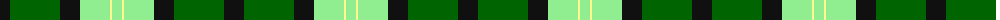

In pattern [KGKYWY](/patterns/kgkywy/).

This was sourced from register-of-tartans.  It is a [6 stripes tartan](/stripes/stripes6/).

Original link https://www.tartanregister.gov.uk/tartanDetails.aspx?ref=10204

## Thread count
K/20 G50 K20 LG30 LY2 LG/10

## Palette
Each colour and its ΔE from the base-6 reference it is a variant of.

| Colour | Shade | Base | ΔE (OKLab) |
|---|---|---|---|
| G | <code style="background-color:#006400;">#006400</code> `#006400` | G <code style="background-color:#006100;">#006100</code> | 0.01 |
| K | <code style="background-color:#101010;">#101010</code> `#101010` | K <code style="background-color:#000000;">#000000</code> | 0.17 |
| LG | <code style="background-color:#90EE90;">#90EE90</code> `#90EE90` | Y <code style="background-color:#F2BF00;">#F2BF00</code> | 0.16 |
| LY | <code style="background-color:#FFF68F;">#FFF68F</code> `#FFF68F` | W <code style="background-color:#F7F7F7;">#F7F7F7</code> | 0.13 |

# Sample pattern

## Nearest tartans

The nearest existing variants by ΔTartan distance.

1. [Delaware Fine Spirits Guild (Corp)](/setts/s6/k10g50k20y30ya2y10-g589058-k101010-y9cc484-yae8c000/) — ΔT 1.09
1. [Barber Family (Personal)](/setts/s4/y60g60r2b32-b2c2c80-g006818-rc80000-yfccc00/) — ΔT 1.57
1. [Hibernian F. C. (2004) (C orporate)](/setts/s8/g42w4g42k34ga24b12k4w2-b780078-g289c18-ga285800-k101010-we0e0e0/) — ΔT 1.69
1. [Herbage](/setts/s5/g100k32ga40r4ga12-g008000-ga808080-k000000-rc00000/) — ΔT 1.75
1. [MacKay Dress](/setts/s6/b8w46g4k46g46k8-b1474b4-g006818-k101010-we0e0e0/) — ΔT 1.80
1. [Marie Curie Fields of Hope](/setts/s9/g32y4g8y4g10k28ga56y4ga14-g30a010-ga008000-k000000-yf0c000/) — ΔT 1.86
1. [Vancouver, Centennial](/setts/s6/g8y4g48w24b52r2-b304080-g008000-rc00000-we0e0e0-yf0c000/) — ΔT 1.90
1. [John Telfar, Dunbar hunting](/setts/s7/g10k4g56k20r52b8g8-b304080-g008000-k000000-r806050/) — ΔT 1.90
1. [McCabe (2016)](/setts/s6/b48y6g30y72r6g12-b000080-g003820-rdc0000-yfff000/) — ΔT 1.92
1. [Kilkenny](/setts/s7/r10g54ra4ga50y14g6r6-g003000-ga30a010-r802040-ra906030-yf0c000/) — ΔT 1.93

## Neighbour map

Every grey dot is one of 15726 variants placed by the first two principal components of the ΔTartan feature space (44% of its variance). Red is this tartan; blue dots are its nearest — click one to open its page.

<svg viewBox="0 0 640 380" role="img" style="max-width:100%;height:auto;border:1px solid #e0e0e0;border-radius:4px;display:block" xmlns="http://www.w3.org/2000/svg"><image href="/nn/cloud.v1.png" width="640" height="380"/><a href="/setts/s6/k10g50k20y30ya2y10-g589058-k101010-y9cc484-yae8c000/"><circle cx="222.2" cy="172.3" r="4" fill="#3465a4"><title>Delaware Fine Spirits Guild (Corp)</title></circle></a><a href="/setts/s4/y60g60r2b32-b2c2c80-g006818-rc80000-yfccc00/"><circle cx="213.0" cy="190.6" r="4" fill="#3465a4"><title>Barber Family (Personal)</title></circle></a><a href="/setts/s8/g42w4g42k34ga24b12k4w2-b780078-g289c18-ga285800-k101010-we0e0e0/"><circle cx="232.5" cy="158.8" r="4" fill="#3465a4"><title>Hibernian F. C. (2004) (C orporate)</title></circle></a><a href="/setts/s5/g100k32ga40r4ga12-g008000-ga808080-k000000-rc00000/"><circle cx="299.2" cy="180.4" r="4" fill="#3465a4"><title>Herbage</title></circle></a><a href="/setts/s6/b8w46g4k46g46k8-b1474b4-g006818-k101010-we0e0e0/"><circle cx="141.4" cy="195.7" r="4" fill="#3465a4"><title>MacKay Dress</title></circle></a><a href="/setts/s9/g32y4g8y4g10k28ga56y4ga14-g30a010-ga008000-k000000-yf0c000/"><circle cx="203.4" cy="170.2" r="4" fill="#3465a4"><title>Marie Curie Fields of Hope</title></circle></a><a href="/setts/s6/g8y4g48w24b52r2-b304080-g008000-rc00000-we0e0e0-yf0c000/"><circle cx="216.9" cy="149.6" r="4" fill="#3465a4"><title>Vancouver, Centennial</title></circle></a><a href="/setts/s7/g10k4g56k20r52b8g8-b304080-g008000-k000000-r806050/"><circle cx="250.5" cy="189.0" r="4" fill="#3465a4"><title>John Telfar, Dunbar hunting</title></circle></a><a href="/setts/s6/b48y6g30y72r6g12-b000080-g003820-rdc0000-yfff000/"><circle cx="186.2" cy="177.5" r="4" fill="#3465a4"><title>McCabe (2016)</title></circle></a><a href="/setts/s7/r10g54ra4ga50y14g6r6-g003000-ga30a010-r802040-ra906030-yf0c000/"><circle cx="199.0" cy="163.6" r="4" fill="#3465a4"><title>Kilkenny</title></circle></a><circle cx="183.0" cy="178.8" r="5" fill="#c00000"/></svg>

ID: /setts/s6/k20g50k20y30w2y10-g006400-k101010-wfff68f-y90ee90/
