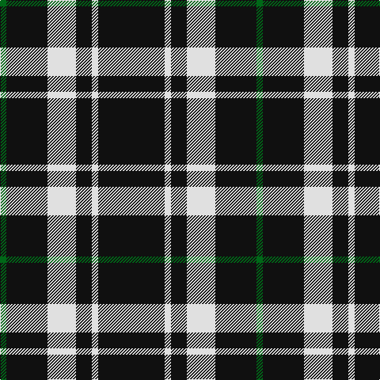

In pattern [GKWKWK](/patterns/gkwkwk/).

This was sourced from house-of-tartan.  It is a [6 stripes tartan](/stripes/stripes6/).

Original link http://www.house-of-tartan.scotland.net/house/TartanViewjs.asp?colr=Def&tnam=3250

## Thread count
G/8 K52 LN36 K20 LN8 K/84

## Palette
Each colour and its ΔE from the base-6 reference it is a variant of.

| Colour | Shade | Base | ΔE (OKLab) |
|---|---|---|---|
| G | <code style="background-color:#006818;">#006818</code> `#006818` | G <code style="background-color:#006100;">#006100</code> | 0.02 |
| K | <code style="background-color:#101010;">#101010</code> `#101010` | K <code style="background-color:#000000;">#000000</code> | 0.17 |
| LN | <code style="background-color:#E0E0E0;">#E0E0E0</code> `#E0E0E0` | W <code style="background-color:#F7F7F7;">#F7F7F7</code> | 0.07 |

# Sample pattern

## Nearest tartans

The nearest existing variants by ΔTartan distance.

1. [Believe - Colette](/setts/s7/b3k31w6k8b3k12w2x2~b5c5c5c-k101010-wfcfcfc/) — ΔT 1.15
1. [Believe - Colette](/setts/s7/b3k31w6k7b3k12w2x2~b646464-k101010-wffffff/) — ΔT 1.15
1. [Punky Princess (Fashion)](/setts/s7/k14r2k4w3k12r8k1x2~k101010-re87878-wc0c0c0/) — ΔT 1.16
1. [New Zealand (2000)](/setts/s6/k21w2k5w9k13g2x4~g007800-k000000-wc8c8c8/) — ΔT 1.23
1. [Ochterlonie](/setts/s6/b30w7b18w11b6y3x2~b102040-we0e0e0-yf0c000/) — ΔT 1.24
1. [Black 1990 (Name)](/setts/s6/k17r6k2w6k17y2x2~k101010-r880000-we0e0e0-ybc8c00/) — ΔT 1.29
1. [Jensen, Sven (Personal)](/setts/s9/g12k8w6k22w3k8w3k40g6~g006818-k101010-we0e0e0/) — ΔT 1.36
1. [Anzac (Fashion)](/setts/s8/k21w2k4w4b2w4k13g2x4~b4c3428-g006818-k101010-wc0c0c0/) — ΔT 1.36
1. [Black Clan/Family Tartan Tartan Number: 2761. Earliest known date: pre 1945 In 1990, taken to a TECA stand at one of the US Highland Games by a Timothy Wood, who explained that his faher had 'found' it in a shop in northern England during World War II. See products available Copyright © Blair Urquhart, Comrie, 2015](/setts/s6/k17r6k2w6k17y2x2~k101010-r880000-wc0c0c0-yd09800/) — ΔT 1.41
1. [Lundy Reform](/setts/s7/k2w5k1w1k10r1k1x4~k101010-rc80000-wc0c0c0/) — ΔT 1.41

## Neighbour map

Every grey dot is one of 15726 variants placed by the first two principal components of the ΔTartan feature space (44% of its variance). Red is this tartan; blue dots are its nearest — click one to open its page.

<svg viewBox="0 0 640 380" role="img" style="max-width:100%;height:auto;border:1px solid #e0e0e0;border-radius:4px;display:block" xmlns="http://www.w3.org/2000/svg"><image href="/nn/cloud.v1.png" width="640" height="380"/><a href="/setts/s7/b3k31w6k8b3k12w2x2~b5c5c5c-k101010-wfcfcfc/"><circle cx="473.5" cy="202.0" r="4" fill="#3465a4"><title>Believe - Colette</title></circle></a><a href="/setts/s7/b3k31w6k7b3k12w2x2~b646464-k101010-wffffff/"><circle cx="470.3" cy="199.7" r="4" fill="#3465a4"><title>Believe - Colette</title></circle></a><a href="/setts/s7/k14r2k4w3k12r8k1x2~k101010-re87878-wc0c0c0/"><circle cx="397.4" cy="217.7" r="4" fill="#3465a4"><title>Punky Princess (Fashion)</title></circle></a><a href="/setts/s6/k21w2k5w9k13g2x4~g007800-k000000-wc8c8c8/"><circle cx="413.3" cy="241.9" r="4" fill="#3465a4"><title>New Zealand (2000)</title></circle></a><a href="/setts/s6/b30w7b18w11b6y3x2~b102040-we0e0e0-yf0c000/"><circle cx="381.6" cy="236.0" r="4" fill="#3465a4"><title>Ochterlonie</title></circle></a><a href="/setts/s6/k17r6k2w6k17y2x2~k101010-r880000-we0e0e0-ybc8c00/"><circle cx="370.3" cy="228.7" r="4" fill="#3465a4"><title>Black 1990 (Name)</title></circle></a><a href="/setts/s9/g12k8w6k22w3k8w3k40g6~g006818-k101010-we0e0e0/"><circle cx="414.3" cy="202.6" r="4" fill="#3465a4"><title>Jensen, Sven (Personal)</title></circle></a><a href="/setts/s8/k21w2k4w4b2w4k13g2x4~b4c3428-g006818-k101010-wc0c0c0/"><circle cx="400.6" cy="194.1" r="4" fill="#3465a4"><title>Anzac (Fashion)</title></circle></a><a href="/setts/s6/k17r6k2w6k17y2x2~k101010-r880000-wc0c0c0-yd09800/"><circle cx="378.5" cy="232.1" r="4" fill="#3465a4"><title>Black Clan/Family Tartan Tartan Number: 2761. Earliest known date: pre 1945 In 1990, taken to a TECA stand at one of the US Highland Games by a Timothy Wood, who explained that his faher had 'found' it in a shop in northern England during World War II. See products available Copyright © Blair Urquhart, Comrie, 2015</title></circle></a><a href="/setts/s7/k2w5k1w1k10r1k1x4~k101010-rc80000-wc0c0c0/"><circle cx="374.8" cy="202.4" r="4" fill="#3465a4"><title>Lundy Reform</title></circle></a><circle cx="413.7" cy="235.4" r="5" fill="#c00000"/></svg>

ID: /setts/s6/k21w2k5w9k13g2x4~g006818-k101010-we0e0e0/
