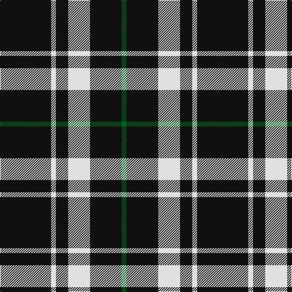

In pattern [GKWKWK](/stripes/gkwkwk/).

This was sourced from house-of-tartan.  It is a [6 stripe tartan](/stripes/stripes6/).

Original link http://www.house-of-tartan.scotland.net/house/TartanViewjs.asp?colr=Def&tnam=3250

## Thread count
K/84 LN8 K20 LN36 K52 G/8

## Palette
Each colour and the base-6 reference it is a variant of.

| Colour | Shade | Base |
|---|---|---|
| G | <code style="background-color:#006818;">#006818</code> `oklch(45.0% 0.142 145.0)` <small>#006818</small> | G <code style="background-color:#006100;">#006100</code> |
| K | <code style="background-color:#101010;">#101010</code> `oklch(17.3% 0.000 89.9)` <small>#101010</small> | K <code style="background-color:#000000;">#000000</code> |
| LN | <code style="background-color:#E0E0E0;">#E0E0E0</code> `oklch(90.7% 0.000 89.9)` <small>#E0E0E0</small> | W <code style="background-color:#F7F7F7;">#F7F7F7</code> |

# Sample pattern

## Nearest tartans

The nearest existing variants by ΔTartan distance.

1. [Believe - Colette](/setts/s7/n3k31w6k8n3k12w2~x2/) — ΔT 1.15
1. [Believe - Colette](/setts/s7/n3k31w6k7n3k12w2~x2/) — ΔT 1.15
1. [Punky Princess (Fashion)](/setts/s7/k14r2k4lb3k12r8k1~x2/) — ΔT 1.17
1. [New Zealand (2000)](/setts/s6/k21lb2k5lb9k13g2~x4/) — ΔT 1.23
1. [Ochterlonie](/setts/s6/dt30w7dt18w11dt6ly3~x2/) — ΔT 1.24
1. [Black 1990 (Name)](/setts/s6/k17r6k2w6k17lo2~x2/) — ΔT 1.29
1. [Jensen, Sven (Personal)](/setts/s9/g12k8w6k22w3k8w3k40g6/) — ΔT 1.36
1. [Anzac (Fashion)](/setts/s8/k21lb2k4lb4do2lb4k13g2~x4/) — ΔT 1.36
1. [Lundy Reform](/setts/s7/k2lb5k1lb1k10r1k1~x4/) — ΔT 1.41
1. [Black (symmetrical)](/setts/s6/k17r6k2lb6k17lo2~x2/) — ΔT 1.43

## Neighbour map

Every grey dot is one of 14299 variants placed by the first two principal components of the ΔTartan feature space (44% of its variance). Red is this tartan; blue dots are its nearest — click one to open its page.

<svg viewBox="0 0 640 380" role="img" style="max-width:100%;height:auto;border:1px solid #e0e0e0;border-radius:4px;display:block" xmlns="http://www.w3.org/2000/svg"><image href="/nn/cloud.v1.png" width="640" height="380"/><a href="/setts/s7/n3k31w6k8n3k12w2~x2/"><circle cx="475.5" cy="194.2" r="4" fill="#3465a4"><title>Believe - Colette</title></circle></a><a href="/setts/s7/n3k31w6k7n3k12w2~x2/"><circle cx="472.3" cy="191.8" r="4" fill="#3465a4"><title>Believe - Colette</title></circle></a><a href="/setts/s7/k14r2k4lb3k12r8k1~x2/"><circle cx="399.0" cy="210.5" r="4" fill="#3465a4"><title>Punky Princess (Fashion)</title></circle></a><a href="/setts/s6/k21lb2k5lb9k13g2~x4/"><circle cx="415.9" cy="233.9" r="4" fill="#3465a4"><title>New Zealand (2000)</title></circle></a><a href="/setts/s6/dt30w7dt18w11dt6ly3~x2/"><circle cx="384.0" cy="228.3" r="4" fill="#3465a4"><title>Ochterlonie</title></circle></a><a href="/setts/s6/k17r6k2w6k17lo2~x2/"><circle cx="372.1" cy="222.4" r="4" fill="#3465a4"><title>Black 1990 (Name)</title></circle></a><a href="/setts/s9/g12k8w6k22w3k8w3k40g6/"><circle cx="416.7" cy="197.5" r="4" fill="#3465a4"><title>Jensen, Sven (Personal)</title></circle></a><a href="/setts/s8/k21lb2k4lb4do2lb4k13g2~x4/"><circle cx="402.9" cy="188.6" r="4" fill="#3465a4"><title>Anzac (Fashion)</title></circle></a><a href="/setts/s7/k2lb5k1lb1k10r1k1~x4/"><circle cx="377.0" cy="195.3" r="4" fill="#3465a4"><title>Lundy Reform</title></circle></a><a href="/setts/s6/k17r6k2lb6k17lo2~x2/"><circle cx="381.5" cy="227.4" r="4" fill="#3465a4"><title>Black (symmetrical)</title></circle></a><circle cx="415.8" cy="227.2" r="5" fill="#c00000"/></svg>

ID: /setts/s6/k21w2k5w9k13g2~x4/
