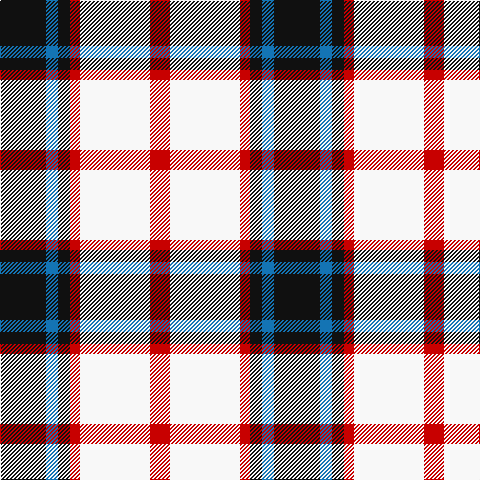

**Bands:** [KBKRWR](/stripes/kbkrwr/) · **Stripes:** [K B K R W R](/stripes/stripes6/) K B K R W R

This was sourced from register-of-tartans.  It is a [6 band tartan](/bands/bands6/).

Original link https://www.tartanregister.gov.uk/tartanDetails.aspx?ref=2939

## Attestations

This cloth appears in 2 source records; the oldest owns this page.

- 01/01/2000 — Merrilees Dress (Dance) (register-of-tartans, [record](https://www.tartanregister.gov.uk/tartanDetails.aspx?ref=2939))
- pre 2000 — Merrilees Dress (Dance) (tartans-authority, [record](http://www.tartansauthority.com/tartan-ferret/display/6369/))

## Register references

External register numbers recorded for this tartan.

- Scottish Register of Tartans: [2939](https://www.tartanregister.gov.uk/tartanDetails.aspx?ref=2939)
- Scottish Tartans Authority (ITI): 6369

## Thread count
K/46 B12 K12 R10 W70 R/20

## Palette
Each colour and its ΔE from the base-6 reference it is a variant of.

| Colour | Shade | Base | ΔE (OKLab) |
|---|---|---|---|
| B | <code style="background-color:#1474B4;">#1474B4</code> `#1474B4` | B <code style="background-color:#2A418A;">#2A418A</code> | 0.15 |
| K | <code style="background-color:#101010;">#101010</code> `#101010` | K <code style="background-color:#000000;">#000000</code> | 0.17 |
| R | <code style="background-color:#C80000;">#C80000</code> `#C80000` | R <code style="background-color:#CC0000;">#CC0000</code> | 0.01 |
| W | <code style="background-color:#F8F8F8;">#F8F8F8</code> `#F8F8F8` | W <code style="background-color:#F7F7F7;">#F7F7F7</code> | 0.00 |

# Sample pattern

## Nearest tartans

The nearest existing variants by ΔTartan distance.

1. [Merrilees](/setts/s6/w23t6w6r5k35r10~x2/) — ΔT 0.44
1. [Thomson, Camel (Fashion)](/setts/s6/r4ly30k6w13k13w3~x2/) — ΔT 0.90
1. [Fraser Dress](/setts/s6/r6k14r6dg14w27k4/) — ΔT 0.92
1. [Thompson Grey Dress](/setts/s6/r1o6k1w3k3r1~x8/) — ΔT 0.94
1. [Thompson Grey Family Tartan Tartan Number: 1611. Earliest known date: pre 2003 Designed for Lord Thomson of Fleet in 1958 based on a sample in the Moy Hall collection dating from the mid 19th century. The tartan is also suitable for MacTavishs and Thompsons, who claim descent from the Clan MacIntosh. See products available Copyright © Blair Urquhart, Comrie, 2015](/setts/s6/r2o20k5w10k10r2~x2/) — ΔT 0.95
1. [Thompson Camel Clan Tartan Tartan Number: 2421. Earliest known date: 1967 Designed by Scotty Thompson. It it a simple colour variation on the usual blue Thompson, but is often confused with the Burberry Check. See products available Copyright © Blair Urquhart, Comrie, 2015](/setts/s6/r2lo20k5w10k10w2~x2/) — ΔT 0.98
1. [Thomson Camel](/setts/s6/r4lo30k6w13k13w3~x2/) — ΔT 1.02
1. [Common Ground (Dress)](/setts/s5/ly3db27w16r27w3~x2/) — ΔT 1.03
1. [Holden Beige (Corporate)](/setts/s8/lb13k3lb3k3lb3k15lo18r3~x2/) — ΔT 1.18
1. [Black and White Golf](/setts/s7/ly9k32g6w20ly3w9k5~x2/) — ΔT 1.18

## Neighbour map

Every grey dot is one of 14313 variants placed by the first two principal components of the ΔTartan feature space (44% of its variance). Red is this tartan; blue dots are its nearest — click one to open its page.

<svg viewBox="0 0 640 380" role="img" style="max-width:100%;height:auto;border:1px solid #e0e0e0;border-radius:4px;display:block" xmlns="http://www.w3.org/2000/svg"><image href="/nn/cloud.v1.png" width="640" height="380"/><a href="/setts/s6/w23t6w6r5k35r10~x2/"><circle cx="157.4" cy="193.6" r="4" fill="#3465a4"><title>Merrilees</title></circle></a><a href="/setts/s6/r4ly30k6w13k13w3~x2/"><circle cx="186.1" cy="183.5" r="4" fill="#3465a4"><title>Thomson, Camel (Fashion)</title></circle></a><a href="/setts/s6/r6k14r6dg14w27k4/"><circle cx="120.5" cy="207.8" r="4" fill="#3465a4"><title>Fraser Dress</title></circle></a><a href="/setts/s6/r1o6k1w3k3r1~x8/"><circle cx="144.9" cy="214.3" r="4" fill="#3465a4"><title>Thompson Grey Dress</title></circle></a><a href="/setts/s6/r2o20k5w10k10r2~x2/"><circle cx="174.7" cy="192.4" r="4" fill="#3465a4"><title>Thompson Grey Family Tartan Tartan Number: 1611. Earliest known date: pre 2003 Designed for Lord Thomson of Fleet in 1958 based on a sample in the Moy Hall collection dating from the mid 19th century. The tartan is also suitable for MacTavishs and Thompsons, who claim descent from the Clan MacIntosh. See products available Copyright © Blair Urquhart, Comrie, 2015</title></circle></a><a href="/setts/s6/r2lo20k5w10k10w2~x2/"><circle cx="176.6" cy="190.1" r="4" fill="#3465a4"><title>Thompson Camel Clan Tartan Tartan Number: 2421. Earliest known date: 1967 Designed by Scotty Thompson. It it a simple colour variation on the usual blue Thompson, but is often confused with the Burberry Check. See products available Copyright © Blair Urquhart, Comrie, 2015</title></circle></a><a href="/setts/s6/r4lo30k6w13k13w3~x2/"><circle cx="190.7" cy="187.0" r="4" fill="#3465a4"><title>Thomson Camel</title></circle></a><a href="/setts/s5/ly3db27w16r27w3~x2/"><circle cx="149.6" cy="201.9" r="4" fill="#3465a4"><title>Common Ground (Dress)</title></circle></a><a href="/setts/s8/lb13k3lb3k3lb3k15lo18r3~x2/"><circle cx="129.0" cy="191.3" r="4" fill="#3465a4"><title>Holden Beige (Corporate)</title></circle></a><a href="/setts/s7/ly9k32g6w20ly3w9k5~x2/"><circle cx="178.1" cy="173.6" r="4" fill="#3465a4"><title>Black and White Golf</title></circle></a><circle cx="154.7" cy="190.5" r="5" fill="#c00000"/></svg>

ID: /setts/s6/k23b6k6r5w35r10~x2/
