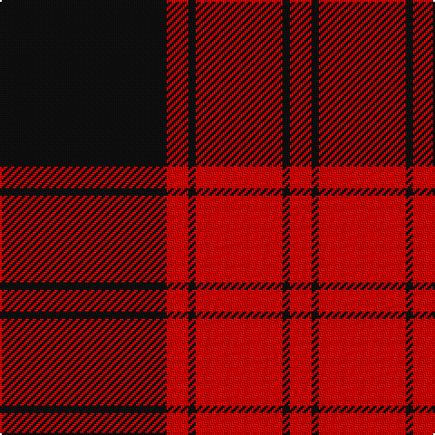

**Bands:** [KRKRKR](/stripes/krkrkr/) · **Stripes:** [K R K R K R](/stripes/stripes6/) K R K R K R

This was sourced from register-of-tartans.  It is a [6 band tartan](/bands/bands6/).

Original link https://www.tartanregister.gov.uk/tartanDetails.aspx?ref=11082

## Attestations

This cloth appears in 3 source records; the oldest owns this page.

- 29/05/2014 — Ewing (register-of-tartans, [record](https://www.tartanregister.gov.uk/tartanDetails.aspx?ref=11082))
- 2014 — Ewing (Clan) (tartans-authority, [record](http://www.tartansauthority.com/tartan-ferret/display/11082/))
- undated — Ewing Clan Tartan Tartan Number: 11082. Earliest known date: 2014 Following official recognition, this tartan was chosen by the new Commander of Clan Ewing, John Thor Ewing, as the Clan Ewing tartan. The tartan takes its inspiration from the plaid of John Ewing in Heiddykis of Kirkmichael (d.1609), described in his testament as 'sax ellis of reid & blak cullerit claith' The design relates to historical and traditional tartans from the areas and clans among which Clan Ewing has its roots. This tartan is woven to order by Lochcarron on behalf of Clan Ewing. All weavers must seek permission from John Thor Ewing as registrant and copyright holder. See products available Copyright © Blair Urquhart, Comrie, 2015 (house-of-tartan, [record](http://www.house-of-tartan.scotland.net/house/TartanViewjs.asp?colr=Def&tnam=11082))

## Register references

External register numbers recorded for this tartan.

- Scottish Register of Tartans: [11082](https://www.tartanregister.gov.uk/tartanDetails.aspx?ref=11082)

## Variants

Other setts woven to the same stripe pattern.

- [Aragon (Erskine)](/setts/s6/k6r1k24r28k1r4~x2/)
- [Cameron Black & Red (Dress)](/setts/s6/k2r12k2r12k33r2~x2/)
- [Cameron, Black & Red (dress)](/setts/s6/k1r4k1r4k13r1~x4/)
- [Erskine (Paton)](/setts/s6/k31r4k47r47k4r31~x2/)
- [Erskine, Black & Red (Clan)](/setts/s6/k6r3k28r28k3r6~x2/)
- [The Mary Erskine](/setts/s6/k3r1k16r16k1r3~x4/)

## Thread count
K/92 R12 K4 R48 K4 R/12

## Palette
Each colour and its ΔE from the base-6 reference it is a variant of.

| Colour | Shade | Base | ΔE (OKLab) |
|---|---|---|---|
| K | <code style="background-color:#101010;">#101010</code> `#101010` | K <code style="background-color:#000000;">#000000</code> | 0.17 |
| R | <code style="background-color:#DC0000;">#DC0000</code> `#DC0000` | R <code style="background-color:#CC0000;">#CC0000</code> | 0.03 |

# Sample pattern

## Nearest tartans

The nearest existing variants by ΔTartan distance.

1. [Aragon (Erskine)](/setts/s6/k6r1k24r28k1r4~x2/) — ΔT 0.78
1. [Campbell Red (artefact)](/setts/s5/r4k1r24k22r2~x2/) — ΔT 1.05
1. [Murray of Ochtertyre #2](/setts/s8/k30r3k2r3k2r27k30r4~x2/) — ΔT 1.20
1. [Masai Shuka 15 (Artefact)](/setts/s5/r20k2r2k15w1~x2/) — ΔT 1.24
1. [The Mary Erskine](/setts/s6/k3r1k16r16k1r3~x4/) — ΔT 1.29
1. [MacIver](/setts/s5/k16r2k2r12w1~x2/) — ΔT 1.30
1. [Ramsay of Dalhousie](/setts/s6/k4w2k28r30k1r3~x2/) — ΔT 1.38
1. [Cunningham](/setts/s7/k3r1k30r28k1r1w3~x2/) — ΔT 1.40
1. [Cunningham #2](/setts/s7/k3r2k30r28k2r2w3~x2/) — ΔT 1.41
1. [Forget Family (Red)](/setts/s6/r42k2w2k18w2k5~x2/) — ΔT 1.41

## Neighbour map

Every grey dot is one of 14313 variants placed by the first two principal components of the ΔTartan feature space (44% of its variance). Red is this tartan; blue dots are its nearest — click one to open its page.

<svg viewBox="0 0 640 380" role="img" style="max-width:100%;height:auto;border:1px solid #e0e0e0;border-radius:4px;display:block" xmlns="http://www.w3.org/2000/svg"><image href="/nn/cloud.v1.png" width="640" height="380"/><a href="/setts/s6/k6r1k24r28k1r4~x2/"><circle cx="417.0" cy="183.3" r="4" fill="#3465a4"><title>Aragon (Erskine)</title></circle></a><a href="/setts/s5/r4k1r24k22r2~x2/"><circle cx="421.2" cy="192.4" r="4" fill="#3465a4"><title>Campbell Red (artefact)</title></circle></a><a href="/setts/s8/k30r3k2r3k2r27k30r4~x2/"><circle cx="438.3" cy="204.9" r="4" fill="#3465a4"><title>Murray of Ochtertyre #2</title></circle></a><a href="/setts/s5/r20k2r2k15w1~x2/"><circle cx="386.6" cy="184.1" r="4" fill="#3465a4"><title>Masai Shuka 15 (Artefact)</title></circle></a><a href="/setts/s6/k3r1k16r16k1r3~x4/"><circle cx="376.2" cy="205.3" r="4" fill="#3465a4"><title>The Mary Erskine</title></circle></a><a href="/setts/s5/k16r2k2r12w1~x2/"><circle cx="360.5" cy="195.4" r="4" fill="#3465a4"><title>MacIver</title></circle></a><a href="/setts/s6/k4w2k28r30k1r3~x2/"><circle cx="371.0" cy="150.9" r="4" fill="#3465a4"><title>Ramsay of Dalhousie</title></circle></a><a href="/setts/s7/k3r1k30r28k1r1w3~x2/"><circle cx="377.4" cy="133.6" r="4" fill="#3465a4"><title>Cunningham</title></circle></a><a href="/setts/s7/k3r2k30r28k2r2w3~x2/"><circle cx="351.2" cy="167.0" r="4" fill="#3465a4"><title>Cunningham #2</title></circle></a><a href="/setts/s6/r42k2w2k18w2k5~x2/"><circle cx="401.8" cy="151.2" r="4" fill="#3465a4"><title>Forget Family (Red)</title></circle></a><circle cx="431.2" cy="184.0" r="5" fill="#c00000"/></svg>

ID: /setts/s6/k23r3k1r12k1r3~x4/
