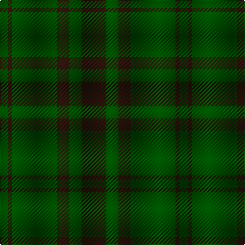

In pattern [GKGKGK](/patterns/gkgkgk/).

This was sourced from tartans-authority.  It is a [6 stripes tartan](/stripes/stripes6/).

Original link http://www.tartansauthority.com/tartan-ferret/display/4464/

## Thread count
G/8 K4 G44 K12 G12 K/24

## Palette
Each colour and its ΔE from the base-6 reference it is a variant of.

| Colour | Shade | Base | ΔE (OKLab) |
|---|---|---|---|
| G | <code style="background-color:#004C00;">#004C00</code> `#004C00` | G <code style="background-color:#006100;">#006100</code> | 0.07 |
| K | <code style="background-color:#28140C;">#28140C</code> `#28140C` | K <code style="background-color:#000000;">#000000</code> | 0.22 |

# Sample pattern

## Nearest tartans

The nearest existing variants by ΔTartan distance.

1. [Graham](/setts/s4/g24k8g2k8-g005020-k101010/) — ΔT 1.46
1. [Glen Boig](/setts/s5/g74r18g6b18r6-b401000-g006020-r806050/) — ΔT 1.75
1. [Erskine Hunting](/setts/s6/g10ga6g48ga48g6ga10-g003820-ga006818/) — ΔT 1.95
1. [Dunbar Hunting](/setts/s6/g8k4g56k16ga42g6-g006818-ga003820-k101010/) — ΔT 2.06
1. [MacSporran Rejected design](/setts/s6/g60ga26g14ga60g4y8-g002814-ga005020-ye8c000/) — ΔT 2.10
1. [Glen Trool District Tartan Tartan Number: 914. Earliest known date: pre 1945 Glen Trool is in the Galloway Uplands in the Southwest of Scotland. The tartan began life as a trade sett - a colourful fashion fabric - and was given a name merely to identify it. It proved very popular and is now recognised as a District Tartan. See products available Copyright © Blair Urquhart, Comrie, 2015](/setts/s5/g74ga18g6r18ga6-g003820-ga604000-rc80000/) — ΔT 2.15
1. [Guildry of Stirling](/setts/s10/g36k6g6k6g6k42ga4k42g42k8-g005014-ga3c6838-k101010/) — ΔT 2.16
1. [Crawford](/setts/s7/b12y4b60g24b6g24b6-b59110d-g11450d-yaaaaaa/) — ΔT 2.17
1. [Crawford](/setts/s7/b6y2b30g12b3g12b3-b59110d-g11450d-yaaaaaa/) — ΔT 2.17
1. [Harmony, 11](/setts/s6/g12r4g58r58g4r12-g008000-r806050/) — ΔT 2.20

## Neighbour map

Every grey dot is one of 15726 variants placed by the first two principal components of the ΔTartan feature space (44% of its variance). Red is this tartan; blue dots are its nearest — click one to open its page.

<svg viewBox="0 0 640 380" role="img" style="max-width:100%;height:auto;border:1px solid #e0e0e0;border-radius:4px;display:block" xmlns="http://www.w3.org/2000/svg"><image href="/nn/cloud.v1.png" width="640" height="380"/><a href="/setts/s4/g24k8g2k8-g005020-k101010/"><circle cx="487.4" cy="311.8" r="4" fill="#3465a4"><title>Graham</title></circle></a><a href="/setts/s5/g74r18g6b18r6-b401000-g006020-r806050/"><circle cx="491.4" cy="262.6" r="4" fill="#3465a4"><title>Glen Boig</title></circle></a><a href="/setts/s6/g10ga6g48ga48g6ga10-g003820-ga006818/"><circle cx="475.2" cy="326.1" r="4" fill="#3465a4"><title>Erskine Hunting</title></circle></a><a href="/setts/s6/g8k4g56k16ga42g6-g006818-ga003820-k101010/"><circle cx="399.0" cy="261.0" r="4" fill="#3465a4"><title>Dunbar Hunting</title></circle></a><a href="/setts/s6/g60ga26g14ga60g4y8-g002814-ga005020-ye8c000/"><circle cx="393.5" cy="263.8" r="4" fill="#3465a4"><title>MacSporran Rejected design</title></circle></a><a href="/setts/s5/g74ga18g6r18ga6-g003820-ga604000-rc80000/"><circle cx="476.1" cy="251.7" r="4" fill="#3465a4"><title>Glen Trool District Tartan Tartan Number: 914. Earliest known date: pre 1945 Glen Trool is in the Galloway Uplands in the Southwest of Scotland. The tartan began life as a trade sett - a colourful fashion fabric - and was given a name merely to identify it. It proved very popular and is now recognised as a District Tartan. See products available Copyright © Blair Urquhart, Comrie, 2015</title></circle></a><a href="/setts/s10/g36k6g6k6g6k42ga4k42g42k8-g005014-ga3c6838-k101010/"><circle cx="399.1" cy="251.2" r="4" fill="#3465a4"><title>Guildry of Stirling</title></circle></a><a href="/setts/s7/b12y4b60g24b6g24b6-b59110d-g11450d-yaaaaaa/"><circle cx="491.9" cy="245.1" r="4" fill="#3465a4"><title>Crawford</title></circle></a><a href="/setts/s7/b6y2b30g12b3g12b3-b59110d-g11450d-yaaaaaa/"><circle cx="491.9" cy="245.1" r="4" fill="#3465a4"><title>Crawford</title></circle></a><a href="/setts/s6/g12r4g58r58g4r12-g008000-r806050/"><circle cx="479.7" cy="275.3" r="4" fill="#3465a4"><title>Harmony, 11</title></circle></a><circle cx="504.3" cy="310.6" r="5" fill="#c00000"/></svg>

ID: /setts/s6/k24g12k12g44k4g8-g004c00-k28140c/
