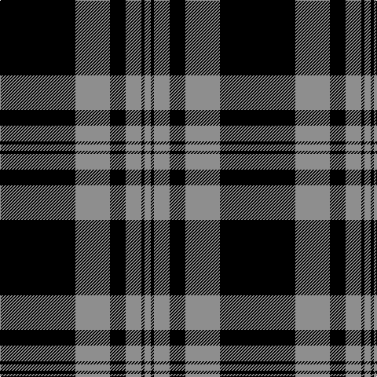

In pattern [KRKRKR](/patterns/krkrkr/).

This was sourced from house-of-tartan.  It is a [6 stripes tartan](/stripes/stripes6/).

Original link http://www.house-of-tartan.scotland.net/house/TartanViewjs.asp?colr=Def&tnam=6183

## Thread count
K/96 N44 K20 N20 K4 N/8

## Palette
Each colour and its ΔE from the base-6 reference it is a variant of.

| Colour | Shade | Base | ΔE (OKLab) |
|---|---|---|---|
| K | <code style="background-color:#000000;">#000000</code> `#000000` | K <code style="background-color:#000000;">#000000</code> | 0.00 |
| N | <code style="background-color:#8E8E8E;">#8E8E8E</code> `#8E8E8E` | R <code style="background-color:#CC0000;">#CC0000</code> | 0.25 |

# Sample pattern

## Nearest tartans

The nearest existing variants by ΔTartan distance.

1. [MacPhee, MacFee or MacIvor](/setts/s5/k22w3k3w11k1~k000000-we0e0e0~x2/) — ΔT 0.86
1. [Douglas VS](/setts/s8/k16g1k1g1k8g16k1g2~g7e7e7e-k000000~x2/) — ΔT 1.06
1. [Douglas VS](/setts/s8/k16g1k1g1k8g16k1g2~g707070-k000000~x2/) — ΔT 1.08
1. [Black Isle](/setts/s6/k53r22k10r10k2r4~k101010-r888888~x2/) — ΔT 1.21
1. [Moffat](/setts/s7/k39g3k3g3k14g28r3~g808080-k000000-rc00000~x2/) — ΔT 1.36
1. [DDB Canada (Fashion)](/setts/s7/k1r2k7r11k18y2k1~k101010-r888888-ye8c000~x2/) — ΔT 1.50
1. [Menzies](/setts/s8/k32w4k2w4k4w2k1w6~k000000-we0e0e0~x2/) — ΔT 1.55
1. [Glencoe](/setts/s5/k37w9k3g9w3~g008000-k000000-we0e0e0~x2/) — ΔT 1.57
1. [West Point](/setts/s8/k13g1k1g1k4g10y1g1~g808080-k000000-yf0c000~x6/) — ΔT 1.60
1. [Perry Ancient (Personal)](/setts/s5/k75g26g3k4y6~g808080-k101010-ye8c000~x2/) — ΔT 1.61

## Neighbour map

Every grey dot is one of 15726 variants placed by the first two principal components of the ΔTartan feature space (44% of its variance). Red is this tartan; blue dots are its nearest — click one to open its page.

<svg viewBox="0 0 640 380" role="img" style="max-width:100%;height:auto;border:1px solid #e0e0e0;border-radius:4px;display:block" xmlns="http://www.w3.org/2000/svg"><image href="/nn/cloud.v1.png" width="640" height="380"/><a href="/setts/s5/k22w3k3w11k1~k000000-we0e0e0~x2/"><circle cx="409.8" cy="210.6" r="4" fill="#3465a4"><title>MacPhee, MacFee or MacIvor</title></circle></a><a href="/setts/s8/k16g1k1g1k8g16k1g2~g7e7e7e-k000000~x2/"><circle cx="371.5" cy="199.1" r="4" fill="#3465a4"><title>Douglas VS</title></circle></a><a href="/setts/s8/k16g1k1g1k8g16k1g2~g707070-k000000~x2/"><circle cx="377.4" cy="202.2" r="4" fill="#3465a4"><title>Douglas VS</title></circle></a><a href="/setts/s6/k53r22k10r10k2r4~k101010-r888888~x2/"><circle cx="448.3" cy="203.6" r="4" fill="#3465a4"><title>Black Isle</title></circle></a><a href="/setts/s7/k39g3k3g3k14g28r3~g808080-k000000-rc00000~x2/"><circle cx="354.7" cy="201.5" r="4" fill="#3465a4"><title>Moffat</title></circle></a><a href="/setts/s7/k1r2k7r11k18y2k1~k101010-r888888-ye8c000~x2/"><circle cx="393.2" cy="192.4" r="4" fill="#3465a4"><title>DDB Canada (Fashion)</title></circle></a><a href="/setts/s8/k32w4k2w4k4w2k1w6~k000000-we0e0e0~x2/"><circle cx="476.9" cy="158.0" r="4" fill="#3465a4"><title>Menzies</title></circle></a><a href="/setts/s5/k37w9k3g9w3~g008000-k000000-we0e0e0~x2/"><circle cx="360.2" cy="214.3" r="4" fill="#3465a4"><title>Glencoe</title></circle></a><a href="/setts/s8/k13g1k1g1k4g10y1g1~g808080-k000000-yf0c000~x6/"><circle cx="334.9" cy="185.9" r="4" fill="#3465a4"><title>West Point</title></circle></a><a href="/setts/s5/k75g26g3k4y6~g808080-k101010-ye8c000~x2/"><circle cx="460.8" cy="187.8" r="4" fill="#3465a4"><title>Perry Ancient (Personal)</title></circle></a><circle cx="409.6" cy="206.6" r="5" fill="#c00000"/></svg>

ID: /setts/s6/k24r11k5r5k1r2~k000000-r8e8e8e~x4/
