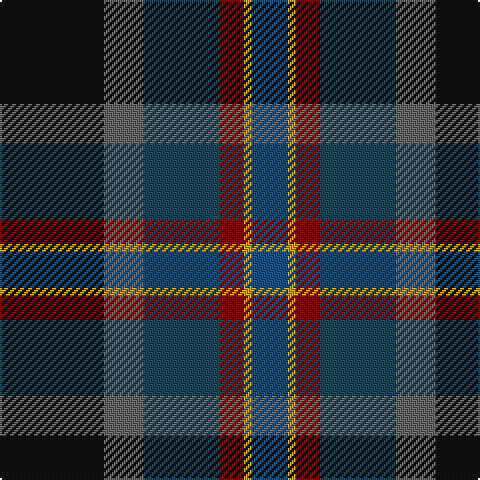

This page is one **sett** — a single exact thread-count. It belongs to the [tartan](/tartans/k26n10dt19r6ly2db9/)
(the same proportion at any scale), whose colour order is pattern [BYRBBK](/stripes/byrbbk/).

Sourced from register-of-tartans.  It is a [6 stripe tartan](/stripes/stripes6/).

Original link https://www.tartanregister.gov.uk/tartanDetails.aspx?ref=6027

2 attestations — the source records this cloth was collapsed from (oldest owns this page)

<ul>
<li>01/01/2007 — Meeson Hunting (register-of-tartans, <a href="https://www.tartanregister.gov.uk/tartanDetails.aspx?ref=6027">record</a>)</li>
<li>undated — Meeson Hunting Name Tartan Tartan Number: 6027. Earliest known date: 2007 Hunting version. The black and gray were originally woven with a melange or marled yarn. See products available Copyright © Blair Urquhart, Comrie, 2015 (house-of-tartan, <a href="http://www.house-of-tartan.scotland.net/house/TartanViewjs.asp?colr=Def&tnam=6027">record</a>)</li>
</ul>

## Register references

External register numbers recorded for this tartan.

- Scottish Register of Tartans: [6027](https://www.tartanregister.gov.uk/tartanDetails.aspx?ref=6027)

## Thread count
K/52 N20 DB38 DR12 DY4 B/18

## Palette

Palette: <strong>Tartan Register</strong> <small style="color:#888">(4 of 6 colours)</small>
<table><thead><tr><th>Colour</th><th>Threads</th><th>Shade</th><th>Base</th><th>OKLCh</th></tr></thead><tbody><tr><td>K/</td><td style="text-align:right;font-variant-numeric:tabular-nums">52</td><td><code style="background-color:#101010;">#101010</code> <small style="color:#888">#101010</small></td><td>K <code style="background-color:#000000;">#000000</code></td><td><small style="color:#888">oklch(17.3% 0.000 89.9)</small></td></tr><tr><td>N</td><td style="text-align:right;font-variant-numeric:tabular-nums">20</td><td><code style="background-color:#646464;">#646464</code> <small style="color:#888">#646464</small></td><td>B <code style="background-color:#2A418A;">#2A418A</code></td><td><small style="color:#888">oklch(50.3% 0.000 89.9)</small></td></tr><tr><td>DB</td><td style="text-align:right;font-variant-numeric:tabular-nums">38</td><td><code style="background-color:#184458;">#184458</code> <small style="color:#888">#184458</small></td><td>B <code style="background-color:#2A418A;">#2A418A</code></td><td><small style="color:#888">oklch(36.6% 0.059 231.2)</small></td></tr><tr><td>DR</td><td style="text-align:right;font-variant-numeric:tabular-nums">12</td><td><code style="background-color:#880000;">#880000</code> <small style="color:#888">#880000</small></td><td>R <code style="background-color:#CC0000;">#CC0000</code></td><td><small style="color:#888">oklch(39.4% 0.162 29.2)</small></td></tr><tr><td>DY</td><td style="text-align:right;font-variant-numeric:tabular-nums">4</td><td><code style="background-color:#C89800;">#C89800</code> <small style="color:#888">#C89800</small></td><td>Y <code style="background-color:#F2BF00;">#F2BF00</code></td><td><small style="color:#888">oklch(70.6% 0.144 85.9)</small></td></tr><tr><td>B/</td><td style="text-align:right;font-variant-numeric:tabular-nums">18</td><td><code style="background-color:#105088;">#105088</code> <small style="color:#888">#105088</small></td><td>B <code style="background-color:#2A418A;">#2A418A</code></td><td><small style="color:#888">oklch(42.4% 0.111 250.4)</small></td></tr></tbody></table>

# Sample pattern

## Nearest tartans

The nearest existing variants by ΔTartan distance, with this tartan at the top so the swatches line up against it.

ΔTartan

Tartan

Sett

—

<a href="/ttd/edit/#slug=k26n10dt19r6ly2db9~x2">Meeson Hunting</a> <a class="nn-out" href="/setts/s6/k26n10dt19r6ly2db9~x2/" title="open its dictionary page">↗</a>

0.92

<a href="/ttd/edit/#slug=r3dt24k7db11g11ly2~x2">Cowie</a> <a class="nn-out" href="/setts/s6/r3dt24k7db11g11ly2~x2/" title="open its dictionary page">↗</a>

1.10

<a href="/ttd/edit/#slug=lb3db17do16dt2dg17lo2~x2">Ancient Atlantic (Fashion)</a> <a class="nn-out" href="/setts/s6/lb3db17do16dt2dg17lo2~x2/" title="open its dictionary page">↗</a>

1.16

<a href="/ttd/edit/#slug=n15k10dt30dy11w3lg5~x2">McHale, Barry Name Tartan Tartan Number: 10708. Earliest known date: 27 September 2012 Barry McHale commissioned the production of this tartan to be worn at his wedding. It may be worn by any of his McHale relatives. See products available Copyright © Blair Urquhart, Comrie, 2015</a> <a class="nn-out" href="/setts/s6/n15k10dt30dy11w3lg5~x2/" title="open its dictionary page">↗</a>

1.19

<a href="/ttd/edit/#slug=db10dg5g5k1ly2k1db10~x2">Lenaghan (Personal)</a> <a class="nn-out" href="/setts/s7/db10dg5g5k1ly2k1db10~x2/" title="open its dictionary page">↗</a>

1.26

<a href="/ttd/edit/#slug=dg24lo2y16db7do16r5~x2">Waterford, County (District)</a> <a class="nn-out" href="/setts/s6/dg24lo2y16db7do16r5~x2/" title="open its dictionary page">↗</a>

1.29

<a href="/ttd/edit/#slug=r1dg14k14r2db14t1~x2">Wilson's No.221</a> <a class="nn-out" href="/setts/s6/r1dg14k14r2db14t1~x2/" title="open its dictionary page">↗</a>

1.30

<a href="/ttd/edit/#slug=k10dg9w2dg9k10r1db8dp12k3~x2">Hunter Graham</a> <a class="nn-out" href="/setts/s9/k10dg9w2dg9k10r1db8dp12k3~x2/" title="open its dictionary page">↗</a>

1.31

<a href="/ttd/edit/#slug=dp11db2t4db21k16dg19ly4~x2">Ayrshire (International Tartans)</a> <a class="nn-out" href="/setts/s7/dp11db2t4db21k16dg19ly4~x2/" title="open its dictionary page">↗</a>

1.31

<a href="/ttd/edit/#slug=db9w2dg25do10k15dp4~x2">Staley (2014)</a> <a class="nn-out" href="/setts/s6/db9w2dg25do10k15dp4~x2/" title="open its dictionary page">↗</a>

1.33

<a href="/ttd/edit/#slug=r4k15t4dt15dg24y4~x2">Haughfoot (Commemorative)</a> <a class="nn-out" href="/setts/s6/r4k15t4dt15dg24y4~x2/" title="open its dictionary page">↗</a>

## Neighbour map

Every grey dot is one of 14299 variants placed by the first two principal components of the ΔTartan feature space (44% of its variance). Red is this tartan; blue dots are its nearest — click one to open its page.

<svg viewBox="0 0 640 380" role="img" style="max-width:100%;height:auto;border:1px solid #e0e0e0;border-radius:4px;display:block" xmlns="http://www.w3.org/2000/svg"><image href="/nn/cloud.v1.png" width="640" height="380"/><a href="/setts/s6/r3dt24k7db11g11ly2~x2/"><circle cx="197.1" cy="207.8" r="4" fill="#3465a4"><title>Cowie</title></circle></a><a href="/setts/s6/lb3db17do16dt2dg17lo2~x2/"><circle cx="143.3" cy="213.6" r="4" fill="#3465a4"><title>Ancient Atlantic (Fashion)</title></circle></a><a href="/setts/s6/n15k10dt30dy11w3lg5~x2/"><circle cx="192.5" cy="219.8" r="4" fill="#3465a4"><title>McHale, Barry Name Tartan Tartan Number: 10708. Earliest known date: 27 September 2012 Barry McHale commissioned the production of this tartan to be worn at his wedding. It may be worn by any of his McHale relatives. See products available Copyright © Blair Urquhart, Comrie, 2015</title></circle></a><a href="/setts/s7/db10dg5g5k1ly2k1db10~x2/"><circle cx="131.6" cy="207.7" r="4" fill="#3465a4"><title>Lenaghan (Personal)</title></circle></a><a href="/setts/s6/dg24lo2y16db7do16r5~x2/"><circle cx="181.6" cy="222.8" r="4" fill="#3465a4"><title>Waterford, County (District)</title></circle></a><a href="/setts/s6/r1dg14k14r2db14t1~x2/"><circle cx="201.8" cy="211.0" r="4" fill="#3465a4"><title>Wilson's No.221</title></circle></a><a href="/setts/s9/k10dg9w2dg9k10r1db8dp12k3~x2/"><circle cx="145.2" cy="209.6" r="4" fill="#3465a4"><title>Hunter Graham</title></circle></a><a href="/setts/s7/dp11db2t4db21k16dg19ly4~x2/"><circle cx="111.2" cy="202.1" r="4" fill="#3465a4"><title>Ayrshire (International Tartans)</title></circle></a><a href="/setts/s6/db9w2dg25do10k15dp4~x2/"><circle cx="209.2" cy="228.9" r="4" fill="#3465a4"><title>Staley (2014)</title></circle></a><a href="/setts/s6/r4k15t4dt15dg24y4~x2/"><circle cx="157.6" cy="244.8" r="4" fill="#3465a4"><title>Haughfoot (Commemorative)</title></circle></a><circle cx="181.2" cy="214.4" r="5" fill="#c00000"/></svg>

ID: /setts/s6/k26n10dt19r6ly2db9~x2/
