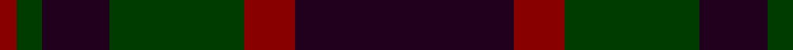
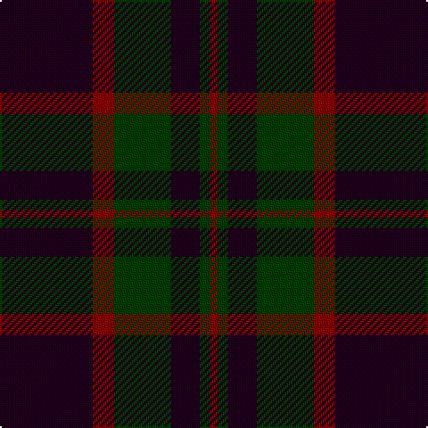

This page is one **sett** — a single exact thread-count. It belongs to the [tartan](/tartans/k26r6dg16k8dg3r2/)
(the same proportion at any scale), whose colour order is pattern [KRGKGR](/stripes/krgkgr/).

Sourced from register-of-tartans.  It is a [6 stripe tartan](/stripes/stripes6/).

Original link https://www.tartanregister.gov.uk/tartanDetails.aspx?ref=3327

## Register references

External register numbers recorded for this tartan.

- Scottish Register of Tartans: [3327](https://www.tartanregister.gov.uk/tartanDetails.aspx?ref=3327)
- Scottish Tartans Authority (ITI): 2410
- Scottish Tartans World Register: 2410

## Thread count
K/52 DR12 G32 K16 G6 DR/4

## Palette

Palette: <strong>Tartan Register</strong> <small style="color:#888">(1 of 3 colours)</small>
<table><thead><tr><th>Colour</th><th>Threads</th><th>Shade</th><th>Base</th><th>OKLCh</th></tr></thead><tbody><tr><td>K/</td><td style="text-align:right;font-variant-numeric:tabular-nums">52</td><td><code style="background-color:#20001C;">#20001C</code> <small style="color:#888">#20001C</small></td><td>K <code style="background-color:#000000;">#000000</code></td><td><small style="color:#888">oklch(16.8% 0.075 333.6)</small></td></tr><tr><td>DR</td><td style="text-align:right;font-variant-numeric:tabular-nums">12</td><td><code style="background-color:#880000;">#880000</code> <small style="color:#888">#880000</small></td><td>R <code style="background-color:#CC0000;">#CC0000</code></td><td><small style="color:#888">oklch(39.4% 0.162 29.2)</small></td></tr><tr><td>G</td><td style="text-align:right;font-variant-numeric:tabular-nums">32</td><td><code style="background-color:#003C00;">#003C00</code> <small style="color:#888">#003C00</small></td><td>G <code style="background-color:#006100;">#006100</code></td><td><small style="color:#888">oklch(30.9% 0.105 142.5)</small></td></tr><tr><td>K</td><td style="text-align:right;font-variant-numeric:tabular-nums">16</td><td><code style="background-color:#20001C;">#20001C</code> <small style="color:#888">#20001C</small></td><td>K <code style="background-color:#000000;">#000000</code></td><td><small style="color:#888">oklch(16.8% 0.075 333.6)</small></td></tr><tr><td>G</td><td style="text-align:right;font-variant-numeric:tabular-nums">6</td><td><code style="background-color:#003C00;">#003C00</code> <small style="color:#888">#003C00</small></td><td>G <code style="background-color:#006100;">#006100</code></td><td><small style="color:#888">oklch(30.9% 0.105 142.5)</small></td></tr><tr><td>DR/</td><td style="text-align:right;font-variant-numeric:tabular-nums">4</td><td><code style="background-color:#880000;">#880000</code> <small style="color:#888">#880000</small></td><td>R <code style="background-color:#CC0000;">#CC0000</code></td><td><small style="color:#888">oklch(39.4% 0.162 29.2)</small></td></tr></tbody></table>

# Sample pattern

## Nearest tartans

The nearest existing variants by ΔTartan distance, with this tartan at the top so the swatches line up against it.

ΔTartan

Tartan

Sett

—

<a href="/ttd/edit/#slug=k26r6dg16k8dg3r2~x2">Perthshire Tourist Board</a> <a class="nn-out" href="/setts/s6/k26r6dg16k8dg3r2~x2/" title="open its dictionary page">↗</a>

1.36

<a href="/ttd/edit/#slug=db13n6r51db51n5~x2">Hillsdale (Corporate?)</a> <a class="nn-out" href="/setts/s5/db13n6r51db51n5~x2/" title="open its dictionary page">↗</a>

1.37

<a href="/ttd/edit/#slug=dp26r6g16dp8g3r2~x2">Perthshire Tourist Board (Corporate)</a> <a class="nn-out" href="/setts/s6/dp26r6g16dp8g3r2~x2/" title="open its dictionary page">↗</a>

1.46

<a href="/ttd/edit/#slug=dg2k12dg1k12dg12r2~x2">Gunn (Logan)</a> <a class="nn-out" href="/setts/s6/dg2k12dg1k12dg12r2~x2/" title="open its dictionary page">↗</a>

1.50

<a href="/ttd/edit/#slug=db37r10dg22db11dg3r3~x2">Perthshire, New /Tourist Board</a> <a class="nn-out" href="/setts/s6/db37r10dg22db11dg3r3~x2/" title="open its dictionary page">↗</a>

1.50

<a href="/ttd/edit/#slug=dr26w2dr3dt15dt26dr2dt3~x2">Gavin</a> <a class="nn-out" href="/setts/s7/dr26w2dr3dt15dt26dr2dt3~x2/" title="open its dictionary page">↗</a>

1.53

<a href="/ttd/edit/#slug=dg28r4dp27r27dg28r5dp2~x2">Madder</a> <a class="nn-out" href="/setts/s7/dg28r4dp27r27dg28r5dp2~x2/" title="open its dictionary page">↗</a>

1.53

<a href="/ttd/edit/#slug=k4r2k12db12k1lo2~x2">Robert Gordon University</a> <a class="nn-out" href="/setts/s6/k4r2k12db12k1lo2~x2/" title="open its dictionary page">↗</a>

1.53

<a href="/ttd/edit/#slug=dy11db1dy3db1db9r1~x4">Dege of Saville Row</a> <a class="nn-out" href="/setts/s6/dy11db1dy3db1db9r1~x4/" title="open its dictionary page">↗</a>

1.56

<a href="/ttd/edit/#slug=dy3db3dy3db27dy40y3">Keeper of the Quaich</a> <a class="nn-out" href="/setts/s6/dy3db3dy3db27dy40y3/" title="open its dictionary page">↗</a>

1.58

<a href="/ttd/edit/#slug=k5g23k18db21k33db3~x2">Black Watch (variation)</a> <a class="nn-out" href="/setts/s6/k5g23k18db21k33db3~x2/" title="open its dictionary page">↗</a>

## Neighbour map

Every grey dot is one of 14299 variants placed by the first two principal components of the ΔTartan feature space (44% of its variance). Red is this tartan; blue dots are its nearest — click one to open its page.

<svg viewBox="0 0 640 380" role="img" style="max-width:100%;height:auto;border:1px solid #e0e0e0;border-radius:4px;display:block" xmlns="http://www.w3.org/2000/svg"><image href="/nn/cloud.v1.png" width="640" height="380"/><a href="/setts/s5/db13n6r51db51n5~x2/"><circle cx="386.9" cy="267.2" r="4" fill="#3465a4"><title>Hillsdale (Corporate?)</title></circle></a><a href="/setts/s6/dp26r6g16dp8g3r2~x2/"><circle cx="378.9" cy="239.5" r="4" fill="#3465a4"><title>Perthshire Tourist Board (Corporate)</title></circle></a><a href="/setts/s6/dg2k12dg1k12dg12r2~x2/"><circle cx="403.3" cy="269.0" r="4" fill="#3465a4"><title>Gunn (Logan)</title></circle></a><a href="/setts/s6/db37r10dg22db11dg3r3~x2/"><circle cx="387.9" cy="265.7" r="4" fill="#3465a4"><title>Perthshire, New /Tourist Board</title></circle></a><a href="/setts/s7/dr26w2dr3dt15dt26dr2dt3~x2/"><circle cx="412.0" cy="228.9" r="4" fill="#3465a4"><title>Gavin</title></circle></a><a href="/setts/s7/dg28r4dp27r27dg28r5dp2~x2/"><circle cx="353.4" cy="270.9" r="4" fill="#3465a4"><title>Madder</title></circle></a><a href="/setts/s6/k4r2k12db12k1lo2~x2/"><circle cx="338.7" cy="237.6" r="4" fill="#3465a4"><title>Robert Gordon University</title></circle></a><a href="/setts/s6/dy11db1dy3db1db9r1~x4/"><circle cx="399.7" cy="245.0" r="4" fill="#3465a4"><title>Dege of Saville Row</title></circle></a><a href="/setts/s6/dy3db3dy3db27dy40y3/"><circle cx="472.2" cy="247.6" r="4" fill="#3465a4"><title>Keeper of the Quaich</title></circle></a><a href="/setts/s6/k5g23k18db21k33db3~x2/"><circle cx="346.4" cy="289.3" r="4" fill="#3465a4"><title>Black Watch (variation)</title></circle></a><circle cx="405.2" cy="261.5" r="5" fill="#c00000"/></svg>

ID: /setts/s6/k26r6dg16k8dg3r2~x2/
