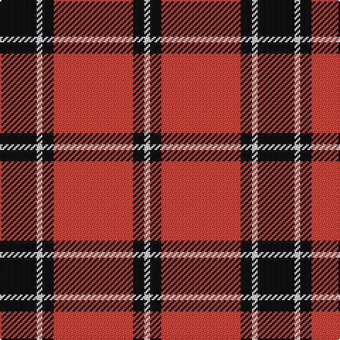

In pattern [KWKRKW](/patterns/kwkrkw/).

This was sourced from register-of-tartans.  It is a [6 stripes tartan](/stripes/stripes6/).

Original link https://www.tartanregister.gov.uk/tartanDetails.aspx?ref=1016

## Thread count
K/26 LN4 K8 R56 K8 LN/4

## Palette
Each colour and its ΔE from the base-6 reference it is a variant of.

| Colour | Shade | Base | ΔE (OKLab) |
|---|---|---|---|
| K | <code style="background-color:#101010;">#101010</code> `#101010` | K <code style="background-color:#000000;">#000000</code> | 0.17 |
| LN | <code style="background-color:#E0E0E0;">#E0E0E0</code> `#E0E0E0` | W <code style="background-color:#F7F7F7;">#F7F7F7</code> | 0.07 |
| R | <code style="background-color:#CC4438;">#CC4438</code> `#CC4438` | R <code style="background-color:#CC0000;">#CC0000</code> | 0.06 |

# Sample pattern

## Nearest tartans

The nearest existing variants by ΔTartan distance.

1. [Monmouth College](/setts/s6/k8r66k48w6k8r6-k101010-rc80000-we0e0e0/) — ΔT 0.80
1. [Cunningham #2](/setts/s7/k6r4k60r56k4r4w6-k101010-rc80000-we0e0e0/) — ΔT 0.90
1. [MacIver](/setts/s5/k32r4k4r24w2-k101010-rdc0000-we0e0e0/) — ΔT 0.96
1. [University of Nebraska Alumni Association](/setts/s8/w12k4w4k62r82k4r4k8-k101010-rc80000-we0e0e0/) — ΔT 1.15
1. [Masai Shuka 15 (Artefact)](/setts/s5/r40k4r4k30w2-k101010-rc80000-we0e0e0/) — ΔT 1.15
1. [Brodie (Clan)](/setts/s6/k8r64k32y4k32r8-k101010-rc80000-yd8b000/) — ΔT 1.18
1. [Dunbar #2](/setts/s6/k8r52k8w4k26y8-k101010-rdc0000-we0e0e0-ye8c000/) — ΔT 1.18
1. [Wcwm 1166-2](/setts/s6/b88y6b8w6b8y88-b3c2010-wc8c8c8-yc09898/) — ΔT 1.19
1. [Ramsay Red Clan Tartan Tartan Number: 1238. Earliest known date: 1842 Ramsay was one of the names adopted by members of the Clan MacGregor when their own was proscribed. It is not surprising then that an early MacGregor sett was used as a basis for the Ramsay tartan. It is possible that the tartan was in existance long before the earliest recorded date given. See products available Copyright © Blair Urquhart, Comrie, 2015](/setts/s6/r10ra4r60k56w4k8-k101010-rc80000-raa00048-we0e0e0/) — ΔT 1.19
1. [Forget Family (Red)](/setts/s6/r84k4w4k36w4k10-k101010-rc80000-wffffff/) — ΔT 1.22

## Neighbour map

Every grey dot is one of 15726 variants placed by the first two principal components of the ΔTartan feature space (44% of its variance). Red is this tartan; blue dots are its nearest — click one to open its page.

<svg viewBox="0 0 640 380" role="img" style="max-width:100%;height:auto;border:1px solid #e0e0e0;border-radius:4px;display:block" xmlns="http://www.w3.org/2000/svg"><image href="/nn/cloud.v1.png" width="640" height="380"/><a href="/setts/s6/k8r66k48w6k8r6-k101010-rc80000-we0e0e0/"><circle cx="335.9" cy="195.8" r="4" fill="#3465a4"><title>Monmouth College</title></circle></a><a href="/setts/s7/k6r4k60r56k4r4w6-k101010-rc80000-we0e0e0/"><circle cx="350.4" cy="168.5" r="4" fill="#3465a4"><title>Cunningham #2</title></circle></a><a href="/setts/s5/k32r4k4r24w2-k101010-rdc0000-we0e0e0/"><circle cx="361.0" cy="197.5" r="4" fill="#3465a4"><title>MacIver</title></circle></a><a href="/setts/s8/w12k4w4k62r82k4r4k8-k101010-rc80000-we0e0e0/"><circle cx="334.8" cy="139.7" r="4" fill="#3465a4"><title>University of Nebraska Alumni Association</title></circle></a><a href="/setts/s5/r40k4r4k30w2-k101010-rc80000-we0e0e0/"><circle cx="387.3" cy="186.1" r="4" fill="#3465a4"><title>Masai Shuka 15 (Artefact)</title></circle></a><a href="/setts/s6/k8r64k32y4k32r8-k101010-rc80000-yd8b000/"><circle cx="341.7" cy="200.2" r="4" fill="#3465a4"><title>Brodie (Clan)</title></circle></a><a href="/setts/s6/k8r52k8w4k26y8-k101010-rdc0000-we0e0e0-ye8c000/"><circle cx="281.7" cy="168.7" r="4" fill="#3465a4"><title>Dunbar #2</title></circle></a><a href="/setts/s6/b88y6b8w6b8y88-b3c2010-wc8c8c8-yc09898/"><circle cx="345.7" cy="180.2" r="4" fill="#3465a4"><title>Wcwm 1166-2</title></circle></a><a href="/setts/s6/r10ra4r60k56w4k8-k101010-rc80000-raa00048-we0e0e0/"><circle cx="325.3" cy="170.3" r="4" fill="#3465a4"><title>Ramsay Red Clan Tartan Tartan Number: 1238. Earliest known date: 1842 Ramsay was one of the names adopted by members of the Clan MacGregor when their own was proscribed. It is not surprising then that an early MacGregor sett was used as a basis for the Ramsay tartan. It is possible that the tartan was in existance long before the earliest recorded date given. See products available Copyright © Blair Urquhart, Comrie, 2015</title></circle></a><a href="/setts/s6/r84k4w4k36w4k10-k101010-rc80000-wffffff/"><circle cx="402.1" cy="153.9" r="4" fill="#3465a4"><title>Forget Family (Red)</title></circle></a><circle cx="334.6" cy="179.4" r="5" fill="#c00000"/></svg>

ID: /setts/s6/k26w4k8r56k8w4-k101010-rcc4438-we0e0e0/
