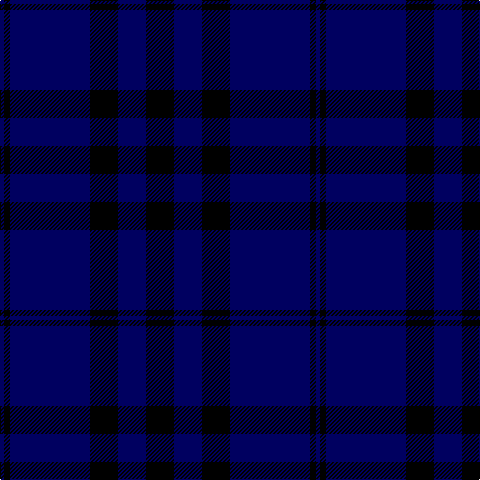

In pattern [BKBKBK](/patterns/bkbkbk/).

This was sourced from tartans-authority.  It is a [6 stripes tartan](/stripes/stripes6/).

Original link http://www.tartansauthority.com/tartan-ferret/display/3624/

## Thread count
DB/4 K6 DB80 K28 DB28 K/28

## Palette
Each colour and its ΔE from the base-6 reference it is a variant of.

| Colour | Shade | Base | ΔE (OKLab) |
|---|---|---|---|
| DB | <code style="background-color:#000060;">#000060</code> `#000060` | B <code style="background-color:#2A418A;">#2A418A</code> | 0.18 |
| K | <code style="background-color:#000000;">#000000</code> `#000000` | K <code style="background-color:#000000;">#000000</code> | 0.00 |

# Sample pattern

## Nearest tartans

The nearest existing variants by ΔTartan distance.

1. [MacKay VS](/setts/s6/b4k12b4k12b32r2-b000052-k000000-raa0000/) — ΔT 1.14
1. [MacKay V](/setts/s6/b4k12b4k12b32r2-b000064-k000000-rc80000/) — ΔT 1.38
1. [Williams (New York) (Personal)](/setts/s5/k60b12k12b82w4-b000080-k101010-w87ceeb/) — ΔT 1.61
1. [Gagetown (School)](/setts/s6/b12k66b30k6b30k6-b343498-k101010/) — ΔT 1.90
1. [Largan (?)](/setts/s6/b8k39b8k39b87r6-b2c2c80-k101010-rc80000/) — ΔT 2.00
1. [The Caledonian Hotel](/setts/s8/k48k6k6k6k6k36g40r8-g003000-k000030-rc00000/) — ΔT 2.10
1. [Atlin](/setts/s6/b28ba28b28ba80b6ba4-b381c0c-ba000060/) — ΔT 2.12
1. [Lochleven (Dance)](/setts/s8/b96k12b6k12b12k8b4k20-b00008c-k000000/) — ΔT 2.20
1. [Perthshire, New /Tourist Board](/setts/s6/b74r20g44b22g6r6-b000050-g003000-r800000/) — ΔT 2.24
1. [Lochleven (Dance)](/setts/s8/b96g12b6g12b12g8b4g20-b00008c-g004c00/) — ΔT 2.26

## Neighbour map

Every grey dot is one of 15726 variants placed by the first two principal components of the ΔTartan feature space (44% of its variance). Red is this tartan; blue dots are its nearest — click one to open its page.

<svg viewBox="0 0 640 380" role="img" style="max-width:100%;height:auto;border:1px solid #e0e0e0;border-radius:4px;display:block" xmlns="http://www.w3.org/2000/svg"><image href="/nn/cloud.v1.png" width="640" height="380"/><a href="/setts/s6/b4k12b4k12b32r2-b000052-k000000-raa0000/"><circle cx="446.7" cy="248.8" r="4" fill="#3465a4"><title>MacKay VS</title></circle></a><a href="/setts/s6/b4k12b4k12b32r2-b000064-k000000-rc80000/"><circle cx="424.3" cy="238.5" r="4" fill="#3465a4"><title>MacKay V</title></circle></a><a href="/setts/s5/k60b12k12b82w4-b000080-k101010-w87ceeb/"><circle cx="432.6" cy="245.5" r="4" fill="#3465a4"><title>Williams (New York) (Personal)</title></circle></a><a href="/setts/s6/b12k66b30k6b30k6-b343498-k101010/"><circle cx="411.5" cy="274.1" r="4" fill="#3465a4"><title>Gagetown (School)</title></circle></a><a href="/setts/s6/b8k39b8k39b87r6-b2c2c80-k101010-rc80000/"><circle cx="427.2" cy="247.4" r="4" fill="#3465a4"><title>Largan (?)</title></circle></a><a href="/setts/s8/k48k6k6k6k6k36g40r8-g003000-k000030-rc00000/"><circle cx="462.3" cy="266.8" r="4" fill="#3465a4"><title>The Caledonian Hotel</title></circle></a><a href="/setts/s6/b28ba28b28ba80b6ba4-b381c0c-ba000060/"><circle cx="550.0" cy="283.0" r="4" fill="#3465a4"><title>Atlin</title></circle></a><a href="/setts/s8/b96k12b6k12b12k8b4k20-b00008c-k000000/"><circle cx="516.8" cy="198.4" r="4" fill="#3465a4"><title>Lochleven (Dance)</title></circle></a><a href="/setts/s6/b74r20g44b22g6r6-b000050-g003000-r800000/"><circle cx="385.0" cy="258.3" r="4" fill="#3465a4"><title>Perthshire, New /Tourist Board</title></circle></a><a href="/setts/s8/b96g12b6g12b12g8b4g20-b00008c-g004c00/"><circle cx="535.3" cy="206.1" r="4" fill="#3465a4"><title>Lochleven (Dance)</title></circle></a><circle cx="498.2" cy="265.2" r="5" fill="#c00000"/></svg>

ID: /setts/s6/k28b28k28b80k6b4-b000060-k000000/
