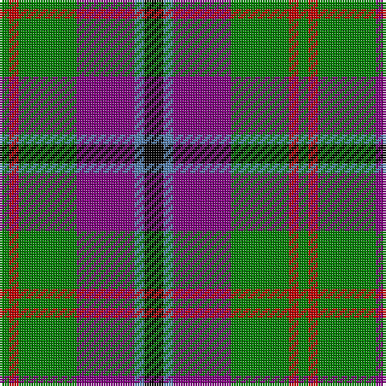

In pattern [GRGBBK](/patterns/grgbbk/).

This was sourced from weddslist.  It is a [6 stripes tartan](/stripes/stripes6/).

Original link http://www.weddslist.com/cgi-bin/tartans/pg.pl?source=sts

## Thread count
G/4 R4 G24 P24 B4 K/8

## Palette
Each colour and its ΔE from the base-6 reference it is a variant of.

| Colour | Shade | Base | ΔE (OKLab) |
|---|---|---|---|
| B | <code style="background-color:#5480B0;">#5480B0</code> `#5480B0` | B <code style="background-color:#2A418A;">#2A418A</code> | 0.19 |
| G | <code style="background-color:#008000;">#008000</code> `#008000` | G <code style="background-color:#006100;">#006100</code> | 0.10 |
| K | <code style="background-color:#000000;">#000000</code> `#000000` | K <code style="background-color:#000000;">#000000</code> | 0.00 |
| P | <code style="background-color:#800080;">#800080</code> `#800080` | B <code style="background-color:#2A418A;">#2A418A</code> | 0.17 |
| R | <code style="background-color:#C00000;">#C00000</code> `#C00000` | R <code style="background-color:#CC0000;">#CC0000</code> | 0.03 |

# Sample pattern

## Nearest tartans

The nearest existing variants by ΔTartan distance.

1. [Lindley-Highfield (Name)](/setts/s7/g7b3w1ga2g1r2b1x8~b780078-g003820-ga289c18-re87878-we0e0e0/) — ΔT 0.66
1. [Wilson's, No 176](/setts/s5/k4b3g12ba13y2x2~b5480b0-ba800080-g008000-k000000-yf0c000/) — ΔT 0.70
1. [Dunbog, Primary School](/setts/s6/r12b3g5ba16y2g2x2~b304080-ba000050-g008000-rc00000-yf0c000/) — ΔT 0.73
1. [Wellington, No 122](/setts/s5/k4b3ba11g14y2x2~b5480b0-ba800080-g008000-k000000-yf0c000/) — ΔT 0.74
1. [Wilson's No 148](/setts/s5/k4b3g13ba12w2x2~b5480b0-ba800080-g008000-k000000-we0e0e0/) — ΔT 0.76
1. [Wellington, No 229](/setts/s5/k4b3ba11g14w2x2~b5480b0-ba800080-g008000-k000000-we0e0e0/) — ΔT 0.77
1. [Kervegant, Suzanne (Personal)](/setts/s8/g6b11w8k4w8k27w4r4x2~b2c2c80-g006818-k101010-rc80000-wc0c0c0/) — ΔT 0.87
1. [Jewell of Kernow (Personal)](/setts/s6/w6k29r29b7k3ra3x2~b600060-k101010-r888888-rac80000-we0e0e0/) — ΔT 0.90
1. [Akins Clan (Personal)](/setts/s8/r21ra3r3ra3r3b19g22w3x2~b00008b-g008000-r800000-radc143c-w87cefa/) — ΔT 1.02
1. [Dunbog Primary School Corporate Tartan Tartan Number: 954. Earliest known date: 1985 C. Armstrong is a pupil at the school. See products available Copyright © Blair Urquhart, Comrie, 2015](/setts/s6/r12b3g5ba16y2g2x2~b2c2c80-ba202060-g006818-rc80000-ye8c000/) — ΔT 1.07

## Neighbour map

Every grey dot is one of 15726 variants placed by the first two principal components of the ΔTartan feature space (44% of its variance). Red is this tartan; blue dots are its nearest — click one to open its page.

<svg viewBox="0 0 640 380" role="img" style="max-width:100%;height:auto;border:1px solid #e0e0e0;border-radius:4px;display:block" xmlns="http://www.w3.org/2000/svg"><image href="/nn/cloud.v1.png" width="640" height="380"/><a href="/setts/s7/g7b3w1ga2g1r2b1x8~b780078-g003820-ga289c18-re87878-we0e0e0/"><circle cx="182.9" cy="194.4" r="4" fill="#3465a4"><title>Lindley-Highfield (Name)</title></circle></a><a href="/setts/s5/k4b3g12ba13y2x2~b5480b0-ba800080-g008000-k000000-yf0c000/"><circle cx="132.8" cy="217.2" r="4" fill="#3465a4"><title>Wilson's, No 176</title></circle></a><a href="/setts/s6/r12b3g5ba16y2g2x2~b304080-ba000050-g008000-rc00000-yf0c000/"><circle cx="157.2" cy="194.1" r="4" fill="#3465a4"><title>Dunbog, Primary School</title></circle></a><a href="/setts/s5/k4b3ba11g14y2x2~b5480b0-ba800080-g008000-k000000-yf0c000/"><circle cx="145.0" cy="214.9" r="4" fill="#3465a4"><title>Wellington, No 122</title></circle></a><a href="/setts/s5/k4b3g13ba12w2x2~b5480b0-ba800080-g008000-k000000-we0e0e0/"><circle cx="129.5" cy="217.2" r="4" fill="#3465a4"><title>Wilson's No 148</title></circle></a><a href="/setts/s5/k4b3ba11g14w2x2~b5480b0-ba800080-g008000-k000000-we0e0e0/"><circle cx="142.9" cy="214.3" r="4" fill="#3465a4"><title>Wellington, No 229</title></circle></a><a href="/setts/s8/g6b11w8k4w8k27w4r4x2~b2c2c80-g006818-k101010-rc80000-wc0c0c0/"><circle cx="142.2" cy="185.9" r="4" fill="#3465a4"><title>Kervegant, Suzanne (Personal)</title></circle></a><a href="/setts/s6/w6k29r29b7k3ra3x2~b600060-k101010-r888888-rac80000-we0e0e0/"><circle cx="186.1" cy="179.1" r="4" fill="#3465a4"><title>Jewell of Kernow (Personal)</title></circle></a><a href="/setts/s8/r21ra3r3ra3r3b19g22w3x2~b00008b-g008000-r800000-radc143c-w87cefa/"><circle cx="142.9" cy="180.1" r="4" fill="#3465a4"><title>Akins Clan (Personal)</title></circle></a><a href="/setts/s6/r12b3g5ba16y2g2x2~b2c2c80-ba202060-g006818-rc80000-ye8c000/"><circle cx="178.3" cy="198.5" r="4" fill="#3465a4"><title>Dunbog Primary School Corporate Tartan Tartan Number: 954. Earliest known date: 1985 C. Armstrong is a pupil at the school. See products available Copyright © Blair Urquhart, Comrie, 2015</title></circle></a><circle cx="158.7" cy="206.4" r="5" fill="#c00000"/></svg>

ID: /setts/s6/k2b1ba6g6r1g1x4~b5480b0-ba800080-g008000-k000000-rc00000/
