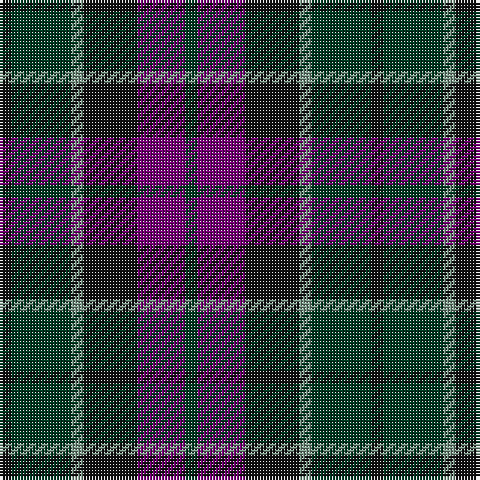

This page is one **sett** — a single exact thread-count. It belongs to the [tartan](/tartans/k2dg10y2k9dp8dg2/)
(the same proportion at any scale), whose colour order is pattern [GBKGGK](/stripes/gbkggk/).

Sourced from register-of-tartans.  It is a [6 stripe tartan](/stripes/stripes6/).

Original link https://www.tartanregister.gov.uk/tartanDetails.aspx?ref=2095

2 attestations — the source records this cloth was collapsed from (oldest owns this page)

<ul>
<li>01/01/1819 — Lennie (register-of-tartans, <a href="https://www.tartanregister.gov.uk/tartanDetails.aspx?ref=2095">record</a>)</li>
<li>1819 — Lennie (Clan) (tartans-authority, <a href="http://www.tartansauthority.com/tartan-ferret/display/725/">record</a>)</li>
</ul>

## Register references

External register numbers recorded for this tartan.

- Scottish Register of Tartans: [2095](https://www.tartanregister.gov.uk/tartanDetails.aspx?ref=2095)
- Scottish Tartans Authority (ITI): 725
- Scottish Tartans World Register: 725

## Thread count
K/4 DG20 LG4 K18 P16 DG/4

## Palette

Palette: <strong>Tartan Register</strong> <small style="color:#888">(3 of 4 colours)</small>
<table><thead><tr><th>Colour</th><th>Threads</th><th>Shade</th><th>Base</th><th>OKLCh</th></tr></thead><tbody><tr><td>K/</td><td style="text-align:right;font-variant-numeric:tabular-nums">4</td><td><code style="background-color:#101010;">#101010</code> <small style="color:#888">#101010</small></td><td>K <code style="background-color:#000000;">#000000</code></td><td><small style="color:#888">oklch(17.3% 0.000 89.9)</small></td></tr><tr><td>DG</td><td style="text-align:right;font-variant-numeric:tabular-nums">20</td><td><code style="background-color:#003820;">#003820</code> <small style="color:#888">#003820</small></td><td>G <code style="background-color:#006100;">#006100</code></td><td><small style="color:#888">oklch(30.0% 0.070 158.3)</small></td></tr><tr><td>LG</td><td style="text-align:right;font-variant-numeric:tabular-nums">4</td><td><code style="background-color:#789484;">#789484</code> <small style="color:#888">#789484</small></td><td>G <code style="background-color:#006100;">#006100</code></td><td><small style="color:#888">oklch(64.0% 0.040 160.0)</small></td></tr><tr><td>K</td><td style="text-align:right;font-variant-numeric:tabular-nums">18</td><td><code style="background-color:#101010;">#101010</code> <small style="color:#888">#101010</small></td><td>K <code style="background-color:#000000;">#000000</code></td><td><small style="color:#888">oklch(17.3% 0.000 89.9)</small></td></tr><tr><td>P</td><td style="text-align:right;font-variant-numeric:tabular-nums">16</td><td><code style="background-color:#740074;">#740074</code> <small style="color:#888">#740074</small></td><td>B <code style="background-color:#2A418A;">#2A418A</code></td><td><small style="color:#888">oklch(39.2% 0.180 328.4)</small></td></tr><tr><td>DG/</td><td style="text-align:right;font-variant-numeric:tabular-nums">4</td><td><code style="background-color:#003820;">#003820</code> <small style="color:#888">#003820</small></td><td>G <code style="background-color:#006100;">#006100</code></td><td><small style="color:#888">oklch(30.0% 0.070 158.3)</small></td></tr></tbody></table>

# Sample pattern

## Nearest tartans

The nearest existing variants by ΔTartan distance, with this tartan at the top so the swatches line up against it.

ΔTartan

Tartan

Sett

—

<a href="/ttd/edit/#slug=k2dg10y2k9dp8dg2~x2">Lennie</a> <a class="nn-out" href="/setts/s6/k2dg10y2k9dp8dg2~x2/" title="open its dictionary page">↗</a>

0.75

<a href="/ttd/edit/#slug=k2dg8db2k9dp7k2~x2">Campbell, Sir Walter Scott</a> <a class="nn-out" href="/setts/s6/k2dg8db2k9dp7k2~x2/" title="open its dictionary page">↗</a>

0.77

<a href="/ttd/edit/#slug=k3dg12k12r2db12k3~x2">Ferguson of Balquhidder #3</a> <a class="nn-out" href="/setts/s6/k3dg12k12r2db12k3~x2/" title="open its dictionary page">↗</a>

0.83

<a href="/ttd/edit/#slug=db2k2db12k8dg11r2~x2">Murray #3</a> <a class="nn-out" href="/setts/s6/db2k2db12k8dg11r2~x2/" title="open its dictionary page">↗</a>

0.84

<a href="/ttd/edit/#slug=db4k2db10k10g10k2r3~x2">MacKinlay (Clan)</a> <a class="nn-out" href="/setts/s7/db4k2db10k10g10k2r3~x2/" title="open its dictionary page">↗</a>

1.05

<a href="/ttd/edit/#slug=db4k3db16k14g14r3g3~x2">Inneryne (Personal)</a> <a class="nn-out" href="/setts/s7/db4k3db16k14g14r3g3~x2/" title="open its dictionary page">↗</a>

1.08

<a href="/ttd/edit/#slug=r5db8k5db24k24y24y5~x2">Heritage (Corporate)</a> <a class="nn-out" href="/setts/s7/r5db8k5db24k24y24y5~x2/" title="open its dictionary page">↗</a>

1.10

<a href="/ttd/edit/#slug=k3db14r2k14g14k3~x2">Gallamore</a> <a class="nn-out" href="/setts/s6/k3db14r2k14g14k3~x2/" title="open its dictionary page">↗</a>

1.12

<a href="/ttd/edit/#slug=dp8k9y2dg10k2dg10y2k9dp8dg2~x2">Wilson's No.231</a> <a class="nn-out" href="/setts/s10/dp8k9y2dg10k2dg10y2k9dp8dg2~x2/" title="open its dictionary page">↗</a>

1.16

<a href="/ttd/edit/#slug=k7dg7k1dg7k7t1dp7k1~x4">Wilson's No 108</a> <a class="nn-out" href="/setts/s8/k7dg7k1dg7k7t1dp7k1~x4/" title="open its dictionary page">↗</a>

1.16

<a href="/ttd/edit/#slug=g8t1g1k6dp6k1dp3~x4">Unnamed 19th Century Plaid</a> <a class="nn-out" href="/setts/s7/g8t1g1k6dp6k1dp3~x4/" title="open its dictionary page">↗</a>

## Neighbour map

Every grey dot is one of 14299 variants placed by the first two principal components of the ΔTartan feature space (44% of its variance). Red is this tartan; blue dots are its nearest — click one to open its page.

<svg viewBox="0 0 640 380" role="img" style="max-width:100%;height:auto;border:1px solid #e0e0e0;border-radius:4px;display:block" xmlns="http://www.w3.org/2000/svg"><image href="/nn/cloud.v1.png" width="640" height="380"/><a href="/setts/s6/k2dg8db2k9dp7k2~x2/"><circle cx="223.9" cy="293.2" r="4" fill="#3465a4"><title>Campbell, Sir Walter Scott</title></circle></a><a href="/setts/s6/k3dg12k12r2db12k3~x2/"><circle cx="225.1" cy="280.0" r="4" fill="#3465a4"><title>Ferguson of Balquhidder #3</title></circle></a><a href="/setts/s6/db2k2db12k8dg11r2~x2/"><circle cx="217.4" cy="272.4" r="4" fill="#3465a4"><title>Murray #3</title></circle></a><a href="/setts/s7/db4k2db10k10g10k2r3~x2/"><circle cx="171.8" cy="274.8" r="4" fill="#3465a4"><title>MacKinlay (Clan)</title></circle></a><a href="/setts/s7/db4k3db16k14g14r3g3~x2/"><circle cx="179.6" cy="259.6" r="4" fill="#3465a4"><title>Inneryne (Personal)</title></circle></a><a href="/setts/s7/r5db8k5db24k24y24y5~x2/"><circle cx="154.4" cy="254.9" r="4" fill="#3465a4"><title>Heritage (Corporate)</title></circle></a><a href="/setts/s6/k3db14r2k14g14k3~x2/"><circle cx="214.2" cy="260.7" r="4" fill="#3465a4"><title>Gallamore</title></circle></a><a href="/setts/s10/dp8k9y2dg10k2dg10y2k9dp8dg2~x2/"><circle cx="171.9" cy="265.0" r="4" fill="#3465a4"><title>Wilson's No.231</title></circle></a><a href="/setts/s8/k7dg7k1dg7k7t1dp7k1~x4/"><circle cx="234.9" cy="264.8" r="4" fill="#3465a4"><title>Wilson's No 108</title></circle></a><a href="/setts/s7/g8t1g1k6dp6k1dp3~x4/"><circle cx="203.2" cy="241.8" r="4" fill="#3465a4"><title>Unnamed 19th Century Plaid</title></circle></a><circle cx="200.9" cy="281.0" r="5" fill="#c00000"/></svg>

ID: /setts/s6/k2dg10y2k9dp8dg2~x2/
