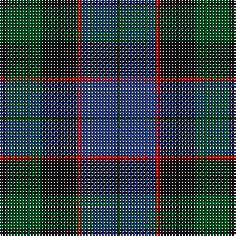

**Bands:** [KGKRBG](/stripes/kgkrbg/) · **Stripes:** [K DG K R DB DG](/stripes/stripes6/) K DG K R DB DG

This was sourced from register-of-tartans.  It is a [6 band tartan](/bands/bands6/).

Original link https://www.tartanregister.gov.uk/tartanDetails.aspx?ref=1166

## Attestations

This cloth appears in 4 source records; the oldest owns this page.

- undated — Ferguson of Balquhidder (register-of-tartans, [record](https://www.tartanregister.gov.uk/tartanDetails.aspx?ref=1166))
- undated — Ferguson of Balquhidder (weddslist, [record](http://www.weddslist.com/cgi-bin/tartans/pg.pl?source=rb))
- undated — Ferguson of Balquhidder (weddslist, [record](http://www.weddslist.com/cgi-bin/tartans/pg.pl?source=tinsel))
- undated — Ferguson of Balquhidder (weddslist, [record](http://www.weddslist.com/cgi-bin/tartans/pg.pl?source=x))

## Register references

External register numbers recorded for this tartan.

- Scottish Register of Tartans: [1166](https://www.tartanregister.gov.uk/tartanDetails.aspx?ref=1166)
- Scottish Register of Tartans: [1510](https://www.tartanregister.gov.uk/tartanDetails.aspx?ref=1510)
- Scottish Register of Tartans: [1758](https://www.tartanregister.gov.uk/tartanDetails.aspx?ref=1758)
- Scottish Register of Tartans: [2307](https://www.tartanregister.gov.uk/tartanDetails.aspx?ref=2307)
- Scottish Register of Tartans: [2349](https://www.tartanregister.gov.uk/tartanDetails.aspx?ref=2349)
- Scottish Register of Tartans: [2540](https://www.tartanregister.gov.uk/tartanDetails.aspx?ref=2540)
- Scottish Register of Tartans: [2582](https://www.tartanregister.gov.uk/tartanDetails.aspx?ref=2582)
- Scottish Register of Tartans: [2585](https://www.tartanregister.gov.uk/tartanDetails.aspx?ref=2585)
- Scottish Register of Tartans: [2625](https://www.tartanregister.gov.uk/tartanDetails.aspx?ref=2625)
- Scottish Register of Tartans: [2666](https://www.tartanregister.gov.uk/tartanDetails.aspx?ref=2666)
- Scottish Register of Tartans: [2730](https://www.tartanregister.gov.uk/tartanDetails.aspx?ref=2730)
- Scottish Register of Tartans: [2862](https://www.tartanregister.gov.uk/tartanDetails.aspx?ref=2862)
- Scottish Register of Tartans: [3072](https://www.tartanregister.gov.uk/tartanDetails.aspx?ref=3072)
- Scottish Register of Tartans: [3555](https://www.tartanregister.gov.uk/tartanDetails.aspx?ref=3555)
- Scottish Register of Tartans: [3808](https://www.tartanregister.gov.uk/tartanDetails.aspx?ref=3808)
- Scottish Register of Tartans: [4925](https://www.tartanregister.gov.uk/tartanDetails.aspx?ref=4925)
- Scottish Register of Tartans: [696](https://www.tartanregister.gov.uk/tartanDetails.aspx?ref=696)
- Scottish Register of Tartans: [697](https://www.tartanregister.gov.uk/tartanDetails.aspx?ref=697)
- Scottish Register of Tartans: [982](https://www.tartanregister.gov.uk/tartanDetails.aspx?ref=982)
- Scottish Tartans Authority (ITI): 1277
- Scottish Tartans Authority (ITI): 1429
- Scottish Tartans Authority (ITI): 218
- Scottish Tartans Authority (ITI): 977
- Scottish Tartans World Register: 1010
- Scottish Tartans World Register: 1042
- Scottish Tartans World Register: 127
- Scottish Tartans World Register: 1277
- Scottish Tartans World Register: 1399
- Scottish Tartans World Register: 1429
- Scottish Tartans World Register: 1585
- Scottish Tartans World Register: 1593
- Scottish Tartans World Register: 218
- Scottish Tartans World Register: 2218
- Scottish Tartans World Register: 3061
- Scottish Tartans World Register: 441
- Scottish Tartans World Register: 737
- Scottish Tartans World Register: 858
- Scottish Tartans World Register: 864
- Scottish Tartans World Register: 873
- Scottish Tartans World Register: 897
- Scottish Tartans World Register: 977
- Scottish Tartans World Register: 978

## Thread count
K/4 G24 K24 R2 B24 G/4

## Palette
Each colour and its ΔE from the base-6 reference it is a variant of.

| Colour | Shade | Base | ΔE (OKLab) |
|---|---|---|---|
| B | <code style="background-color:#2C4084;">#2C4084</code> `#2C4084` | B <code style="background-color:#2A418A;">#2A418A</code> | 0.01 |
| G | <code style="background-color:#005020;">#005020</code> `#005020` | G <code style="background-color:#006100;">#006100</code> | 0.07 |
| K | <code style="background-color:#101010;">#101010</code> `#101010` | K <code style="background-color:#000000;">#000000</code> | 0.17 |
| R | <code style="background-color:#DC0000;">#DC0000</code> `#DC0000` | R <code style="background-color:#CC0000;">#CC0000</code> | 0.03 |

# Sample pattern

## Nearest tartans

The nearest existing variants by ΔTartan distance.

1. [Unidentified No 59](/setts/s6/t1db11k11dg11k2t1~x2/) — ΔT 0.34
1. [Unidentified No 115](/setts/s8/db10k6t1dg6k1~x2/) — ΔT 0.78
1. [Graham of Montrose](/setts/s6/k4dg19k16w2db15dg4~x2/) — ΔT 1.03
1. [Reid and Taylor](/setts/s7/k2g10k9db9r1k1db2~x2/) — ΔT 1.06
1. [Dundas #2](/setts/s7/k4db16k12g12r1g2k2~x2/) — ΔT 1.08
1. [Renfrew](/setts/s7/db6k2db18k18g18k3r2~x2/) — ΔT 1.09
1. [Baird](/setts/s8/r7dg3r2dg33k31db31k3db3/) — ΔT 1.11
1. [Strange of Balcaskie (Clan)](/setts/s7/g32dy7g7dy16db32ly3dy8~x2/) — ΔT 1.14
1. [Aitchison Family (Kinghorn) (Personal)](/setts/s9/k2db3k2db18k11db2k11g25p2~x2/) — ΔT 1.18
1. [Murray #3](/setts/s6/db2k2db12k8dg11r2~x2/) — ΔT 1.20

## Neighbour map

Every grey dot is one of 14299 variants placed by the first two principal components of the ΔTartan feature space (44% of its variance). Red is this tartan; blue dots are its nearest — click one to open its page.

<svg viewBox="0 0 640 380" role="img" style="max-width:100%;height:auto;border:1px solid #e0e0e0;border-radius:4px;display:block" xmlns="http://www.w3.org/2000/svg"><image href="/nn/cloud.v1.png" width="640" height="380"/><a href="/setts/s6/t1db11k11dg11k2t1~x2/"><circle cx="243.5" cy="250.4" r="4" fill="#3465a4"><title>Unidentified No 59</title></circle></a><a href="/setts/s8/db10k6t1dg6k1~x2/"><circle cx="223.7" cy="253.5" r="4" fill="#3465a4"><title>Unidentified No 115</title></circle></a><a href="/setts/s6/k4dg19k16w2db15dg4~x2/"><circle cx="222.9" cy="254.1" r="4" fill="#3465a4"><title>Graham of Montrose</title></circle></a><a href="/setts/s7/k2g10k9db9r1k1db2~x2/"><circle cx="221.3" cy="231.7" r="4" fill="#3465a4"><title>Reid and Taylor</title></circle></a><a href="/setts/s7/k4db16k12g12r1g2k2~x2/"><circle cx="248.7" cy="216.6" r="4" fill="#3465a4"><title>Dundas #2</title></circle></a><a href="/setts/s7/db6k2db18k18g18k3r2~x2/"><circle cx="219.3" cy="238.9" r="4" fill="#3465a4"><title>Renfrew</title></circle></a><a href="/setts/s8/r7dg3r2dg33k31db31k3db3/"><circle cx="256.0" cy="208.5" r="4" fill="#3465a4"><title>Baird</title></circle></a><a href="/setts/s7/g32dy7g7dy16db32ly3dy8~x2/"><circle cx="243.8" cy="240.5" r="4" fill="#3465a4"><title>Strange of Balcaskie (Clan)</title></circle></a><a href="/setts/s9/k2db3k2db18k11db2k11g25p2~x2/"><circle cx="247.5" cy="212.4" r="4" fill="#3465a4"><title>Aitchison Family (Kinghorn) (Personal)</title></circle></a><a href="/setts/s6/db2k2db12k8dg11r2~x2/"><circle cx="217.4" cy="272.4" r="4" fill="#3465a4"><title>Murray #3</title></circle></a><circle cx="250.1" cy="250.9" r="5" fill="#c00000"/></svg>

ID: /setts/s6/k2dg12k12r1db12dg2~x2/
