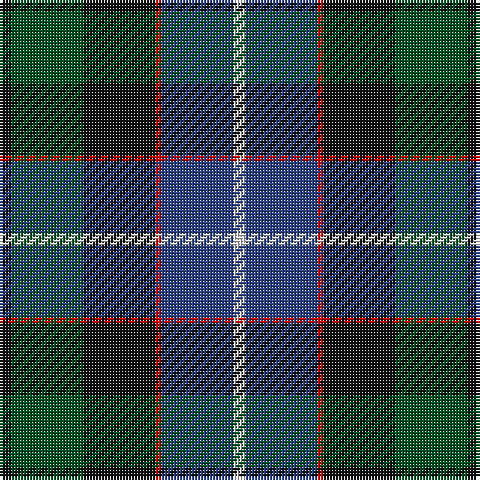

In pattern [KGKRBW](/stripes/kgkrbw/).

This was sourced from register-of-tartans.  It is a [6 stripe tartan](/stripes/stripes6/).

Original link https://www.tartanregister.gov.uk/tartanDetails.aspx?ref=3618

## Also known as

This cloth is also recorded under:

- Hunter
- Russell
- Russell or Mitchell or Hunter or Galbraith
- Russell, or Mitchell or Hunter or Galbraith

## Register references

External register numbers recorded for this tartan.

- Scottish Register of Tartans: [3618](https://www.tartanregister.gov.uk/tartanDetails.aspx?ref=3618)
- Scottish Tartans World Register: 1094

## Thread count
K/4 G24 K24 R2 B24 LN/4

## Palette
Each colour and the base-6 reference it is a variant of.

| Colour | Shade | Base |
|---|---|---|
| B | <code style="background-color:#2C4084;">#2C4084</code> `oklch(39.4% 0.117 268.3)` <small>#2C4084</small> | B <code style="background-color:#2A418A;">#2A418A</code> |
| G | <code style="background-color:#005020;">#005020</code> `oklch(37.7% 0.105 149.6)` <small>#005020</small> | G <code style="background-color:#006100;">#006100</code> |
| K | <code style="background-color:#101010;">#101010</code> `oklch(17.3% 0.000 89.9)` <small>#101010</small> | K <code style="background-color:#000000;">#000000</code> |
| LN | <code style="background-color:#E0E0E0;">#E0E0E0</code> `oklch(90.7% 0.000 89.9)` <small>#E0E0E0</small> | W <code style="background-color:#F7F7F7;">#F7F7F7</code> |
| R | <code style="background-color:#DC0000;">#DC0000</code> `oklch(56.2% 0.230 29.2)` <small>#DC0000</small> | R <code style="background-color:#CC0000;">#CC0000</code> |

# Sample pattern

## Nearest tartans

The nearest existing variants by ΔTartan distance, with this tartan at the top so the swatches line up against it.

ΔTartan

Tartan

Sett

—

<a href="/ttd/edit/#slug=k2dg12k12r1db12w2~x2">Russell or Mitchell or Hunter or Galbraith</a> <a class="nn-out" href="/setts/s6/k2dg12k12r1db12w2~x2/" title="open its dictionary page">↗</a>

0.36

<a href="/ttd/edit/#slug=r4k2db24k20g20lo3~x2">Loudoun's Highlanders - 1747 #1 (Mil</a> <a class="nn-out" href="/setts/s6/r4k2db24k20g20lo3~x2/" title="open its dictionary page">↗</a>

0.55

<a href="/ttd/edit/#slug=db20k6o4db3k16g20w2~x2">Deloughery, Paul</a> <a class="nn-out" href="/setts/s7/db20k6o4db3k16g20w2~x2/" title="open its dictionary page">↗</a>

0.64

<a href="/ttd/edit/#slug=k2g17k16r2db17lr2~x2">Mitchell (Clan)</a> <a class="nn-out" href="/setts/s6/k2g17k16r2db17lr2~x2/" title="open its dictionary page">↗</a>

0.65

<a href="/ttd/edit/#slug=r2db23k14dg16k2w2~x2">MacPhail Hunting</a> <a class="nn-out" href="/setts/s6/r2db23k14dg16k2w2~x2/" title="open its dictionary page">↗</a>

0.68

<a href="/ttd/edit/#slug=b32do16dg3o4k28~x2">Corey in Balachuirn</a> <a class="nn-out" href="/setts/s5/b32do16dg3o4k28~x2/" title="open its dictionary page">↗</a>

0.69

<a href="/ttd/edit/#slug=k1g8w1k8db8r1~x4">Leslie Hunting</a> <a class="nn-out" href="/setts/s6/k1g8w1k8db8r1~x4/" title="open its dictionary page">↗</a>

0.71

<a href="/ttd/edit/#slug=k4w1g10k10db10r2~x2">Rose Hunting Clan Tartan Tartan Number: 1226. Earliest known date: 1831 First recorded in James Logan's, 'The Scottish Gael' in 1831. See products available Copyright © Blair Urquhart, Comrie, 2015</a> <a class="nn-out" href="/setts/s6/k4w1g10k10db10r2~x2/" title="open its dictionary page">↗</a>

0.72

<a href="/ttd/edit/#slug=dg17ly2k14r2db9r2db10~x2">MacDonald (Flora.. )</a> <a class="nn-out" href="/setts/s7/dg17ly2k14r2db9r2db10~x2/" title="open its dictionary page">↗</a>

0.72

<a href="/ttd/edit/#slug=k2g17k16r2db17w2~x2">Galbraith</a> <a class="nn-out" href="/setts/s6/k2g17k16r2db17w2~x2/" title="open its dictionary page">↗</a>

0.73

<a href="/ttd/edit/#slug=r5g19w3k19db19k3db2~x2">Fruin Colquhoun (Commemorative?)</a> <a class="nn-out" href="/setts/s7/r5g19w3k19db19k3db2~x2/" title="open its dictionary page">↗</a>

## Neighbour map

Every grey dot is one of 14299 variants placed by the first two principal components of the ΔTartan feature space (44% of its variance). Red is this tartan; blue dots are its nearest — click one to open its page.

<svg viewBox="0 0 640 380" role="img" style="max-width:100%;height:auto;border:1px solid #e0e0e0;border-radius:4px;display:block" xmlns="http://www.w3.org/2000/svg"><image href="/nn/cloud.v1.png" width="640" height="380"/><a href="/setts/s6/r4k2db24k20g20lo3~x2/"><circle cx="173.5" cy="210.6" r="4" fill="#3465a4"><title>Loudoun's Highlanders - 1747 #1 (Mil</title></circle></a><a href="/setts/s7/db20k6o4db3k16g20w2~x2/"><circle cx="167.2" cy="215.9" r="4" fill="#3465a4"><title>Deloughery, Paul</title></circle></a><a href="/setts/s6/k2g17k16r2db17lr2~x2/"><circle cx="163.2" cy="221.4" r="4" fill="#3465a4"><title>Mitchell (Clan)</title></circle></a><a href="/setts/s6/r2db23k14dg16k2w2~x2/"><circle cx="214.9" cy="209.8" r="4" fill="#3465a4"><title>MacPhail Hunting</title></circle></a><a href="/setts/s5/b32do16dg3o4k28~x2/"><circle cx="199.4" cy="229.4" r="4" fill="#3465a4"><title>Corey in Balachuirn</title></circle></a><a href="/setts/s6/k1g8w1k8db8r1~x4/"><circle cx="160.6" cy="221.4" r="4" fill="#3465a4"><title>Leslie Hunting</title></circle></a><a href="/setts/s6/k4w1g10k10db10r2~x2/"><circle cx="170.6" cy="225.3" r="4" fill="#3465a4"><title>Rose Hunting Clan Tartan Tartan Number: 1226. Earliest known date: 1831 First recorded in James Logan's, 'The Scottish Gael' in 1831. See products available Copyright © Blair Urquhart, Comrie, 2015</title></circle></a><a href="/setts/s7/dg17ly2k14r2db9r2db10~x2/"><circle cx="160.9" cy="220.5" r="4" fill="#3465a4"><title>MacDonald (Flora.. )</title></circle></a><a href="/setts/s6/k2g17k16r2db17w2~x2/"><circle cx="151.3" cy="213.2" r="4" fill="#3465a4"><title>Galbraith</title></circle></a><a href="/setts/s7/r5g19w3k19db19k3db2~x2/"><circle cx="148.1" cy="203.1" r="4" fill="#3465a4"><title>Fruin Colquhoun (Commemorative?)</title></circle></a><circle cx="180.5" cy="211.1" r="5" fill="#c00000"/></svg>

ID: /setts/s6/k2dg12k12r1db12w2~x2/
