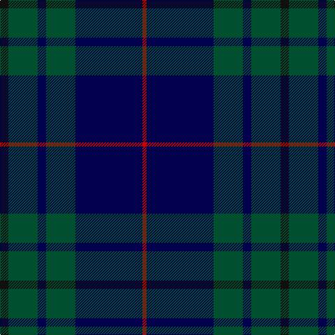

In pattern [KGBGBR](/stripes/kgbgbr/).

This was sourced from register-of-tartans.  It is a [6 stripe tartan](/stripes/stripes6/).

Original link https://www.tartanregister.gov.uk/tartanDetails.aspx?ref=1801

## Attestations

This cloth appears in 2 source records; the oldest owns this page.

- 01/01/2004 — Hutton (register-of-tartans, [record](https://www.tartanregister.gov.uk/tartanDetails.aspx?ref=1801))
- 2004 — Hutton (Name) (tartans-authority, [record](http://www.tartansauthority.com/tartan-ferret/display/7027/))

## Register references

External register numbers recorded for this tartan.

- Scottish Register of Tartans: [1801](https://www.tartanregister.gov.uk/tartanDetails.aspx?ref=1801)
- Scottish Tartans Authority (ITI): 7027

## Thread count
K/12 Gb42 DBa12 Gb42 DBa96 R/6

## Palette
Each colour and its ΔE from the base-6 reference it is a variant of.

| Colour | Shade | Base | ΔE (OKLab) |
|---|---|---|---|
| DB | <code style="background-color:#1C1C50;">#1C1C50</code> `#1C1C50` | B <code style="background-color:#2A418A;">#2A418A</code> | 0.14 |
| DBa | <code style="background-color:#00004C;">#00004C</code> `#00004C` | B <code style="background-color:#2A418A;">#2A418A</code> | 0.21 |
| G | <code style="background-color:#006818;">#006818</code> `#006818` | G <code style="background-color:#006100;">#006100</code> | 0.02 |
| Ga | <code style="background-color:#005448;">#005448</code> `#005448` | G <code style="background-color:#006100;">#006100</code> | 0.10 |
| Gb | <code style="background-color:#005030;">#005030</code> `#005030` | G <code style="background-color:#006100;">#006100</code> | 0.08 |
| K | <code style="background-color:#101010;">#101010</code> `#101010` | K <code style="background-color:#000000;">#000000</code> | 0.17 |
| R | <code style="background-color:#C80000;">#C80000</code> `#C80000` | R <code style="background-color:#CC0000;">#CC0000</code> | 0.01 |

# Sample pattern

## Nearest tartans

The nearest existing variants by ΔTartan distance.

1. [Wcwm 1255-1](/setts/s5/db4db1dg14db14r1~x4/) — ΔT 0.73
1. [Pinehurst Resort](/setts/s7/k4r1k4r1dg14n1dg1~x4/) — ΔT 1.19
1. [Perthshire, New /Tourist Board](/setts/s6/db37r10dg22db11dg3r3~x2/) — ΔT 1.22
1. [Doral](/setts/s7/db26dg6db2dg17dy4w1dy4~x4/) — ΔT 1.25
1. [Lyndon Prep (School)](/setts/s6/k4ly1k18db18lb1db4~x4/) — ΔT 1.27
1. [Patriot, The (Fashion)](/setts/s7/k10db4k34dt2k2dt30w3~x2/) — ΔT 1.29
1. [Deighan (Burham Kent) (Name)](/setts/s5/n4db43k20n7o2~x2/) — ΔT 1.32
1. [Barclay Hunting](/setts/s4/dg1db16dg16r1~x2/) — ΔT 1.34
1. [Robert Gordon University](/setts/s6/k4r2k12db12k1lo2~x2/) — ΔT 1.35
1. [St. Andrews Old Course Hotel (Corp)](/setts/s6/g26db10k3db2dy2db10~x4/) — ΔT 1.39

## Neighbour map

Every grey dot is one of 14299 variants placed by the first two principal components of the ΔTartan feature space (44% of its variance). Red is this tartan; blue dots are its nearest — click one to open its page.

<svg viewBox="0 0 640 380" role="img" style="max-width:100%;height:auto;border:1px solid #e0e0e0;border-radius:4px;display:block" xmlns="http://www.w3.org/2000/svg"><image href="/nn/cloud.v1.png" width="640" height="380"/><a href="/setts/s5/db4db1dg14db14r1~x4/"><circle cx="360.2" cy="242.5" r="4" fill="#3465a4"><title>Wcwm 1255-1</title></circle></a><a href="/setts/s7/k4r1k4r1dg14n1dg1~x4/"><circle cx="393.3" cy="207.2" r="4" fill="#3465a4"><title>Pinehurst Resort</title></circle></a><a href="/setts/s6/db37r10dg22db11dg3r3~x2/"><circle cx="387.9" cy="265.7" r="4" fill="#3465a4"><title>Perthshire, New /Tourist Board</title></circle></a><a href="/setts/s7/db26dg6db2dg17dy4w1dy4~x4/"><circle cx="348.8" cy="199.2" r="4" fill="#3465a4"><title>Doral</title></circle></a><a href="/setts/s6/k4ly1k18db18lb1db4~x4/"><circle cx="368.2" cy="219.3" r="4" fill="#3465a4"><title>Lyndon Prep (School)</title></circle></a><a href="/setts/s7/k10db4k34dt2k2dt30w3~x2/"><circle cx="388.7" cy="210.9" r="4" fill="#3465a4"><title>Patriot, The (Fashion)</title></circle></a><a href="/setts/s5/n4db43k20n7o2~x2/"><circle cx="403.1" cy="225.5" r="4" fill="#3465a4"><title>Deighan (Burham Kent) (Name)</title></circle></a><a href="/setts/s4/dg1db16dg16r1~x2/"><circle cx="400.5" cy="269.2" r="4" fill="#3465a4"><title>Barclay Hunting</title></circle></a><a href="/setts/s6/k4r2k12db12k1lo2~x2/"><circle cx="338.7" cy="237.6" r="4" fill="#3465a4"><title>Robert Gordon University</title></circle></a><a href="/setts/s6/g26db10k3db2dy2db10~x4/"><circle cx="315.7" cy="217.5" r="4" fill="#3465a4"><title>St. Andrews Old Course Hotel (Corp)</title></circle></a><circle cx="360.6" cy="234.7" r="5" fill="#c00000"/></svg>

ID: /setts/s6/k2dg7db2dg7db16r1~x6/
