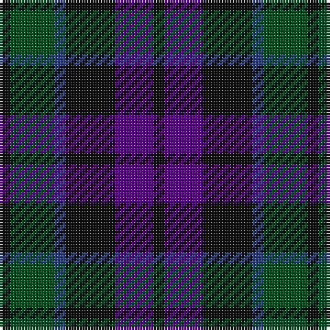

**Bands:** [KBKBGK](/stripes/kbkbgk/) · **Stripes:** [K DP K DB DG K](/stripes/stripes6/) K DP K DB DG K

This was sourced from register-of-tartans.  It is a [6 band tartan](/bands/bands6/).

Original link https://www.tartanregister.gov.uk/tartanDetails.aspx?ref=535

## Register references

External register numbers recorded for this tartan.

- Scottish Register of Tartans: [535](https://www.tartanregister.gov.uk/tartanDetails.aspx?ref=535)
- Scottish Tartans World Register: 10

## Thread count
K/4 G16 B4 K18 P14 K/4

## Palette
Each colour and its ΔE from the base-6 reference it is a variant of.

| Colour | Shade | Base | ΔE (OKLab) |
|---|---|---|---|
| B | <code style="background-color:#2C4084;">#2C4084</code> `#2C4084` | B <code style="background-color:#2A418A;">#2A418A</code> | 0.01 |
| G | <code style="background-color:#005020;">#005020</code> `#005020` | G <code style="background-color:#006100;">#006100</code> | 0.07 |
| K | <code style="background-color:#101010;">#101010</code> `#101010` | K <code style="background-color:#000000;">#000000</code> | 0.17 |
| P | <code style="background-color:#5A008C;">#5A008C</code> `#5A008C` | B <code style="background-color:#2A418A;">#2A418A</code> | 0.13 |

# Sample pattern

## Nearest tartans

The nearest existing variants by ΔTartan distance.

1. [Ferguson of Balquhidder #3](/setts/s6/k3db12r2k12dg12k3~x2/) — ΔT 0.74
1. [Lennie](/setts/s6/dg2dp8k9y2dg10k2~x2/) — ΔT 0.75
1. [The Harbour Town, Hilton Head](/setts/s6/k3dg11k3dr11k18o3~x2/) — ΔT 0.87
1. [Murray #3](/setts/s6/db2k2db12k8dg11r2~x2/) — ΔT 0.96
1. [MacKinlay (Clan)](/setts/s7/db4k2db10k10g10k2r3~x2/) — ΔT 1.03
1. [Wilson's No 108](/setts/s8/k7dg7k1dg7k7t1dp7k1~x4/) — ΔT 1.09
1. [Scotsman](/setts/s7/dg21k14dg9dt21k3dt12p3~x2/) — ΔT 1.22
1. [Gallamore](/setts/s6/k3db14r2k14g14k3~x2/) — ΔT 1.23
1. [Scotsman](/setts/s7/g21k14g9db21k3db12dp3~x2/) — ΔT 1.26
1. [MacCallum #2](/setts/s7/k6dg6r1dg6k6db6k1~x2/) — ΔT 1.26

## Neighbour map

Every grey dot is one of 14313 variants placed by the first two principal components of the ΔTartan feature space (44% of its variance). Red is this tartan; blue dots are its nearest — click one to open its page.

<svg viewBox="0 0 640 380" role="img" style="max-width:100%;height:auto;border:1px solid #e0e0e0;border-radius:4px;display:block" xmlns="http://www.w3.org/2000/svg"><image href="/nn/cloud.v1.png" width="640" height="380"/><a href="/setts/s6/k3db12r2k12dg12k3~x2/"><circle cx="224.9" cy="280.0" r="4" fill="#3465a4"><title>Ferguson of Balquhidder #3</title></circle></a><a href="/setts/s6/dg2dp8k9y2dg10k2~x2/"><circle cx="200.6" cy="280.9" r="4" fill="#3465a4"><title>Lennie</title></circle></a><a href="/setts/s6/k3dg11k3dr11k18o3~x2/"><circle cx="267.9" cy="274.6" r="4" fill="#3465a4"><title>The Harbour Town, Hilton Head</title></circle></a><a href="/setts/s6/db2k2db12k8dg11r2~x2/"><circle cx="217.2" cy="272.3" r="4" fill="#3465a4"><title>Murray #3</title></circle></a><a href="/setts/s7/db4k2db10k10g10k2r3~x2/"><circle cx="171.5" cy="274.7" r="4" fill="#3465a4"><title>MacKinlay (Clan)</title></circle></a><a href="/setts/s8/k7dg7k1dg7k7t1dp7k1~x4/"><circle cx="234.7" cy="264.8" r="4" fill="#3465a4"><title>Wilson's No 108</title></circle></a><a href="/setts/s7/dg21k14dg9dt21k3dt12p3~x2/"><circle cx="231.2" cy="284.0" r="4" fill="#3465a4"><title>Scotsman</title></circle></a><a href="/setts/s6/k3db14r2k14g14k3~x2/"><circle cx="214.0" cy="260.7" r="4" fill="#3465a4"><title>Gallamore</title></circle></a><a href="/setts/s7/g21k14g9db21k3db12dp3~x2/"><circle cx="210.5" cy="268.7" r="4" fill="#3465a4"><title>Scotsman</title></circle></a><a href="/setts/s7/k6dg6r1dg6k6db6k1~x2/"><circle cx="220.5" cy="296.4" r="4" fill="#3465a4"><title>MacCallum #2</title></circle></a><circle cx="223.6" cy="293.2" r="5" fill="#c00000"/></svg>

ID: /setts/s6/k2dg8db2k9dp7k2~x2/
