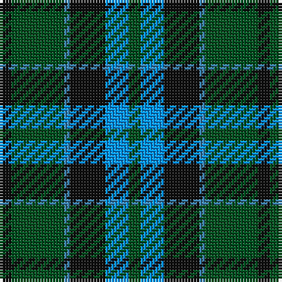

This page is one **sett** — a single exact thread-count. It belongs to the [tartan](/tartans/k2dg9t1k6b4dg2/)
(the same proportion at any scale), whose colour order is pattern [GBKBGK](/stripes/gbkbgk/).

Sourced from register-of-tartans.  It is a [6 stripe tartan](/stripes/stripes6/).

Original link https://www.tartanregister.gov.uk/tartanDetails.aspx?ref=4229

## Register references

External register numbers recorded for this tartan.

- Scottish Register of Tartans: [4229](https://www.tartanregister.gov.uk/tartanDetails.aspx?ref=4229)
- Scottish Tartans World Register: 724

## Thread count
K/4 G18 B2 K12 Ba8 G/4

## Palette

Palette: <strong>Tartan Register</strong>
<table><thead><tr><th>Colour</th><th>Threads</th><th>Shade</th><th>Base</th><th>OKLCh</th></tr></thead><tbody><tr><td>K/</td><td style="text-align:right;font-variant-numeric:tabular-nums">4</td><td><code style="background-color:#101010;">#101010</code> <small style="color:#888">#101010</small></td><td>K <code style="background-color:#000000;">#000000</code></td><td><small style="color:#888">oklch(17.3% 0.000 89.9)</small></td></tr><tr><td>G</td><td style="text-align:right;font-variant-numeric:tabular-nums">18</td><td><code style="background-color:#005020;">#005020</code> <small style="color:#888">#005020</small></td><td>G <code style="background-color:#006100;">#006100</code></td><td><small style="color:#888">oklch(37.7% 0.105 149.6)</small></td></tr><tr><td>B</td><td style="text-align:right;font-variant-numeric:tabular-nums">2</td><td><code style="background-color:#3C82AF;">#3C82AF</code> <small style="color:#888">#3C82AF</small></td><td>B <code style="background-color:#2A418A;">#2A418A</code></td><td><small style="color:#888">oklch(58.1% 0.099 239.8)</small></td></tr><tr><td>K</td><td style="text-align:right;font-variant-numeric:tabular-nums">12</td><td><code style="background-color:#101010;">#101010</code> <small style="color:#888">#101010</small></td><td>K <code style="background-color:#000000;">#000000</code></td><td><small style="color:#888">oklch(17.3% 0.000 89.9)</small></td></tr><tr><td>Ba</td><td style="text-align:right;font-variant-numeric:tabular-nums">8</td><td><code style="background-color:#0596FA;">#0596FA</code> <small style="color:#888">#0596FA</small></td><td>B <code style="background-color:#2A418A;">#2A418A</code></td><td><small style="color:#888">oklch(66.0% 0.180 248.9)</small></td></tr><tr><td>G/</td><td style="text-align:right;font-variant-numeric:tabular-nums">4</td><td><code style="background-color:#005020;">#005020</code> <small style="color:#888">#005020</small></td><td>G <code style="background-color:#006100;">#006100</code></td><td><small style="color:#888">oklch(37.7% 0.105 149.6)</small></td></tr></tbody></table>

# Sample pattern

## Nearest tartans

The nearest existing variants by ΔTartan distance, with this tartan at the top so the swatches line up against it.

ΔTartan

Tartan

Sett

—

<a href="/ttd/edit/#slug=k2dg9t1k6b4dg2~x2">Unidentified #28</a> <a class="nn-out" href="/setts/s6/k2dg9t1k6b4dg2~x2/" title="open its dictionary page">↗</a>

0.53

<a href="/ttd/edit/#slug=g3db1g8db7k3ly1~x2">Trafalgar (Fashion)</a> <a class="nn-out" href="/setts/s6/g3db1g8db7k3ly1~x2/" title="open its dictionary page">↗</a>

0.54

<a href="/ttd/edit/#slug=g9lb1g6k7db7k1~x4">Menteith</a> <a class="nn-out" href="/setts/s6/g9lb1g6k7db7k1~x4/" title="open its dictionary page">↗</a>

0.57

<a href="/ttd/edit/#slug=g52lb7g9k35db35k7">Redland</a> <a class="nn-out" href="/setts/s6/g52lb7g9k35db35k7/" title="open its dictionary page">↗</a>

0.75

<a href="/ttd/edit/#slug=g24b6lb3k6b12k15g4~x2">Blaylock Annandale</a> <a class="nn-out" href="/setts/s7/g24b6lb3k6b12k15g4~x2/" title="open its dictionary page">↗</a>

0.96

<a href="/ttd/edit/#slug=r1g8k8r1k8t8r1~x4">Triad Highland Games Proposed</a> <a class="nn-out" href="/setts/s7/r1g8k8r1k8t8r1~x4/" title="open its dictionary page">↗</a>

0.97

<a href="/ttd/edit/#slug=db3g28db3k16db28r3">Flower of Scotland</a> <a class="nn-out" href="/setts/s6/db3g28db3k16db28r3/" title="open its dictionary page">↗</a>

0.98

<a href="/ttd/edit/#slug=g24db6t3k6db12k15g4~x2">Blaylock Annandale (Name)</a> <a class="nn-out" href="/setts/s7/g24db6t3k6db12k15g4~x2/" title="open its dictionary page">↗</a>

1.01

<a href="/ttd/edit/#slug=g8t1g1k6db6k1~x4">Graham of Menteith (Clan)</a> <a class="nn-out" href="/setts/s6/g8t1g1k6db6k1~x4/" title="open its dictionary page">↗</a>

1.02

<a href="/ttd/edit/#slug=dg3r1dg9o10db3~x4">Bethlehem, City of</a> <a class="nn-out" href="/setts/s5/dg3r1dg9o10db3~x4/" title="open its dictionary page">↗</a>

1.02

<a href="/ttd/edit/#slug=r3dg10r3dg14db16dg3ly2">Cameron Hunting</a> <a class="nn-out" href="/setts/s7/r3dg10r3dg14db16dg3ly2/" title="open its dictionary page">↗</a>

## Neighbour map

Every grey dot is one of 14299 variants placed by the first two principal components of the ΔTartan feature space (44% of its variance). Red is this tartan; blue dots are its nearest — click one to open its page.

<svg viewBox="0 0 640 380" role="img" style="max-width:100%;height:auto;border:1px solid #e0e0e0;border-radius:4px;display:block" xmlns="http://www.w3.org/2000/svg"><image href="/nn/cloud.v1.png" width="640" height="380"/><a href="/setts/s6/g3db1g8db7k3ly1~x2/"><circle cx="248.8" cy="247.4" r="4" fill="#3465a4"><title>Trafalgar (Fashion)</title></circle></a><a href="/setts/s6/g9lb1g6k7db7k1~x4/"><circle cx="232.9" cy="254.6" r="4" fill="#3465a4"><title>Menteith</title></circle></a><a href="/setts/s6/g52lb7g9k35db35k7/"><circle cx="207.6" cy="246.5" r="4" fill="#3465a4"><title>Redland</title></circle></a><a href="/setts/s7/g24b6lb3k6b12k15g4~x2/"><circle cx="189.5" cy="235.8" r="4" fill="#3465a4"><title>Blaylock Annandale</title></circle></a><a href="/setts/s7/r1g8k8r1k8t8r1~x4/"><circle cx="195.0" cy="225.4" r="4" fill="#3465a4"><title>Triad Highland Games Proposed</title></circle></a><a href="/setts/s6/db3g28db3k16db28r3/"><circle cx="207.2" cy="216.0" r="4" fill="#3465a4"><title>Flower of Scotland</title></circle></a><a href="/setts/s7/g24db6t3k6db12k15g4~x2/"><circle cx="212.8" cy="248.1" r="4" fill="#3465a4"><title>Blaylock Annandale (Name)</title></circle></a><a href="/setts/s6/g8t1g1k6db6k1~x4/"><circle cx="218.0" cy="248.8" r="4" fill="#3465a4"><title>Graham of Menteith (Clan)</title></circle></a><a href="/setts/s5/dg3r1dg9o10db3~x4/"><circle cx="256.4" cy="242.7" r="4" fill="#3465a4"><title>Bethlehem, City of</title></circle></a><a href="/setts/s7/r3dg10r3dg14db16dg3ly2/"><circle cx="263.7" cy="229.7" r="4" fill="#3465a4"><title>Cameron Hunting</title></circle></a><circle cx="229.3" cy="242.6" r="5" fill="#c00000"/></svg>

ID: /setts/s6/k2dg9t1k6b4dg2~x2/
