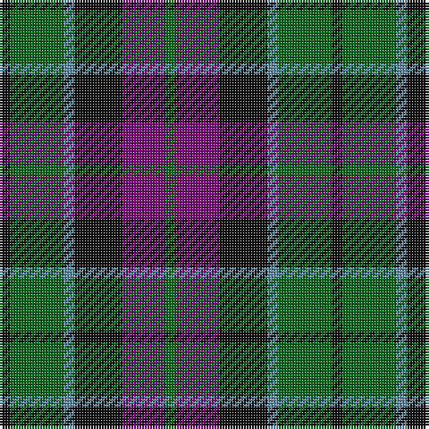

This page is one **sett** — a single exact thread-count. It belongs to the [tartan](/tartans/k2g10t2k9dp8g2/)
(the same proportion at any scale), whose colour order is pattern [GBKBGK](/stripes/gbkbgk/).

Sourced from house-of-tartan.  It is a [6 stripe tartan](/stripes/stripes6/).

Original link http://www.house-of-tartan.scotland.net/house/TartanViewjs.asp?colr=Def&tnam=725

## Thread count
K/4 G20 B4 K18 P16 G/4

## Palette

Palette: <strong>Tartan Register</strong>
<table><thead><tr><th>Colour</th><th>Threads</th><th>Shade</th><th>Base</th><th>OKLCh</th></tr></thead><tbody><tr><td>K/</td><td style="text-align:right;font-variant-numeric:tabular-nums">4</td><td><code style="background-color:#101010;">#101010</code> <small style="color:#888">#101010</small></td><td>K <code style="background-color:#000000;">#000000</code></td><td><small style="color:#888">oklch(17.3% 0.000 89.9)</small></td></tr><tr><td>G</td><td style="text-align:right;font-variant-numeric:tabular-nums">20</td><td><code style="background-color:#006818;">#006818</code> <small style="color:#888">#006818</small></td><td>G <code style="background-color:#006100;">#006100</code></td><td><small style="color:#888">oklch(45.0% 0.142 145.0)</small></td></tr><tr><td>B</td><td style="text-align:right;font-variant-numeric:tabular-nums">4</td><td><code style="background-color:#5C8CA8;">#5C8CA8</code> <small style="color:#888">#5C8CA8</small></td><td>B <code style="background-color:#2A418A;">#2A418A</code></td><td><small style="color:#888">oklch(61.7% 0.067 235.0)</small></td></tr><tr><td>K</td><td style="text-align:right;font-variant-numeric:tabular-nums">18</td><td><code style="background-color:#101010;">#101010</code> <small style="color:#888">#101010</small></td><td>K <code style="background-color:#000000;">#000000</code></td><td><small style="color:#888">oklch(17.3% 0.000 89.9)</small></td></tr><tr><td>P</td><td style="text-align:right;font-variant-numeric:tabular-nums">16</td><td><code style="background-color:#780078;">#780078</code> <small style="color:#888">#780078</small></td><td>B <code style="background-color:#2A418A;">#2A418A</code></td><td><small style="color:#888">oklch(40.2% 0.185 328.4)</small></td></tr><tr><td>G/</td><td style="text-align:right;font-variant-numeric:tabular-nums">4</td><td><code style="background-color:#006818;">#006818</code> <small style="color:#888">#006818</small></td><td>G <code style="background-color:#006100;">#006100</code></td><td><small style="color:#888">oklch(45.0% 0.142 145.0)</small></td></tr></tbody></table>

# Sample pattern

## Nearest tartans

The nearest existing variants by ΔTartan distance, with this tartan at the top so the swatches line up against it.

ΔTartan

Tartan

Sett

—

<a href="/ttd/edit/#slug=k2g10t2k9dp8g2~x2">Lennie Family Tartan Tartan Number: 725. Earliest known date: 1819 Wilson's No 231. See products available Copyright © Blair Urquhart, Comrie, 2015</a> <a class="nn-out" href="/setts/s6/k2g10t2k9dp8g2~x2/" title="open its dictionary page">↗</a>

0.55

<a href="/ttd/edit/#slug=r4g12k12g2db12g3~x2">Gunn - 1810 (Clan)</a> <a class="nn-out" href="/setts/s6/r4g12k12g2db12g3~x2/" title="open its dictionary page">↗</a>

0.73

<a href="/ttd/edit/#slug=t3dg12k14t11r3t3~x2">Wellington or Waterloo</a> <a class="nn-out" href="/setts/s6/t3dg12k14t11r3t3~x2/" title="open its dictionary page">↗</a>

0.85

<a href="/ttd/edit/#slug=g1db6k6g6r1g1~x6">Callum Beg (Fashion)</a> <a class="nn-out" href="/setts/s6/g1db6k6g6r1g1~x6/" title="open its dictionary page">↗</a>

0.86

<a href="/ttd/edit/#slug=y3dg6k6y4r1y1~x2">Waterloo</a> <a class="nn-out" href="/setts/s6/y3dg6k6y4r1y1~x2/" title="open its dictionary page">↗</a>

0.88

<a href="/ttd/edit/#slug=db4k3db16k14g14r3g3~x2">Inneryne (Personal)</a> <a class="nn-out" href="/setts/s7/db4k3db16k14g14r3g3~x2/" title="open its dictionary page">↗</a>

0.88

<a href="/ttd/edit/#slug=g14db2g2k8dp9k2~x2">MacArthur of Milton Hunting Clan Tartan Tartan Number: 700. Earliest known date: 1823 This is the older of the two MacArthur setts, which links the clan with the Campbells. See products available Copyright © Blair Urquhart, Comrie, 2015</a> <a class="nn-out" href="/setts/s6/g14db2g2k8dp9k2~x2/" title="open its dictionary page">↗</a>

0.92

<a href="/ttd/edit/#slug=r3g6db2dbi2db11g9db2r3~x2">Daks (Navy)</a> <a class="nn-out" href="/setts/s8/r3g6db2dbi2db11g9db2r3~x2/" title="open its dictionary page">↗</a>

0.96

<a href="/ttd/edit/#slug=b10k3b10k14r2g14r5~x2">Fletcher of Dunans</a> <a class="nn-out" href="/setts/s7/b10k3b10k14r2g14r5~x2/" title="open its dictionary page">↗</a>

0.98

<a href="/ttd/edit/#slug=k3g14k14g2b14r3~x2">Morrison Society</a> <a class="nn-out" href="/setts/s6/k3g14k14g2b14r3~x2/" title="open its dictionary page">↗</a>

1.01

<a href="/ttd/edit/#slug=k3db14r2k14g14k3~x2">Gallamore</a> <a class="nn-out" href="/setts/s6/k3db14r2k14g14k3~x2/" title="open its dictionary page">↗</a>

## Neighbour map

Every grey dot is one of 14359 variants placed by the first two principal components of the ΔTartan feature space (44% of its variance). Red is this tartan; blue dots are its nearest — click one to open its page.

<svg viewBox="0 0 640 380" role="img" style="max-width:100%;height:auto;border:1px solid #e0e0e0;border-radius:4px;display:block" xmlns="http://www.w3.org/2000/svg"><image href="/nn/cloud.v1.png" width="640" height="380"/><a href="/setts/s6/r4g12k12g2db12g3~x2/"><circle cx="167.6" cy="265.0" r="4" fill="#3465a4"><title>Gunn - 1810 (Clan)</title></circle></a><a href="/setts/s6/t3dg12k14t11r3t3~x2/"><circle cx="149.5" cy="265.6" r="4" fill="#3465a4"><title>Wellington or Waterloo</title></circle></a><a href="/setts/s6/g1db6k6g6r1g1~x6/"><circle cx="197.7" cy="261.4" r="4" fill="#3465a4"><title>Callum Beg (Fashion)</title></circle></a><a href="/setts/s6/y3dg6k6y4r1y1~x2/"><circle cx="157.3" cy="255.5" r="4" fill="#3465a4"><title>Waterloo</title></circle></a><a href="/setts/s7/db4k3db16k14g14r3g3~x2/"><circle cx="179.7" cy="260.9" r="4" fill="#3465a4"><title>Inneryne (Personal)</title></circle></a><a href="/setts/s6/g14db2g2k8dp9k2~x2/"><circle cx="221.2" cy="246.4" r="4" fill="#3465a4"><title>MacArthur of Milton Hunting Clan Tartan Tartan Number: 700. Earliest known date: 1823 This is the older of the two MacArthur setts, which links the clan with the Campbells. See products available Copyright © Blair Urquhart, Comrie, 2015</title></circle></a><a href="/setts/s8/r3g6db2dbi2db11g9db2r3~x2/"><circle cx="200.6" cy="248.3" r="4" fill="#3465a4"><title>Daks (Navy)</title></circle></a><a href="/setts/s7/b10k3b10k14r2g14r5~x2/"><circle cx="141.7" cy="251.9" r="4" fill="#3465a4"><title>Fletcher of Dunans</title></circle></a><a href="/setts/s6/k3g14k14g2b14r3~x2/"><circle cx="163.1" cy="248.6" r="4" fill="#3465a4"><title>Morrison Society</title></circle></a><a href="/setts/s6/k3db14r2k14g14k3~x2/"><circle cx="214.3" cy="262.0" r="4" fill="#3465a4"><title>Gallamore</title></circle></a><circle cx="165.6" cy="263.2" r="5" fill="#c00000"/></svg>

ID: /setts/s6/k2g10t2k9dp8g2~x2/
