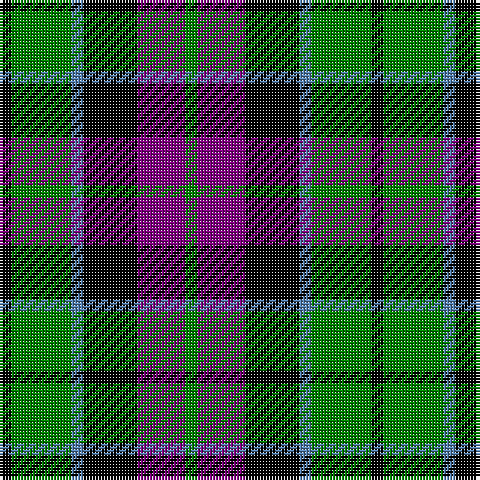

This page is one **sett** — a single exact thread-count. It belongs to the [tartan](/tartans/k2g10t2k9p8g2/)
(the same proportion at any scale), whose colour order is pattern [GBKBGK](/stripes/gbkbgk/).

Sourced from weddslist.  It is a [6 stripe tartan](/stripes/stripes6/).

Original link http://www.weddslist.com/cgi-bin/tartans/pg.pl?source=sts

## Thread count
K/4 G20 B4 K18 P16 G/4

## Palette

Palette: <strong>Ingles Buchan</strong> <small style="color:#888">(1 of 4 colours)</small>
<table><thead><tr><th>Colour</th><th>Threads</th><th>Shade</th><th>Base</th><th>OKLCh</th></tr></thead><tbody><tr><td>K/</td><td style="text-align:right;font-variant-numeric:tabular-nums">4</td><td><code style="background-color:#000000;">#000000</code> <small style="color:#888">#000000</small></td><td>K <code style="background-color:#000000;">#000000</code></td><td><small style="color:#888">oklch(0.0% 0.000 0.0)</small></td></tr><tr><td>G</td><td style="text-align:right;font-variant-numeric:tabular-nums">20</td><td><code style="background-color:#008000;">#008000</code> <small style="color:#888">#008000</small></td><td>G <code style="background-color:#006100;">#006100</code></td><td><small style="color:#888">oklch(52.0% 0.177 142.5)</small></td></tr><tr><td>B</td><td style="text-align:right;font-variant-numeric:tabular-nums">4</td><td><code style="background-color:#5480B0;">#5480B0</code> <small style="color:#888">#5480B0</small></td><td>B <code style="background-color:#2A418A;">#2A418A</code></td><td><small style="color:#888">oklch(58.8% 0.089 251.5)</small></td></tr><tr><td>K</td><td style="text-align:right;font-variant-numeric:tabular-nums">18</td><td><code style="background-color:#000000;">#000000</code> <small style="color:#888">#000000</small></td><td>K <code style="background-color:#000000;">#000000</code></td><td><small style="color:#888">oklch(0.0% 0.000 0.0)</small></td></tr><tr><td>P</td><td style="text-align:right;font-variant-numeric:tabular-nums">16</td><td><code style="background-color:#800080;">#800080</code> <small style="color:#888">#800080</small></td><td>B <code style="background-color:#2A418A;">#2A418A</code></td><td><small style="color:#888">oklch(42.1% 0.193 328.4)</small></td></tr><tr><td>G/</td><td style="text-align:right;font-variant-numeric:tabular-nums">4</td><td><code style="background-color:#008000;">#008000</code> <small style="color:#888">#008000</small></td><td>G <code style="background-color:#006100;">#006100</code></td><td><small style="color:#888">oklch(52.0% 0.177 142.5)</small></td></tr></tbody></table>

# Sample pattern

## Nearest tartans

The nearest existing variants by ΔTartan distance, with this tartan at the top so the swatches line up against it.

ΔTartan

Tartan

Sett

—

<a href="/ttd/edit/#slug=k2g10t2k9p8g2~x2">Lennie</a> <a class="nn-out" href="/setts/s6/k2g10t2k9p8g2~x2/" title="open its dictionary page">↗</a>

0.71

<a href="/ttd/edit/#slug=w2p10k10g9k3w2~x2">MacNeil 2</a> <a class="nn-out" href="/setts/s6/w2p10k10g9k3w2~x2/" title="open its dictionary page">↗</a>

0.72

<a href="/ttd/edit/#slug=db2k2db12k8g11r2~x2">Murray</a> <a class="nn-out" href="/setts/s6/db2k2db12k8g11r2~x2/" title="open its dictionary page">↗</a>

0.73

<a href="/ttd/edit/#slug=t3g12k14t11r3t3~x2">Wellington, or Waterloo</a> <a class="nn-out" href="/setts/s6/t3g12k14t11r3t3~x2/" title="open its dictionary page">↗</a>

0.77

<a href="/ttd/edit/#slug=k3g14k14g2db14r3~x2">Morrison</a> <a class="nn-out" href="/setts/s6/k3g14k14g2db14r3~x2/" title="open its dictionary page">↗</a>

0.80

<a href="/ttd/edit/#slug=db2k2db12k11g12w2~x2">Campbell, The White Stripe</a> <a class="nn-out" href="/setts/s6/db2k2db12k11g12w2~x2/" title="open its dictionary page">↗</a>

0.89

<a href="/ttd/edit/#slug=k2g8db2k9p7k2~x2">Campbell, Sir Walter Scott</a> <a class="nn-out" href="/setts/s6/k2g8db2k9p7k2~x2/" title="open its dictionary page">↗</a>

0.89

<a href="/ttd/edit/#slug=g14db2g2k8p9k2~x2">MacArthur of Milton, hunting</a> <a class="nn-out" href="/setts/s6/g14db2g2k8p9k2~x2/" title="open its dictionary page">↗</a>

0.91

<a href="/ttd/edit/#slug=db6k1db6k8r1g8r2~x2">Fletcher of Dunans</a> <a class="nn-out" href="/setts/s7/db6k1db6k8r1g8r2~x2/" title="open its dictionary page">↗</a>

0.92

<a href="/ttd/edit/#slug=k2g8k7db8r2~x2">Denholme</a> <a class="nn-out" href="/setts/s5/k2g8k7db8r2~x2/" title="open its dictionary page">↗</a>

0.95

<a href="/ttd/edit/#slug=db1k1db6k6g6k1w1~x2">Forbes</a> <a class="nn-out" href="/setts/s7/db1k1db6k6g6k1w1~x2/" title="open its dictionary page">↗</a>

## Neighbour map

Every grey dot is one of 14359 variants placed by the first two principal components of the ΔTartan feature space (44% of its variance). Red is this tartan; blue dots are its nearest — click one to open its page.

<svg viewBox="0 0 640 380" role="img" style="max-width:100%;height:auto;border:1px solid #e0e0e0;border-radius:4px;display:block" xmlns="http://www.w3.org/2000/svg"><image href="/nn/cloud.v1.png" width="640" height="380"/><a href="/setts/s6/w2p10k10g9k3w2~x2/"><circle cx="106.7" cy="239.7" r="4" fill="#3465a4"><title>MacNeil 2</title></circle></a><a href="/setts/s6/db2k2db12k8g11r2~x2/"><circle cx="152.3" cy="241.5" r="4" fill="#3465a4"><title>Murray</title></circle></a><a href="/setts/s6/t3g12k14t11r3t3~x2/"><circle cx="115.6" cy="249.7" r="4" fill="#3465a4"><title>Wellington, or Waterloo</title></circle></a><a href="/setts/s6/k3g14k14g2db14r3~x2/"><circle cx="137.1" cy="236.9" r="4" fill="#3465a4"><title>Morrison</title></circle></a><a href="/setts/s6/db2k2db12k11g12w2~x2/"><circle cx="129.7" cy="237.5" r="4" fill="#3465a4"><title>Campbell, The White Stripe</title></circle></a><a href="/setts/s6/k2g8db2k9p7k2~x2/"><circle cx="152.0" cy="257.1" r="4" fill="#3465a4"><title>Campbell, Sir Walter Scott</title></circle></a><a href="/setts/s6/g14db2g2k8p9k2~x2/"><circle cx="177.6" cy="225.9" r="4" fill="#3465a4"><title>MacArthur of Milton, hunting</title></circle></a><a href="/setts/s7/db6k1db6k8r1g8r2~x2/"><circle cx="147.1" cy="229.1" r="4" fill="#3465a4"><title>Fletcher of Dunans</title></circle></a><a href="/setts/s5/k2g8k7db8r2~x2/"><circle cx="98.7" cy="281.4" r="4" fill="#3465a4"><title>Denholme</title></circle></a><a href="/setts/s7/db1k1db6k6g6k1w1~x2/"><circle cx="142.7" cy="224.5" r="4" fill="#3465a4"><title>Forbes</title></circle></a><circle cx="126.9" cy="245.8" r="5" fill="#c00000"/></svg>

ID: /setts/s6/k2g10t2k9p8g2~x2/
