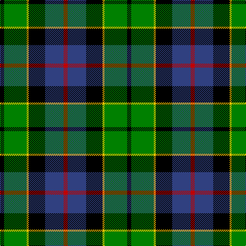

In pattern [KGYKBR](/stripes/kgykbr/).

This was sourced from weddslist.  It is a [6 stripe tartan](/stripes/stripes6/).

Original link http://www.weddslist.com/cgi-bin/tartans/pg.pl?source=sts

## Attestations

This cloth appears in 2 source records; the oldest owns this page.

- undated — Forsyth (weddslist, [record](http://www.weddslist.com/cgi-bin/tartans/pg.pl?source=sts))
- undated — Forsyth Clan Tartan Tartan Number: 1122. Earliest known date: 1872 (1830) This sett has a close resemblance to the the Leslie tartan in which white replaces yellow. A description of the tartan appears in Jennie Forsyth Jeffrie's 'History of the Forsyth Family' (1918). Clan Chief, Alistair Forsyth, was recognised by Lord Lyon in 1978 - the first for over 300 years. See products available Copyright © Blair Urquhart, Comrie, 2015 (house-of-tartan, [record](http://www.house-of-tartan.scotland.net/house/TartanViewjs.asp?colr=Def&tnam=1122))

## Thread count
K/8 G44 Y4 K32 B36 R/8

## Palette
Each colour and the base-6 reference it is a variant of.

| Colour | Shade | Base |
|---|---|---|
| B | <code style="background-color:#304080;">#304080</code> `oklch(39.4% 0.109 270.2)` <small>#304080</small> | B <code style="background-color:#2A418A;">#2A418A</code> |
| G | <code style="background-color:#008000;">#008000</code> `oklch(52.0% 0.177 142.5)` <small>#008000</small> | G <code style="background-color:#006100;">#006100</code> |
| K | <code style="background-color:#000000;">#000000</code> `oklch(0.0% 0.000 0.0)` <small>#000000</small> | K <code style="background-color:#000000;">#000000</code> |
| R | <code style="background-color:#C00000;">#C00000</code> `oklch(50.7% 0.208 29.2)` <small>#C00000</small> | R <code style="background-color:#CC0000;">#CC0000</code> |
| Y | <code style="background-color:#F0C000;">#F0C000</code> `oklch(82.7% 0.169 90.5)` <small>#F0C000</small> | Y <code style="background-color:#F2BF00;">#F2BF00</code> |

# Sample pattern

## Nearest tartans

The nearest existing variants by ΔTartan distance.

1. [Forsyth (1795)](/setts/s6/k2g11ly1k8b9r2~x4/) — ΔT 0.41
1. [Russell, or Mitchell or Hunter or Galbraith](/setts/s6/k2g12k12r1db12w2~x2/) — ΔT 0.42
1. [MacWilliam](/setts/s6/r10db24r4k30g36db5/) — ΔT 0.52
1. [MacNeil 4](/setts/s6/w1db8k9g9k1ly1~x4/) — ΔT 0.54
1. [Leslie, hunting](/setts/s6/r2db8k8w1g8k1~x2/) — ΔT 0.58
1. [MacDonald, (Flora.. )](/setts/s7/g17ly2k14r2db9r2db10~x2/) — ΔT 0.58
1. [Junior Chamber International](/setts/s7/r4g16k16db4g3db12ly2~x2/) — ΔT 0.59
1. [Wilson's, No 221](/setts/s6/r1g14k14r2db14t1~x2/) — ΔT 0.67
1. [Dahlonega (District)](/setts/s6/r5g18ly2k14t5k4~x2/) — ΔT 0.68
1. [New York, Firemen's Pipe Band](/setts/s6/k14w3g42k36db40t10/) — ΔT 0.69

## Neighbour map

Every grey dot is one of 14299 variants placed by the first two principal components of the ΔTartan feature space (44% of its variance). Red is this tartan; blue dots are its nearest — click one to open its page.

<svg viewBox="0 0 640 380" role="img" style="max-width:100%;height:auto;border:1px solid #e0e0e0;border-radius:4px;display:block" xmlns="http://www.w3.org/2000/svg"><image href="/nn/cloud.v1.png" width="640" height="380"/><a href="/setts/s6/k2g11ly1k8b9r2~x4/"><circle cx="121.2" cy="195.1" r="4" fill="#3465a4"><title>Forsyth (1795)</title></circle></a><a href="/setts/s6/k2g12k12r1db12w2~x2/"><circle cx="136.7" cy="190.3" r="4" fill="#3465a4"><title>Russell, or Mitchell or Hunter or Galbraith</title></circle></a><a href="/setts/s6/r10db24r4k30g36db5/"><circle cx="109.5" cy="206.2" r="4" fill="#3465a4"><title>MacWilliam</title></circle></a><a href="/setts/s6/w1db8k9g9k1ly1~x4/"><circle cx="129.1" cy="196.5" r="4" fill="#3465a4"><title>MacNeil 4</title></circle></a><a href="/setts/s6/r2db8k8w1g8k1~x2/"><circle cx="107.6" cy="206.5" r="4" fill="#3465a4"><title>Leslie, hunting</title></circle></a><a href="/setts/s7/g17ly2k14r2db9r2db10~x2/"><circle cx="116.7" cy="199.0" r="4" fill="#3465a4"><title>MacDonald, (Flora.. )</title></circle></a><a href="/setts/s7/r4g16k16db4g3db12ly2~x2/"><circle cx="109.6" cy="200.9" r="4" fill="#3465a4"><title>Junior Chamber International</title></circle></a><a href="/setts/s6/r1g14k14r2db14t1~x2/"><circle cx="141.9" cy="181.7" r="4" fill="#3465a4"><title>Wilson's, No 221</title></circle></a><a href="/setts/s6/r5g18ly2k14t5k4~x2/"><circle cx="140.5" cy="200.8" r="4" fill="#3465a4"><title>Dahlonega (District)</title></circle></a><a href="/setts/s6/k14w3g42k36db40t10/"><circle cx="132.8" cy="198.6" r="4" fill="#3465a4"><title>New York, Firemen's Pipe Band</title></circle></a><circle cx="127.4" cy="197.0" r="5" fill="#c00000"/></svg>

ID: /setts/s6/k2g11ly1k8db9r2~x4/
