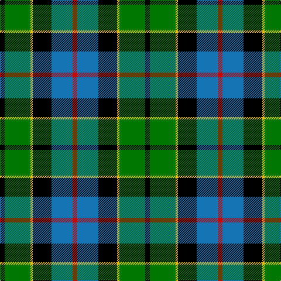

In pattern [KGYKBR](/patterns/kgykbr/).

This was sourced from register-of-tartans.  It is a [6 stripes tartan](/stripes/stripes6/).

Original link https://www.tartanregister.gov.uk/tartanDetails.aspx?ref=1236

## Attestations

This cloth appears in 2 source records; the oldest owns this page.

- 01/01/1795 — Forsyth (1795) (register-of-tartans, [record](https://www.tartanregister.gov.uk/tartanDetails.aspx?ref=1236))
- 1795 — Forsyth (Clan) (tartans-authority, [record](http://www.tartansauthority.com/tartan-ferret/display/1122/))

## Register references

External register numbers recorded for this tartan.

- Scottish Register of Tartans: [1236](https://www.tartanregister.gov.uk/tartanDetails.aspx?ref=1236)
- Scottish Tartans Authority (ITI): 1122
- Scottish Tartans World Register: 1122

## Thread count
K/8 G44 Y4 K32 B36 R/8

## Palette
Each colour and its ΔE from the base-6 reference it is a variant of.

| Colour | Shade | Base | ΔE (OKLab) |
|---|---|---|---|
| B | <code style="background-color:#1474B4;">#1474B4</code> `#1474B4` | B <code style="background-color:#2A418A;">#2A418A</code> | 0.15 |
| G | <code style="background-color:#007800;">#007800</code> `#007800` | G <code style="background-color:#006100;">#006100</code> | 0.07 |
| K | <code style="background-color:#000000;">#000000</code> `#000000` | K <code style="background-color:#000000;">#000000</code> | 0.00 |
| R | <code style="background-color:#C80000;">#C80000</code> `#C80000` | R <code style="background-color:#CC0000;">#CC0000</code> | 0.01 |
| Y | <code style="background-color:#E8C000;">#E8C000</code> `#E8C000` | Y <code style="background-color:#F2BF00;">#F2BF00</code> | 0.02 |

# Sample pattern

## Nearest tartans

The nearest existing variants by ΔTartan distance.

1. [Forsyth](/setts/s6/k2g11y1k8b9r2~b304080-g008000-k000000-rc00000-yf0c000~x4/) — ΔT 0.41
1. [Russell, or Mitchell or Hunter or Galbraith](/setts/s6/k2g12k12r1b12w2~b304080-g008000-k000000-rc00000-we0e0e0~x2/) — ΔT 0.57
1. [MacNeil 4](/setts/s6/w1b8k9g9k1y1~b304080-g008000-k000000-we0e0e0-yf0c000~x4/) — ΔT 0.58
1. [MacDonald, (Flora.. )](/setts/s7/g17y2k14r2b9r2b10~b304080-g008000-k000000-rc00000-yf0c000~x2/) — ΔT 0.69
1. [Junior Chamber International](/setts/s7/r4g16k16b4g3b12y2~b304080-g008000-k000000-rc00000-yf0c000~x2/) — ΔT 0.69
1. [Sanix Modern](/setts/s5/r2b16k11g19y2~b304080-g30a010-k000000-rc00000-yf0c000~x2/) — ΔT 0.73
1. [New York, Firemen's Pipe Band](/setts/s6/k14w3g42k36b40ba10~b304080-ba5480b0-g008000-k000000-we0e0e0/) — ΔT 0.76
1. [MacLeod of Assynt](/setts/s6/r3k2g15k10b20y2~b304080-g008000-k000000-rc00000-yf0c000~x2/) — ΔT 0.76
1. [Leslie, hunting](/setts/s6/r2b8k8w1g8k1~b304080-g008000-k000000-rc00000-we0e0e0~x2/) — ΔT 0.77
1. [MacTaggert](/setts/s7/g9b2g1k6ba6r1ba1~b5480b0-ba304080-g008000-k000000-rc00000~x2/) — ΔT 0.78

## Neighbour map

Every grey dot is one of 15726 variants placed by the first two principal components of the ΔTartan feature space (44% of its variance). Red is this tartan; blue dots are its nearest — click one to open its page.

<svg viewBox="0 0 640 380" role="img" style="max-width:100%;height:auto;border:1px solid #e0e0e0;border-radius:4px;display:block" xmlns="http://www.w3.org/2000/svg"><image href="/nn/cloud.v1.png" width="640" height="380"/><a href="/setts/s6/k2g11y1k8b9r2~b304080-g008000-k000000-rc00000-yf0c000~x4/"><circle cx="123.5" cy="196.7" r="4" fill="#3465a4"><title>Forsyth</title></circle></a><a href="/setts/s6/k2g12k12r1b12w2~b304080-g008000-k000000-rc00000-we0e0e0~x2/"><circle cx="132.6" cy="190.3" r="4" fill="#3465a4"><title>Russell, or Mitchell or Hunter or Galbraith</title></circle></a><a href="/setts/s6/w1b8k9g9k1y1~b304080-g008000-k000000-we0e0e0-yf0c000~x4/"><circle cx="125.0" cy="196.6" r="4" fill="#3465a4"><title>MacNeil 4</title></circle></a><a href="/setts/s7/g17y2k14r2b9r2b10~b304080-g008000-k000000-rc00000-yf0c000~x2/"><circle cx="112.9" cy="198.4" r="4" fill="#3465a4"><title>MacDonald, (Flora.. )</title></circle></a><a href="/setts/s7/r4g16k16b4g3b12y2~b304080-g008000-k000000-rc00000-yf0c000~x2/"><circle cx="105.8" cy="200.4" r="4" fill="#3465a4"><title>Junior Chamber International</title></circle></a><a href="/setts/s5/r2b16k11g19y2~b304080-g30a010-k000000-rc00000-yf0c000~x2/"><circle cx="132.3" cy="207.3" r="4" fill="#3465a4"><title>Sanix Modern</title></circle></a><a href="/setts/s6/k14w3g42k36b40ba10~b304080-ba5480b0-g008000-k000000-we0e0e0/"><circle cx="128.7" cy="197.9" r="4" fill="#3465a4"><title>New York, Firemen's Pipe Band</title></circle></a><a href="/setts/s6/r3k2g15k10b20y2~b304080-g008000-k000000-rc00000-yf0c000~x2/"><circle cx="150.5" cy="192.8" r="4" fill="#3465a4"><title>MacLeod of Assynt</title></circle></a><a href="/setts/s6/r2b8k8w1g8k1~b304080-g008000-k000000-rc00000-we0e0e0~x2/"><circle cx="103.7" cy="206.4" r="4" fill="#3465a4"><title>Leslie, hunting</title></circle></a><a href="/setts/s7/g9b2g1k6ba6r1ba1~b5480b0-ba304080-g008000-k000000-rc00000~x2/"><circle cx="141.0" cy="191.4" r="4" fill="#3465a4"><title>MacTaggert</title></circle></a><circle cx="117.1" cy="195.0" r="5" fill="#c00000"/></svg>

ID: /setts/s6/k2g11y1k8b9r2~b1474b4-g007800-k000000-rc80000-ye8c000~x4/
