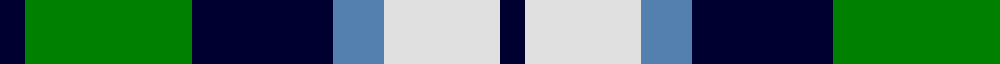
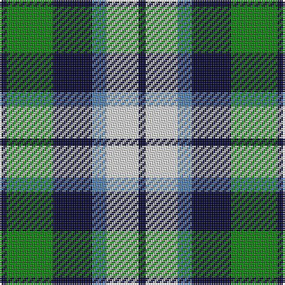

This page is one **sett** — a single exact thread-count. It belongs to the [tartan](/tartans/k2g13k11t4w9k2/)
(the same proportion at any scale), whose colour order is pattern [KGKBWK](/stripes/kgkbwk/).

Sourced from weddslist.  It is a [6 stripe tartan](/stripes/stripes6/).

Original link http://www.weddslist.com/cgi-bin/tartans/pg.pl?source=sts

## Thread count
DB/4 G26 DB22 B8 LN18 DB/4

## Palette

Palette: <strong>Tartan Dictionary</strong> <small style="color:#888">(1 of 4 colours)</small>
<table><thead><tr><th>Colour</th><th>Threads</th><th>Shade</th><th>Base</th><th>OKLCh</th></tr></thead><tbody><tr><td>DB/</td><td style="text-align:right;font-variant-numeric:tabular-nums">4</td><td><code style="background-color:#000030;">#000030</code> <small style="color:#888">#000030</small></td><td>K <code style="background-color:#000000;">#000000</code></td><td><small style="color:#888">oklch(14.0% 0.097 264.1)</small></td></tr><tr><td>G</td><td style="text-align:right;font-variant-numeric:tabular-nums">26</td><td><code style="background-color:#008000;">#008000</code> <small style="color:#888">#008000</small></td><td>G <code style="background-color:#006100;">#006100</code></td><td><small style="color:#888">oklch(52.0% 0.177 142.5)</small></td></tr><tr><td>DB</td><td style="text-align:right;font-variant-numeric:tabular-nums">22</td><td><code style="background-color:#000030;">#000030</code> <small style="color:#888">#000030</small></td><td>K <code style="background-color:#000000;">#000000</code></td><td><small style="color:#888">oklch(14.0% 0.097 264.1)</small></td></tr><tr><td>B</td><td style="text-align:right;font-variant-numeric:tabular-nums">8</td><td><code style="background-color:#5480B0;">#5480B0</code> <small style="color:#888">#5480B0</small></td><td>B <code style="background-color:#2A418A;">#2A418A</code></td><td><small style="color:#888">oklch(58.8% 0.089 251.5)</small></td></tr><tr><td>LN</td><td style="text-align:right;font-variant-numeric:tabular-nums">18</td><td><code style="background-color:#E0E0E0;">#E0E0E0</code> <small style="color:#888">#E0E0E0</small></td><td>W <code style="background-color:#F7F7F7;">#F7F7F7</code></td><td><small style="color:#888">oklch(90.7% 0.000 89.9)</small></td></tr><tr><td>DB/</td><td style="text-align:right;font-variant-numeric:tabular-nums">4</td><td><code style="background-color:#000030;">#000030</code> <small style="color:#888">#000030</small></td><td>K <code style="background-color:#000000;">#000000</code></td><td><small style="color:#888">oklch(14.0% 0.097 264.1)</small></td></tr></tbody></table>

# Sample pattern

## Nearest tartans

The nearest existing variants by ΔTartan distance, with this tartan at the top so the swatches line up against it.

ΔTartan

Tartan

Sett

—

<a href="/ttd/edit/#slug=k2g13k11t4w9k2~x2">Loch Leven, Check</a> <a class="nn-out" href="/setts/s6/k2g13k11t4w9k2~x2/" title="open its dictionary page">↗</a>

0.66

<a href="/ttd/edit/#slug=k4g14k14g2w14b3~x2">MacKay, Dress (Corporate)</a> <a class="nn-out" href="/setts/s6/k4g14k14g2w14b3~x2/" title="open its dictionary page">↗</a>

0.83

<a href="/ttd/edit/#slug=t3g6k6t4r1t1~x2">Wellington, or Waterloo</a> <a class="nn-out" href="/setts/s6/t3g6k6t4r1t1~x2/" title="open its dictionary page">↗</a>

0.98

<a href="/ttd/edit/#slug=w4db4g22k20db20w3">Unnamed, No 26</a> <a class="nn-out" href="/setts/s6/w4db4g22k20db20w3/" title="open its dictionary page">↗</a>

0.98

<a href="/ttd/edit/#slug=db2g13db11t4w9db2~x2">Loch Leven Check Trade Tartan Tartan Number: 108. Earliest known date: 1976 Sample presented by Clan Crest Textiles Ltd in 1976. See products available Copyright © Blair Urquhart, Comrie, 2015</a> <a class="nn-out" href="/setts/s6/db2g13db11t4w9db2~x2/" title="open its dictionary page">↗</a>

1.01

<a href="/ttd/edit/#slug=t3g12k14t11r3t3~x2">Wellington, or Waterloo</a> <a class="nn-out" href="/setts/s6/t3g12k14t11r3t3~x2/" title="open its dictionary page">↗</a>

1.02

<a href="/ttd/edit/#slug=dbi1g7dbi7db2w6dbi1w1~x4">Blue Boy, The (Fashion)</a> <a class="nn-out" href="/setts/s7/dbi1g7dbi7db2w6dbi1w1~x4/" title="open its dictionary page">↗</a>

1.03

<a href="/ttd/edit/#slug=k4w2g13k13t12k2~x2">Melville</a> <a class="nn-out" href="/setts/s6/k4w2g13k13t12k2~x2/" title="open its dictionary page">↗</a>

1.09

<a href="/ttd/edit/#slug=db3g12k13w2db13w3~x2">Herd/Hurd</a> <a class="nn-out" href="/setts/s6/db3g12k13w2db13w3~x2/" title="open its dictionary page">↗</a>

1.12

<a href="/ttd/edit/#slug=k4w19k11dg15k3dg16ly3~x2">Lawson, William 2002</a> <a class="nn-out" href="/setts/s7/k4w19k11dg15k3dg16ly3~x2/" title="open its dictionary page">↗</a>

1.13

<a href="/ttd/edit/#slug=r2db10k5g12w2~x2">Davidson of Tulloch</a> <a class="nn-out" href="/setts/s5/r2db10k5g12w2~x2/" title="open its dictionary page">↗</a>

## Neighbour map

Every grey dot is one of 14359 variants placed by the first two principal components of the ΔTartan feature space (44% of its variance). Red is this tartan; blue dots are its nearest — click one to open its page.

<svg viewBox="0 0 640 380" role="img" style="max-width:100%;height:auto;border:1px solid #e0e0e0;border-radius:4px;display:block" xmlns="http://www.w3.org/2000/svg"><image href="/nn/cloud.v1.png" width="640" height="380"/><a href="/setts/s6/k4g14k14g2w14b3~x2/"><circle cx="120.1" cy="223.9" r="4" fill="#3465a4"><title>MacKay, Dress (Corporate)</title></circle></a><a href="/setts/s6/t3g6k6t4r1t1~x2/"><circle cx="128.4" cy="245.3" r="4" fill="#3465a4"><title>Wellington, or Waterloo</title></circle></a><a href="/setts/s6/w4db4g22k20db20w3/"><circle cx="118.1" cy="225.8" r="4" fill="#3465a4"><title>Unnamed, No 26</title></circle></a><a href="/setts/s6/db2g13db11t4w9db2~x2/"><circle cx="131.0" cy="233.8" r="4" fill="#3465a4"><title>Loch Leven Check Trade Tartan Tartan Number: 108. Earliest known date: 1976 Sample presented by Clan Crest Textiles Ltd in 1976. See products available Copyright © Blair Urquhart, Comrie, 2015</title></circle></a><a href="/setts/s6/t3g12k14t11r3t3~x2/"><circle cx="115.6" cy="249.7" r="4" fill="#3465a4"><title>Wellington, or Waterloo</title></circle></a><a href="/setts/s7/dbi1g7dbi7db2w6dbi1w1~x4/"><circle cx="115.9" cy="203.8" r="4" fill="#3465a4"><title>Blue Boy, The (Fashion)</title></circle></a><a href="/setts/s6/k4w2g13k13t12k2~x2/"><circle cx="166.4" cy="239.4" r="4" fill="#3465a4"><title>Melville</title></circle></a><a href="/setts/s6/db3g12k13w2db13w3~x2/"><circle cx="126.2" cy="237.8" r="4" fill="#3465a4"><title>Herd/Hurd</title></circle></a><a href="/setts/s7/k4w19k11dg15k3dg16ly3~x2/"><circle cx="148.1" cy="225.5" r="4" fill="#3465a4"><title>Lawson, William 2002</title></circle></a><a href="/setts/s5/r2db10k5g12w2~x2/"><circle cx="119.2" cy="226.2" r="4" fill="#3465a4"><title>Davidson of Tulloch</title></circle></a><circle cx="112.8" cy="229.3" r="5" fill="#c00000"/></svg>

ID: /setts/s6/k2g13k11t4w9k2~x2/
