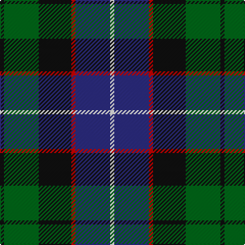

In pattern [KGKRBW](/patterns/kgkrbw/).

This was sourced from register-of-tartans.  It is a [6 stripes tartan](/stripes/stripes6/).

Original link https://www.tartanregister.gov.uk/tartanDetails.aspx?ref=5127

## Attestations

This cloth appears in 2 source records; the oldest owns this page.

- 01/01/1816 — Galbraith (register-of-tartans, [record](https://www.tartanregister.gov.uk/tartanDetails.aspx?ref=5127))
- 1816 — Galbraith (Clan) (tartans-authority, [record](http://www.tartansauthority.com/tartan-ferret/display/3176/))

## Thread count
K/4 G34 K32 R4 DB34 W/4

## Palette
Each colour and its ΔE from the base-6 reference it is a variant of.

| Colour | Shade | Base | ΔE (OKLab) |
|---|---|---|---|
| DB | <code style="background-color:#2C2C80;">#2C2C80</code> `#2C2C80` | B <code style="background-color:#2A418A;">#2A418A</code> | 0.06 |
| G | <code style="background-color:#006818;">#006818</code> `#006818` | G <code style="background-color:#006100;">#006100</code> | 0.02 |
| K | <code style="background-color:#101010;">#101010</code> `#101010` | K <code style="background-color:#000000;">#000000</code> | 0.17 |
| R | <code style="background-color:#C80000;">#C80000</code> `#C80000` | R <code style="background-color:#CC0000;">#CC0000</code> | 0.01 |
| W | <code style="background-color:#FCFCFC;">#FCFCFC</code> `#FCFCFC` | W <code style="background-color:#F7F7F7;">#F7F7F7</code> | 0.01 |

# Sample pattern

## Nearest tartans

The nearest existing variants by ΔTartan distance.

1. [Hunter (Galbraith etc)](/setts/s6/k2g17k16r2b17w2x2~b1c0070-g006818-k101010-rc80000-wf8f8f8/) — ΔT 0.31
1. [Syme (Clan)](/setts/s6/k1g8w1k8b8r1x4~b1c1c50-g408060-k101010-rc80000-wf8f8f8/) — ΔT 0.32
1. [Leslie Hunting Clan Tartan Tartan Number: 1113. Earliest known date: 1810-15 Said to have been worn by George 14th Earl of Rothes who died in 1841. This sett is shown by Smibert (1850) and by W & A Smith (1850) but without the definition of 'Hunting'. This sett is very similar to Duncan, the difference lies in the broad black present in the Leslie Hunting which is green in the Duncan See products available Copyright © Blair Urquhart, Comrie, 2015](/setts/s6/r2b8k8w1g8k1x2~b2c2c80-g006818-k101010-rc80000-we0e0e0/) — ΔT 0.38
1. [Leslie Hunting](/setts/s6/k1g8w1k8b8r1x4~b202060-g006818-k101010-rc80000-we0e0e0/) — ΔT 0.41
1. [Colquhoun Clan Tartan Tartan Number: 274. Earliest known date: 1810-15 The Bonnie Banks and Braes of Loch Lomand were the setting for the interesting and sometimes violent history of the Colquhouns of Luss. Their tartan is well documented, appearing in the earliest collections, and certified by the Chief, with his seal and signature, in the archives of the Highland Society of London. (c.1816). The Clan tartan, in its present form, was woven by Wilson's of Bannockburn at the beginning of the 19th century and recorded in the firms pattern books dated 1819. Wilson often used purple in place of blue and produced proportionately equivalent patterns in different weights of cloth. Logan recorded a similar sett in 1831. The Vestiarium Scoticum shows a pattern with the white stripe next to the blue but this is regarded as an error. See products available Copyright © Blair Urquhart, Comrie, 2015](/setts/s7/r3g16w2k16b16k2b2x2~b2c2c80-g006818-k101010-rc80000-we0e0e0/) — ΔT 0.43
1. [Mitchell (Clan)](/setts/s6/k2g17k16r2b17y2x2~b1c0070-g006818-k101010-r880000-yb8b8b8/) — ΔT 0.52
1. [Russell Clan Tartan Tartan Number: 1094. Earliest known date: c.1815 It seems certain that the tartan was first known as Galbraith. William Wilson and Sons of Bannockburn recorded the pattern as Russell in their pattern book of 1847, although it was named Hunter in the earlier book of 1819. See products available Copyright © Blair Urquhart, Comrie, 2015](/setts/s6/k2g12k12r1b12w2x2~b2c2c80-g006818-k101010-rc80000-we0e0e0/) — ΔT 0.55
1. [Greenock](/setts/s7/g2k2g17k16r2b17y2x2~b2c2c80-g006818-k101010-rc80000-ye8c000/) — ΔT 0.57
1. [Hogarth of Firhill (Clan)](/setts/s7/b4g14y2k14ba14k2ba3x2~b5c8ca8-ba2c2c80-g006818-k101010-ye8c000/) — ΔT 0.58
1. [Fruin Colquhoun (Commemorative?)](/setts/s7/r5g19w3k19b19k3b2x2~b2c2c80-g00643c-k101010-rc80000-we0e0e0/) — ΔT 0.59

## Neighbour map

Every grey dot is one of 15726 variants placed by the first two principal components of the ΔTartan feature space (44% of its variance). Red is this tartan; blue dots are its nearest — click one to open its page.

<svg viewBox="0 0 640 380" role="img" style="max-width:100%;height:auto;border:1px solid #e0e0e0;border-radius:4px;display:block" xmlns="http://www.w3.org/2000/svg"><image href="/nn/cloud.v1.png" width="640" height="380"/><a href="/setts/s6/k2g17k16r2b17w2x2~b1c0070-g006818-k101010-rc80000-wf8f8f8/"><circle cx="144.5" cy="209.8" r="4" fill="#3465a4"><title>Hunter (Galbraith etc)</title></circle></a><a href="/setts/s6/k1g8w1k8b8r1x4~b1c1c50-g408060-k101010-rc80000-wf8f8f8/"><circle cx="144.8" cy="209.8" r="4" fill="#3465a4"><title>Syme (Clan)</title></circle></a><a href="/setts/s6/r2b8k8w1g8k1x2~b2c2c80-g006818-k101010-rc80000-we0e0e0/"><circle cx="135.7" cy="216.9" r="4" fill="#3465a4"><title>Leslie Hunting Clan Tartan Tartan Number: 1113. Earliest known date: 1810-15 Said to have been worn by George 14th Earl of Rothes who died in 1841. This sett is shown by Smibert (1850) and by W &amp; A Smith (1850) but without the definition of 'Hunting'. This sett is very similar to Duncan, the difference lies in the broad black present in the Leslie Hunting which is green in the Duncan See products available Copyright © Blair Urquhart, Comrie, 2015</title></circle></a><a href="/setts/s6/k1g8w1k8b8r1x4~b202060-g006818-k101010-rc80000-we0e0e0/"><circle cx="157.1" cy="217.0" r="4" fill="#3465a4"><title>Leslie Hunting</title></circle></a><a href="/setts/s7/r3g16w2k16b16k2b2x2~b2c2c80-g006818-k101010-rc80000-we0e0e0/"><circle cx="146.7" cy="201.7" r="4" fill="#3465a4"><title>Colquhoun Clan Tartan Tartan Number: 274. Earliest known date: 1810-15 The Bonnie Banks and Braes of Loch Lomand were the setting for the interesting and sometimes violent history of the Colquhouns of Luss. Their tartan is well documented, appearing in the earliest collections, and certified by the Chief, with his seal and signature, in the archives of the Highland Society of London. (c.1816). The Clan tartan, in its present form, was woven by Wilson's of Bannockburn at the beginning of the 19th century and recorded in the firms pattern books dated 1819. Wilson often used purple in place of blue and produced proportionately equivalent patterns in different weights of cloth. Logan recorded a similar sett in 1831. The Vestiarium Scoticum shows a pattern with the white stripe next to the blue but this is regarded as an error. See products available Copyright © Blair Urquhart, Comrie, 2015</title></circle></a><a href="/setts/s6/k2g17k16r2b17y2x2~b1c0070-g006818-k101010-r880000-yb8b8b8/"><circle cx="159.5" cy="216.5" r="4" fill="#3465a4"><title>Mitchell (Clan)</title></circle></a><a href="/setts/s6/k2g12k12r1b12w2x2~b2c2c80-g006818-k101010-rc80000-we0e0e0/"><circle cx="164.7" cy="200.8" r="4" fill="#3465a4"><title>Russell Clan Tartan Tartan Number: 1094. Earliest known date: c.1815 It seems certain that the tartan was first known as Galbraith. William Wilson and Sons of Bannockburn recorded the pattern as Russell in their pattern book of 1847, although it was named Hunter in the earlier book of 1819. See products available Copyright © Blair Urquhart, Comrie, 2015</title></circle></a><a href="/setts/s7/g2k2g17k16r2b17y2x2~b2c2c80-g006818-k101010-rc80000-ye8c000/"><circle cx="163.4" cy="199.4" r="4" fill="#3465a4"><title>Greenock</title></circle></a><a href="/setts/s7/b4g14y2k14ba14k2ba3x2~b5c8ca8-ba2c2c80-g006818-k101010-ye8c000/"><circle cx="131.1" cy="216.1" r="4" fill="#3465a4"><title>Hogarth of Firhill (Clan)</title></circle></a><a href="/setts/s7/r5g19w3k19b19k3b2x2~b2c2c80-g00643c-k101010-rc80000-we0e0e0/"><circle cx="144.6" cy="198.9" r="4" fill="#3465a4"><title>Fruin Colquhoun (Commemorative?)</title></circle></a><circle cx="147.7" cy="209.8" r="5" fill="#c00000"/></svg>

ID: /setts/s6/k2g17k16r2b17w2x2~b2c2c80-g006818-k101010-rc80000-wfcfcfc/
