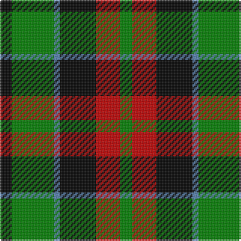

This page is one **sett** — a single exact thread-count. It belongs to the [tartan](/tartans/k2g7b1k6r4g2/)
(the same proportion at any scale), whose colour order is pattern [GRKBGK](/stripes/grkbgk/).

Sourced from weddslist.  It is a [6 stripe tartan](/stripes/stripes6/).

Original link http://www.weddslist.com/cgi-bin/tartans/pg.pl?source=sts

## Thread count
K/8 G28 B4 K24 R16 G/8

## Palette
Each colour and the base-6 reference it is a variant of.

| Colour | Shade | Base |
|---|---|---|
| B | <code style="background-color:#5480B0;">#5480B0</code> `oklch(58.8% 0.089 251.5)` <small>#5480B0</small> | B <code style="background-color:#2A418A;">#2A418A</code> |
| G | <code style="background-color:#008000;">#008000</code> `oklch(52.0% 0.177 142.5)` <small>#008000</small> | G <code style="background-color:#006100;">#006100</code> |
| K | <code style="background-color:#000000;">#000000</code> `oklch(0.0% 0.000 0.0)` <small>#000000</small> | K <code style="background-color:#000000;">#000000</code> |
| R | <code style="background-color:#C00000;">#C00000</code> `oklch(50.7% 0.208 29.2)` <small>#C00000</small> | R <code style="background-color:#CC0000;">#CC0000</code> |

# Sample pattern

## Nearest tartans

The nearest existing variants by ΔTartan distance, with this tartan at the top so the swatches line up against it.

ΔTartan

Tartan

Sett

—

<a href="/ttd/edit/#slug=k2g7t1k6r4g2~x4">Walker, James</a> <a class="nn-out" href="/setts/s6/k2g7t1k6r4g2~x4/" title="open its dictionary page">↗</a>

0.82

<a href="/ttd/edit/#slug=g24k4g24k24t7r24t7~x2">Unidentified, Pinafore</a> <a class="nn-out" href="/setts/s7/g24k4g24k24t7r24t7~x2/" title="open its dictionary page">↗</a>

0.97

<a href="/ttd/edit/#slug=k6g6ly1g6k6p6k1~x4">Abercrombie, (Wilson's No 64)</a> <a class="nn-out" href="/setts/s7/k6g6ly1g6k6p6k1~x4/" title="open its dictionary page">↗</a>

0.99

<a href="/ttd/edit/#slug=g18t2g4k14p12k3~x2">Wilson's, No 150 &quot;Coburg&quot;</a> <a class="nn-out" href="/setts/s6/g18t2g4k14p12k3~x2/" title="open its dictionary page">↗</a>

1.05

<a href="/ttd/edit/#slug=k6g6w1g6k6p6k1~x4">Wilson's, No 64 or Abercrombie</a> <a class="nn-out" href="/setts/s7/k6g6w1g6k6p6k1~x4/" title="open its dictionary page">↗</a>

1.06

<a href="/ttd/edit/#slug=g6r2g13k6w2k16r3~x2">Sinclair, hunting</a> <a class="nn-out" href="/setts/s7/g6r2g13k6w2k16r3~x2/" title="open its dictionary page">↗</a>

1.06

<a href="/ttd/edit/#slug=g21ly2g4k16p14k3~x2">Wilson's, No 160</a> <a class="nn-out" href="/setts/s6/g21ly2g4k16p14k3~x2/" title="open its dictionary page">↗</a>

1.10

<a href="/ttd/edit/#slug=g14db2g2k8p9k2~x2">MacArthur of Milton, hunting</a> <a class="nn-out" href="/setts/s6/g14db2g2k8p9k2~x2/" title="open its dictionary page">↗</a>

1.10

<a href="/ttd/edit/#slug=k7g7k1g7k7t1p7k1~x4">Wilson's, No 108</a> <a class="nn-out" href="/setts/s8/k7g7k1g7k7t1p7k1~x4/" title="open its dictionary page">↗</a>

1.13

<a href="/ttd/edit/#slug=k11g12k2g12k12p12w3~x2">Wilson's, No 97</a> <a class="nn-out" href="/setts/s7/k11g12k2g12k12p12w3~x2/" title="open its dictionary page">↗</a>

1.14

<a href="/ttd/edit/#slug=g21w2g4k17p14k3~x2">Wilson's No 158</a> <a class="nn-out" href="/setts/s6/g21w2g4k17p14k3~x2/" title="open its dictionary page">↗</a>

## Neighbour map

Every grey dot is one of 14299 variants placed by the first two principal components of the ΔTartan feature space (44% of its variance). Red is this tartan; blue dots are its nearest — click one to open its page.

<svg viewBox="0 0 640 380" role="img" style="max-width:100%;height:auto;border:1px solid #e0e0e0;border-radius:4px;display:block" xmlns="http://www.w3.org/2000/svg"><image href="/nn/cloud.v1.png" width="640" height="380"/><a href="/setts/s7/g24k4g24k24t7r24t7~x2/"><circle cx="137.1" cy="241.7" r="4" fill="#3465a4"><title>Unidentified, Pinafore</title></circle></a><a href="/setts/s7/k6g6ly1g6k6p6k1~x4/"><circle cx="137.6" cy="250.4" r="4" fill="#3465a4"><title>Abercrombie, (Wilson's No 64)</title></circle></a><a href="/setts/s6/g18t2g4k14p12k3~x2/"><circle cx="177.0" cy="220.1" r="4" fill="#3465a4"><title>Wilson's, No 150 &quot;Coburg&quot;</title></circle></a><a href="/setts/s7/k6g6w1g6k6p6k1~x4/"><circle cx="136.6" cy="250.1" r="4" fill="#3465a4"><title>Wilson's, No 64 or Abercrombie</title></circle></a><a href="/setts/s7/g6r2g13k6w2k16r3~x2/"><circle cx="203.3" cy="215.8" r="4" fill="#3465a4"><title>Sinclair, hunting</title></circle></a><a href="/setts/s6/g21ly2g4k16p14k3~x2/"><circle cx="185.1" cy="208.6" r="4" fill="#3465a4"><title>Wilson's, No 160</title></circle></a><a href="/setts/s6/g14db2g2k8p9k2~x2/"><circle cx="177.9" cy="224.5" r="4" fill="#3465a4"><title>MacArthur of Milton, hunting</title></circle></a><a href="/setts/s8/k7g7k1g7k7t1p7k1~x4/"><circle cx="163.8" cy="228.5" r="4" fill="#3465a4"><title>Wilson's, No 108</title></circle></a><a href="/setts/s7/k11g12k2g12k12p12w3~x2/"><circle cx="121.5" cy="252.4" r="4" fill="#3465a4"><title>Wilson's, No 97</title></circle></a><a href="/setts/s6/g21w2g4k17p14k3~x2/"><circle cx="182.0" cy="208.3" r="4" fill="#3465a4"><title>Wilson's No 158</title></circle></a><circle cx="158.0" cy="236.6" r="5" fill="#c00000"/></svg>

ID: /setts/s6/k2g7t1k6r4g2~x4/
