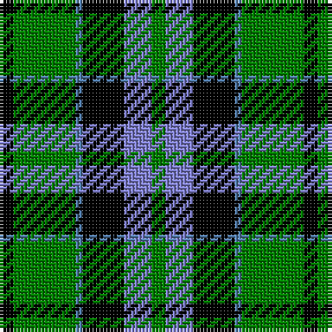

This page is one **sett** — a single exact thread-count. It belongs to the [tartan](/tartans/k2g9t1k6b4g2/)
(the same proportion at any scale), whose colour order is pattern [GBKBGK](/stripes/gbkbgk/).

Sourced from weddslist.  It is a [6 stripe tartan](/stripes/stripes6/).

Original link http://www.weddslist.com/cgi-bin/tartans/pg.pl?source=sts

## Thread count
K/4 G18 Ba2 K12 B8 G/4

## Palette

Palette: <strong>Ingles Buchan</strong> <small style="color:#888">(1 of 4 colours)</small>
<table><thead><tr><th>Colour</th><th>Threads</th><th>Shade</th><th>Base</th><th>OKLCh</th></tr></thead><tbody><tr><td>K/</td><td style="text-align:right;font-variant-numeric:tabular-nums">4</td><td><code style="background-color:#000000;">#000000</code> <small style="color:#888">#000000</small></td><td>K <code style="background-color:#000000;">#000000</code></td><td><small style="color:#888">oklch(0.0% 0.000 0.0)</small></td></tr><tr><td>G</td><td style="text-align:right;font-variant-numeric:tabular-nums">18</td><td><code style="background-color:#008000;">#008000</code> <small style="color:#888">#008000</small></td><td>G <code style="background-color:#006100;">#006100</code></td><td><small style="color:#888">oklch(52.0% 0.177 142.5)</small></td></tr><tr><td>Ba</td><td style="text-align:right;font-variant-numeric:tabular-nums">2</td><td><code style="background-color:#5480B0;">#5480B0</code> <small style="color:#888">#5480B0</small></td><td>B <code style="background-color:#2A418A;">#2A418A</code></td><td><small style="color:#888">oklch(58.8% 0.089 251.5)</small></td></tr><tr><td>K</td><td style="text-align:right;font-variant-numeric:tabular-nums">12</td><td><code style="background-color:#000000;">#000000</code> <small style="color:#888">#000000</small></td><td>K <code style="background-color:#000000;">#000000</code></td><td><small style="color:#888">oklch(0.0% 0.000 0.0)</small></td></tr><tr><td>B</td><td style="text-align:right;font-variant-numeric:tabular-nums">8</td><td><code style="background-color:#8080D0;">#8080D0</code> <small style="color:#888">#8080D0</small></td><td>B <code style="background-color:#2A418A;">#2A418A</code></td><td><small style="color:#888">oklch(63.4% 0.119 282.5)</small></td></tr><tr><td>G/</td><td style="text-align:right;font-variant-numeric:tabular-nums">4</td><td><code style="background-color:#008000;">#008000</code> <small style="color:#888">#008000</small></td><td>G <code style="background-color:#006100;">#006100</code></td><td><small style="color:#888">oklch(52.0% 0.177 142.5)</small></td></tr></tbody></table>

# Sample pattern

## Nearest tartans

The nearest existing variants by ΔTartan distance, with this tartan at the top so the swatches line up against it.

ΔTartan

Tartan

Sett

—

<a href="/ttd/edit/#slug=k2g9t1k6b4g2~x2">Unnamed 3</a> <a class="nn-out" href="/setts/s6/k2g9t1k6b4g2~x2/" title="open its dictionary page">↗</a>

0.53

<a href="/ttd/edit/#slug=g9w1g6k7db7k1~x2">Menteith</a> <a class="nn-out" href="/setts/s6/g9w1g6k7db7k1~x2/" title="open its dictionary page">↗</a>

0.64

<a href="/ttd/edit/#slug=g18t2g4k14db12k3~x2">Graham of Menteith</a> <a class="nn-out" href="/setts/s6/g18t2g4k14db12k3~x2/" title="open its dictionary page">↗</a>

0.68

<a href="/ttd/edit/#slug=g8k2t1g4k6db6k1~x2">MacCallum</a> <a class="nn-out" href="/setts/s7/g8k2t1g4k6db6k1~x2/" title="open its dictionary page">↗</a>

0.77

<a href="/ttd/edit/#slug=g1db5g1k5g6ly1~x2">MacKay</a> <a class="nn-out" href="/setts/s6/g1db5g1k5g6ly1~x2/" title="open its dictionary page">↗</a>

0.81

<a href="/ttd/edit/#slug=k4g19k16w2db15g4~x2">Graham of Montrose</a> <a class="nn-out" href="/setts/s6/k4g19k16w2db15g4~x2/" title="open its dictionary page">↗</a>

0.96

<a href="/ttd/edit/#slug=k4w2g18k13db12k2~x2">Melville</a> <a class="nn-out" href="/setts/s6/k4w2g18k13db12k2~x2/" title="open its dictionary page">↗</a>

1.00

<a href="/ttd/edit/#slug=g18t2g4k14p12k3~x2">Wilson's, No 150 &quot;Coburg&quot;</a> <a class="nn-out" href="/setts/s6/g18t2g4k14p12k3~x2/" title="open its dictionary page">↗</a>

1.02

<a href="/ttd/edit/#slug=db12k17g19w2k5~x2">Wilson's, Folio 131</a> <a class="nn-out" href="/setts/s5/db12k17g19w2k5~x2/" title="open its dictionary page">↗</a>

1.02

<a href="/ttd/edit/#slug=k19w8k19g16ly4g16w2~x2">St Johnstone F.C.</a> <a class="nn-out" href="/setts/s7/k19w8k19g16ly4g16w2~x2/" title="open its dictionary page">↗</a>

1.03

<a href="/ttd/edit/#slug=g21ly2g4k16p14k3~x2">Wilson's, No 160</a> <a class="nn-out" href="/setts/s6/g21ly2g4k16p14k3~x2/" title="open its dictionary page">↗</a>

## Neighbour map

Every grey dot is one of 14299 variants placed by the first two principal components of the ΔTartan feature space (44% of its variance). Red is this tartan; blue dots are its nearest — click one to open its page.

<svg viewBox="0 0 640 380" role="img" style="max-width:100%;height:auto;border:1px solid #e0e0e0;border-radius:4px;display:block" xmlns="http://www.w3.org/2000/svg"><image href="/nn/cloud.v1.png" width="640" height="380"/><a href="/setts/s6/g9w1g6k7db7k1~x2/"><circle cx="194.6" cy="236.0" r="4" fill="#3465a4"><title>Menteith</title></circle></a><a href="/setts/s6/g18t2g4k14db12k3~x2/"><circle cx="177.8" cy="228.0" r="4" fill="#3465a4"><title>Graham of Menteith</title></circle></a><a href="/setts/s7/g8k2t1g4k6db6k1~x2/"><circle cx="171.3" cy="231.1" r="4" fill="#3465a4"><title>MacCallum</title></circle></a><a href="/setts/s6/g1db5g1k5g6ly1~x2/"><circle cx="157.1" cy="237.7" r="4" fill="#3465a4"><title>MacKay</title></circle></a><a href="/setts/s6/k4g19k16w2db15g4~x2/"><circle cx="162.2" cy="224.2" r="4" fill="#3465a4"><title>Graham of Montrose</title></circle></a><a href="/setts/s6/k4w2g18k13db12k2~x2/"><circle cx="159.8" cy="221.5" r="4" fill="#3465a4"><title>Melville</title></circle></a><a href="/setts/s6/g18t2g4k14p12k3~x2/"><circle cx="177.0" cy="220.1" r="4" fill="#3465a4"><title>Wilson's, No 150 &quot;Coburg&quot;</title></circle></a><a href="/setts/s5/db12k17g19w2k5~x2/"><circle cx="165.1" cy="240.6" r="4" fill="#3465a4"><title>Wilson's, Folio 131</title></circle></a><a href="/setts/s7/k19w8k19g16ly4g16w2~x2/"><circle cx="166.7" cy="220.7" r="4" fill="#3465a4"><title>St Johnstone F.C.</title></circle></a><a href="/setts/s6/g21ly2g4k16p14k3~x2/"><circle cx="185.1" cy="208.6" r="4" fill="#3465a4"><title>Wilson's, No 160</title></circle></a><circle cx="190.0" cy="221.9" r="5" fill="#c00000"/></svg>

ID: /setts/s6/k2g9t1k6b4g2~x2/
