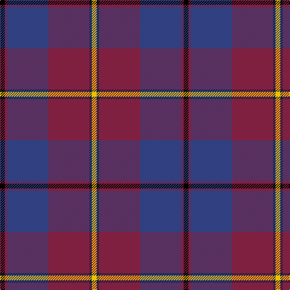

This page is one **sett** — a single exact thread-count. It belongs to the [tartan](/tartans/k2dr1b17dr17db1y2/)
(the same proportion at any scale), whose colour order is pattern [KRBRBY](/stripes/krbrby/).

Sourced from weddslist.  It is a [6 stripe tartan](/stripes/stripes6/).

Original link http://www.weddslist.com/cgi-bin/tartans/pg.pl?source=sts

## Thread count
K/8 DR4 B68 DR68 DB4 Y/8

## Palette
Each colour and the base-6 reference it is a variant of.

| Colour | Shade | Base |
|---|---|---|
| B | <code style="background-color:#304080;">#304080</code> `oklch(39.4% 0.109 270.2)` <small>#304080</small> | B <code style="background-color:#2A418A;">#2A418A</code> |
| DB | <code style="background-color:#102040;">#102040</code> `oklch(24.9% 0.065 262.6)` <small>#102040</small> | B <code style="background-color:#2A418A;">#2A418A</code> |
| DR | <code style="background-color:#802040;">#802040</code> `oklch(40.8% 0.132 5.2)` <small>#802040</small> | R <code style="background-color:#CC0000;">#CC0000</code> |
| K | <code style="background-color:#000000;">#000000</code> `oklch(0.0% 0.000 0.0)` <small>#000000</small> | K <code style="background-color:#000000;">#000000</code> |
| Y | <code style="background-color:#F0C000;">#F0C000</code> `oklch(82.7% 0.169 90.5)` <small>#F0C000</small> | Y <code style="background-color:#F2BF00;">#F2BF00</code> |

# Sample pattern

## Nearest tartans

The nearest existing variants by ΔTartan distance, with this tartan at the top so the swatches line up against it.

ΔTartan

Tartan

Sett

—

<a href="/ttd/edit/#slug=k2m1db17m17dt1ly2~x4">Murdoch</a> <a class="nn-out" href="/setts/s6/k2m1db17m17dt1ly2~x4/" title="open its dictionary page">↗</a>

0.77

<a href="/ttd/edit/#slug=k2dr1dt17dr17db1ly2~x4">Murdoch (Geoffrey)</a> <a class="nn-out" href="/setts/s6/k2dr1dt17dr17db1ly2~x4/" title="open its dictionary page">↗</a>

0.84

<a href="/ttd/edit/#slug=r30db5r3db33g8k3db8w2~x2">St. Margaret Youth Group (Corporate)</a> <a class="nn-out" href="/setts/s8/r30db5r3db33g8k3db8w2~x2/" title="open its dictionary page">↗</a>

0.98

<a href="/ttd/edit/#slug=m5ly2m35g6m2g6db38w4~x2">Scotland 2000</a> <a class="nn-out" href="/setts/s8/m5ly2m35g6m2g6db38w4~x2/" title="open its dictionary page">↗</a>

1.14

<a href="/ttd/edit/#slug=o9k16dg10k22dp67ly4">Widows Sons Scotland (MRA)</a> <a class="nn-out" href="/setts/s6/o9k16dg10k22dp67ly4/" title="open its dictionary page">↗</a>

1.24

<a href="/ttd/edit/#slug=g2n1r29b29n1lo2~x2">Reagan</a> <a class="nn-out" href="/setts/s6/g2n1r29b29n1lo2~x2/" title="open its dictionary page">↗</a>

1.32

<a href="/ttd/edit/#slug=dp22lo10dp6lr18dp50db71k6">Charleston Police Department</a> <a class="nn-out" href="/setts/s7/dp22lo10dp6lr18dp50db71k6/" title="open its dictionary page">↗</a>

1.32

<a href="/ttd/edit/#slug=r16db2o6r3k4t2db40t6~x2">St. Leonards (Corporate)</a> <a class="nn-out" href="/setts/s8/r16db2o6r3k4t2db40t6~x2/" title="open its dictionary page">↗</a>

1.38

<a href="/ttd/edit/#slug=dp3r3dp34g18lo2g18lb2r3~x2">Singh</a> <a class="nn-out" href="/setts/s8/dp3r3dp34g18lo2g18lb2r3~x2/" title="open its dictionary page">↗</a>

1.38

<a href="/ttd/edit/#slug=r28r1db18ly2g1db18~x2">European Judo Union</a> <a class="nn-out" href="/setts/s6/r28r1db18ly2g1db18~x2/" title="open its dictionary page">↗</a>

1.39

<a href="/ttd/edit/#slug=m4dp1m1dp12k6dt16w1~x2">First (Corporate)</a> <a class="nn-out" href="/setts/s7/m4dp1m1dp12k6dt16w1~x2/" title="open its dictionary page">↗</a>

## Neighbour map

Every grey dot is one of 14299 variants placed by the first two principal components of the ΔTartan feature space (44% of its variance). Red is this tartan; blue dots are its nearest — click one to open its page.

<svg viewBox="0 0 640 380" role="img" style="max-width:100%;height:auto;border:1px solid #e0e0e0;border-radius:4px;display:block" xmlns="http://www.w3.org/2000/svg"><image href="/nn/cloud.v1.png" width="640" height="380"/><a href="/setts/s6/k2dr1dt17dr17db1ly2~x4/"><circle cx="327.8" cy="183.4" r="4" fill="#3465a4"><title>Murdoch (Geoffrey)</title></circle></a><a href="/setts/s8/r30db5r3db33g8k3db8w2~x2/"><circle cx="321.8" cy="170.4" r="4" fill="#3465a4"><title>St. Margaret Youth Group (Corporate)</title></circle></a><a href="/setts/s8/m5ly2m35g6m2g6db38w4~x2/"><circle cx="287.4" cy="148.4" r="4" fill="#3465a4"><title>Scotland 2000</title></circle></a><a href="/setts/s6/o9k16dg10k22dp67ly4/"><circle cx="309.5" cy="168.6" r="4" fill="#3465a4"><title>Widows Sons Scotland (MRA)</title></circle></a><a href="/setts/s6/g2n1r29b29n1lo2~x2/"><circle cx="362.5" cy="151.9" r="4" fill="#3465a4"><title>Reagan</title></circle></a><a href="/setts/s7/dp22lo10dp6lr18dp50db71k6/"><circle cx="262.2" cy="200.0" r="4" fill="#3465a4"><title>Charleston Police Department</title></circle></a><a href="/setts/s8/r16db2o6r3k4t2db40t6~x2/"><circle cx="318.8" cy="136.5" r="4" fill="#3465a4"><title>St. Leonards (Corporate)</title></circle></a><a href="/setts/s8/dp3r3dp34g18lo2g18lb2r3~x2/"><circle cx="288.4" cy="154.6" r="4" fill="#3465a4"><title>Singh</title></circle></a><a href="/setts/s6/r28r1db18ly2g1db18~x2/"><circle cx="365.1" cy="160.3" r="4" fill="#3465a4"><title>European Judo Union</title></circle></a><a href="/setts/s7/m4dp1m1dp12k6dt16w1~x2/"><circle cx="252.4" cy="183.2" r="4" fill="#3465a4"><title>First (Corporate)</title></circle></a><circle cx="314.4" cy="171.7" r="5" fill="#c00000"/></svg>

ID: /setts/s6/k2m1db17m17dt1ly2~x4/
