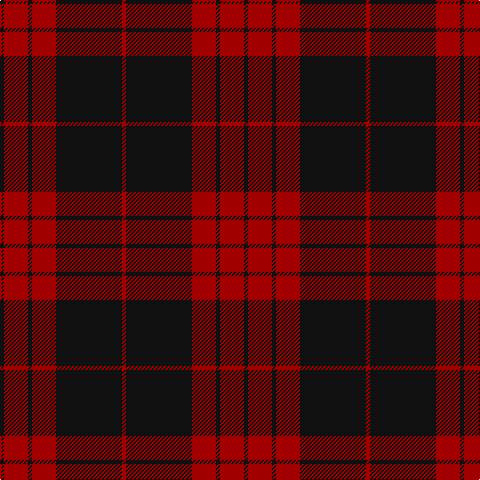

This page is one **sett** — a single exact thread-count. It belongs to the [tartan](/tartans/k2r12k2r12k33r2/)
(the same proportion at any scale), whose colour order is pattern [KRKRKR](/stripes/krkrkr/).

Sourced from register-of-tartans.  It is a [6 stripe tartan](/stripes/stripes6/).

Original link https://www.tartanregister.gov.uk/tartanDetails.aspx?ref=491

## Also known as

This cloth is also recorded under:

- Cameron, Black & Red

2 attestations — the source records this cloth was collapsed from (oldest owns this page)

<ul>
<li>01/01/2002 — Cameron Black & Red (Dress) (register-of-tartans, <a href="https://www.tartanregister.gov.uk/tartanDetails.aspx?ref=491">record</a>)</li>
<li>pre 2002 — Cameron, Black & Red (Artefact) (tartans-authority, <a href="http://www.tartansauthority.com/tartan-ferret/display/1186/">record</a>)</li>
</ul>

## Register references

External register numbers recorded for this tartan.

- Scottish Register of Tartans: [491](https://www.tartanregister.gov.uk/tartanDetails.aspx?ref=491)
- Scottish Tartans Authority (ITI): 1186
- Scottish Tartans World Register: 1186

## Thread count
K/4 DR24 K4 DR24 K66 DR/4

## Palette

Palette: <strong>Tartan Register</strong>
<table><thead><tr><th>Colour</th><th>Threads</th><th>Shade</th><th>Base</th><th>OKLCh</th></tr></thead><tbody><tr><td>K/</td><td style="text-align:right;font-variant-numeric:tabular-nums">4</td><td><code style="background-color:#101010;">#101010</code> <small style="color:#888">#101010</small></td><td>K <code style="background-color:#000000;">#000000</code></td><td><small style="color:#888">oklch(17.3% 0.000 89.9)</small></td></tr><tr><td>DR</td><td style="text-align:right;font-variant-numeric:tabular-nums">24</td><td><code style="background-color:#A00000;">#A00000</code> <small style="color:#888">#A00000</small></td><td>R <code style="background-color:#CC0000;">#CC0000</code></td><td><small style="color:#888">oklch(44.3% 0.182 29.2)</small></td></tr><tr><td>K</td><td style="text-align:right;font-variant-numeric:tabular-nums">4</td><td><code style="background-color:#101010;">#101010</code> <small style="color:#888">#101010</small></td><td>K <code style="background-color:#000000;">#000000</code></td><td><small style="color:#888">oklch(17.3% 0.000 89.9)</small></td></tr><tr><td>DR</td><td style="text-align:right;font-variant-numeric:tabular-nums">24</td><td><code style="background-color:#A00000;">#A00000</code> <small style="color:#888">#A00000</small></td><td>R <code style="background-color:#CC0000;">#CC0000</code></td><td><small style="color:#888">oklch(44.3% 0.182 29.2)</small></td></tr><tr><td>K</td><td style="text-align:right;font-variant-numeric:tabular-nums">66</td><td><code style="background-color:#101010;">#101010</code> <small style="color:#888">#101010</small></td><td>K <code style="background-color:#000000;">#000000</code></td><td><small style="color:#888">oklch(17.3% 0.000 89.9)</small></td></tr><tr><td>DR/</td><td style="text-align:right;font-variant-numeric:tabular-nums">4</td><td><code style="background-color:#A00000;">#A00000</code> <small style="color:#888">#A00000</small></td><td>R <code style="background-color:#CC0000;">#CC0000</code></td><td><small style="color:#888">oklch(44.3% 0.182 29.2)</small></td></tr></tbody></table>

# Sample pattern

## Nearest tartans

The nearest existing variants by ΔTartan distance, with this tartan at the top so the swatches line up against it.

ΔTartan

Tartan

Sett

—

<a href="/ttd/edit/#slug=k2r12k2r12k33r2~x2">Cameron Black &amp; Red (Dress)</a> <a class="nn-out" href="/setts/s6/k2r12k2r12k33r2~x2/" title="open its dictionary page">↗</a>

1.19

<a href="/ttd/edit/#slug=k30r3k2r3k2r27k30r4~x2">Murray of Ochtertyre #2</a> <a class="nn-out" href="/setts/s8/k30r3k2r3k2r27k30r4~x2/" title="open its dictionary page">↗</a>

1.41

<a href="/ttd/edit/#slug=k4r2k22r22k3r4lb2~x2">Menzies of Culdares</a> <a class="nn-out" href="/setts/s7/k4r2k22r22k3r4lb2~x2/" title="open its dictionary page">↗</a>

1.49

<a href="/ttd/edit/#slug=db3o3db24o30db3o2~x2">Auburn University (Alabama) (Corp)</a> <a class="nn-out" href="/setts/s6/db3o3db24o30db3o2~x2/" title="open its dictionary page">↗</a>

1.54

<a href="/setts/s6/k23r3k1r12~x4/">Ewing</a>

1.55

<a href="/ttd/edit/#slug=r22db5r2dg11r3db1~x2">MacKintosh D</a> <a class="nn-out" href="/setts/s6/r22db5r2dg11r3db1~x2/" title="open its dictionary page">↗</a>

1.60

<a href="/ttd/edit/#slug=r16dg1r1dg1r4dg12~x2">MacQuarrie 7</a> <a class="nn-out" href="/setts/s6/r16dg1r1dg1r4dg12~x2/" title="open its dictionary page">↗</a>

1.62

<a href="/ttd/edit/#slug=r24db6r3dg12r4db1~x2">MacKintosh</a> <a class="nn-out" href="/setts/s6/r24db6r3dg12r4db1~x2/" title="open its dictionary page">↗</a>

1.71

<a href="/ttd/edit/#slug=k6r1k24r28k1r4~x2">Aragon (Erskine)</a> <a class="nn-out" href="/setts/s6/k6r1k24r28k1r4~x2/" title="open its dictionary page">↗</a>

1.79

<a href="/ttd/edit/#slug=k6r3k28r28k3r6~x2">Erskine, Black &amp; Red (Clan)</a> <a class="nn-out" href="/setts/s6/k6r3k28r28k3r6~x2/" title="open its dictionary page">↗</a>

1.80

<a href="/ttd/edit/#slug=k3r1k16r16k1r3~x4">The Mary Erskine</a> <a class="nn-out" href="/setts/s6/k3r1k16r16k1r3~x4/" title="open its dictionary page">↗</a>

## Neighbour map

Every grey dot is one of 14359 variants placed by the first two principal components of the ΔTartan feature space (44% of its variance). Red is this tartan; blue dots are its nearest — click one to open its page.

<svg viewBox="0 0 640 380" role="img" style="max-width:100%;height:auto;border:1px solid #e0e0e0;border-radius:4px;display:block" xmlns="http://www.w3.org/2000/svg"><image href="/nn/cloud.v1.png" width="640" height="380"/><a href="/setts/s8/k30r3k2r3k2r27k30r4~x2/"><circle cx="437.2" cy="205.5" r="4" fill="#3465a4"><title>Murray of Ochtertyre #2</title></circle></a><a href="/setts/s7/k4r2k22r22k3r4lb2~x2/"><circle cx="370.5" cy="219.1" r="4" fill="#3465a4"><title>Menzies of Culdares</title></circle></a><a href="/setts/s6/db3o3db24o30db3o2~x2/"><circle cx="410.9" cy="212.3" r="4" fill="#3465a4"><title>Auburn University (Alabama) (Corp)</title></circle></a><a href="/setts/s6/k23r3k1r12~x4/"><circle cx="429.9" cy="184.5" r="4" fill="#3465a4"><title>Ewing</title></circle></a><a href="/setts/s6/r22db5r2dg11r3db1~x2/"><circle cx="427.4" cy="192.2" r="4" fill="#3465a4"><title>MacKintosh D</title></circle></a><a href="/setts/s6/r16dg1r1dg1r4dg12~x2/"><circle cx="453.9" cy="216.0" r="4" fill="#3465a4"><title>MacQuarrie 7</title></circle></a><a href="/setts/s6/r24db6r3dg12r4db1~x2/"><circle cx="429.6" cy="193.3" r="4" fill="#3465a4"><title>MacKintosh</title></circle></a><a href="/setts/s6/k6r1k24r28k1r4~x2/"><circle cx="415.7" cy="183.8" r="4" fill="#3465a4"><title>Aragon (Erskine)</title></circle></a><a href="/setts/s6/k6r3k28r28k3r6~x2/"><circle cx="360.7" cy="232.7" r="4" fill="#3465a4"><title>Erskine, Black &amp; Red (Clan)</title></circle></a><a href="/setts/s6/k3r1k16r16k1r3~x4/"><circle cx="375.2" cy="206.1" r="4" fill="#3465a4"><title>The Mary Erskine</title></circle></a><circle cx="453.8" cy="225.6" r="5" fill="#c00000"/></svg>

ID: /setts/s6/k2r12k2r12k33r2~x2/
