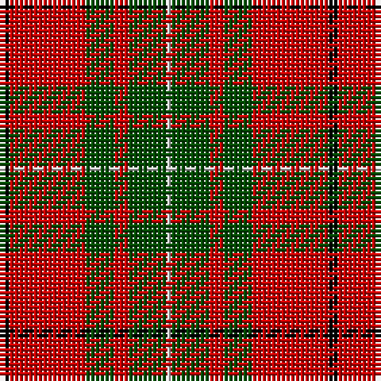

**Bands:** [KRGRGW](/stripes/krgrgw/) · **Stripes:** [K R DG R DG LB](/stripes/stripes6/) K R DG R DG LB

This was sourced from weddslist.  It is a [6 band tartan](/bands/bands6/).

Original link http://www.weddslist.com/cgi-bin/tartans/pg.pl?source=rb

## Register references

External register numbers recorded for this tartan.

- Scottish Register of Tartans: [2540](https://www.tartanregister.gov.uk/tartanDetails.aspx?ref=2540)
- Scottish Register of Tartans: [2666](https://www.tartanregister.gov.uk/tartanDetails.aspx?ref=2666)
- Scottish Register of Tartans: [3808](https://www.tartanregister.gov.uk/tartanDetails.aspx?ref=3808)
- Scottish Tartans Authority (ITI): 218
- Scottish Tartans World Register: 1010
- Scottish Tartans World Register: 1585
- Scottish Tartans World Register: 218

## Thread count
K/2 R16 G6 R3 G8 N/1

## Palette
Each colour and its ΔE from the base-6 reference it is a variant of.

| Colour | Shade | Base | ΔE (OKLab) |
|---|---|---|---|
| G | <code style="background-color:#004C00;">#004C00</code> `#004C00` | G <code style="background-color:#006100;">#006100</code> | 0.07 |
| K | <code style="background-color:#000000;">#000000</code> `#000000` | K <code style="background-color:#000000;">#000000</code> | 0.00 |
| N | <code style="background-color:#D0D0D0;">#D0D0D0</code> `#D0D0D0` | W <code style="background-color:#F7F7F7;">#F7F7F7</code> | 0.12 |
| R | <code style="background-color:#C80000;">#C80000</code> `#C80000` | R <code style="background-color:#CC0000;">#CC0000</code> | 0.01 |

# Sample pattern

## Nearest tartans

The nearest existing variants by ΔTartan distance.

1. [MacAulay (Clan)](/setts/s6/k2r16g6r3g8w1~x4/) — ΔT 0.59
1. [MacAulay](/setts/s6/k2r16g6r3g8w1~x2/) — ΔT 0.67
1. [MacAulay](/setts/s6/k2r16g6r3g8lb1~x2/) — ΔT 0.68
1. [MacAulay](/setts/s6/k2r16dg6r3dg8lr1~x2/) — ΔT 0.82
1. [MacAulay](/setts/s6/k2r16dg6r3dg8lr1/) — ΔT 0.82
1. [MacKintosh #4](/setts/s6/r5w2r28k12dg16r3~x2/) — ΔT 0.82
1. [Denny, hunting](/setts/s6/db1r16g6k1g6k1~x2/) — ΔT 0.82
1. [Cumming SM](/setts/s8/r3dg9lb1dg9r3dg6r18k2/) — ΔT 0.89
1. [MacKintosh 6](/setts/s6/r5w2r28k12g16r3~x2/) — ΔT 0.90
1. [McInally (Name)](/setts/s7/lo3g2r28k6r4g16r3~x2/) — ΔT 0.97

## Neighbour map

Every grey dot is one of 14313 variants placed by the first two principal components of the ΔTartan feature space (44% of its variance). Red is this tartan; blue dots are its nearest — click one to open its page.

<svg viewBox="0 0 640 380" role="img" style="max-width:100%;height:auto;border:1px solid #e0e0e0;border-radius:4px;display:block" xmlns="http://www.w3.org/2000/svg"><image href="/nn/cloud.v1.png" width="640" height="380"/><a href="/setts/s6/k2r16g6r3g8w1~x4/"><circle cx="331.9" cy="187.8" r="4" fill="#3465a4"><title>MacAulay (Clan)</title></circle></a><a href="/setts/s6/k2r16g6r3g8w1~x2/"><circle cx="315.5" cy="181.2" r="4" fill="#3465a4"><title>MacAulay</title></circle></a><a href="/setts/s6/k2r16g6r3g8lb1~x2/"><circle cx="336.0" cy="189.9" r="4" fill="#3465a4"><title>MacAulay</title></circle></a><a href="/setts/s6/k2r16dg6r3dg8lr1~x2/"><circle cx="343.3" cy="197.7" r="4" fill="#3465a4"><title>MacAulay</title></circle></a><a href="/setts/s6/k2r16dg6r3dg8lr1/"><circle cx="343.3" cy="197.7" r="4" fill="#3465a4"><title>MacAulay</title></circle></a><a href="/setts/s6/r5w2r28k12dg16r3~x2/"><circle cx="301.5" cy="181.2" r="4" fill="#3465a4"><title>MacKintosh #4</title></circle></a><a href="/setts/s6/db1r16g6k1g6k1~x2/"><circle cx="324.0" cy="169.5" r="4" fill="#3465a4"><title>Denny, hunting</title></circle></a><a href="/setts/s8/r3dg9lb1dg9r3dg6r18k2/"><circle cx="308.8" cy="175.6" r="4" fill="#3465a4"><title>Cumming SM</title></circle></a><a href="/setts/s6/r5w2r28k12g16r3~x2/"><circle cx="284.2" cy="177.8" r="4" fill="#3465a4"><title>MacKintosh 6</title></circle></a><a href="/setts/s7/lo3g2r28k6r4g16r3~x2/"><circle cx="345.8" cy="171.5" r="4" fill="#3465a4"><title>McInally (Name)</title></circle></a><circle cx="322.5" cy="183.8" r="5" fill="#c00000"/></svg>

ID: /setts/s6/k2r16dg6r3dg8lb1/
