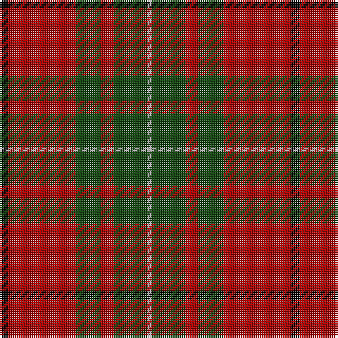

This page is one **sett** — a single exact thread-count. It belongs to the [tartan](/tartans/k2r16dg6r3dg8lr1/)
(the same proportion at any scale), whose colour order is pattern [KRGRGY](/stripes/krgrgy/).

Sourced from weddslist.  It is a [6 stripe tartan](/stripes/stripes6/).

Original link http://www.weddslist.com/cgi-bin/tartans/pg.pl?source=tinsel

## Thread count
K/4 DR32 DG12 DR6 DG16 N/2

## Palette

Palette: <strong>Ingles Buchan</strong> <small style="color:#888">(1 of 4 colours)</small>
<table><thead><tr><th>Colour</th><th>Threads</th><th>Shade</th><th>Base</th><th>OKLCh</th></tr></thead><tbody><tr><td>K/</td><td style="text-align:right;font-variant-numeric:tabular-nums">4</td><td><code style="background-color:#000000;">#000000</code> <small style="color:#888">#000000</small></td><td>K <code style="background-color:#000000;">#000000</code></td><td><small style="color:#888">oklch(0.0% 0.000 0.0)</small></td></tr><tr><td>DR</td><td style="text-align:right;font-variant-numeric:tabular-nums">32</td><td><code style="background-color:#AA0000;">#AA0000</code> <small style="color:#888">#AA0000</small></td><td>R <code style="background-color:#CC0000;">#CC0000</code></td><td><small style="color:#888">oklch(46.3% 0.190 29.2)</small></td></tr><tr><td>DG</td><td style="text-align:right;font-variant-numeric:tabular-nums">12</td><td><code style="background-color:#11450D;">#11450D</code> <small style="color:#888">#11450D</small></td><td>G <code style="background-color:#006100;">#006100</code></td><td><small style="color:#888">oklch(34.4% 0.101 142.1)</small></td></tr><tr><td>DR</td><td style="text-align:right;font-variant-numeric:tabular-nums">6</td><td><code style="background-color:#AA0000;">#AA0000</code> <small style="color:#888">#AA0000</small></td><td>R <code style="background-color:#CC0000;">#CC0000</code></td><td><small style="color:#888">oklch(46.3% 0.190 29.2)</small></td></tr><tr><td>DG</td><td style="text-align:right;font-variant-numeric:tabular-nums">16</td><td><code style="background-color:#11450D;">#11450D</code> <small style="color:#888">#11450D</small></td><td>G <code style="background-color:#006100;">#006100</code></td><td><small style="color:#888">oklch(34.4% 0.101 142.1)</small></td></tr><tr><td>N/</td><td style="text-align:right;font-variant-numeric:tabular-nums">2</td><td><code style="background-color:#AAAAAA;">#AAAAAA</code> <small style="color:#888">#AAAAAA</small></td><td>Y <code style="background-color:#F2BF00;">#F2BF00</code></td><td><small style="color:#888">oklch(73.8% 0.000 89.9)</small></td></tr></tbody></table>

# Sample pattern

## Nearest tartans

The nearest existing variants by ΔTartan distance, with this tartan at the top so the swatches line up against it.

ΔTartan

Tartan

Sett

—

<a href="/ttd/edit/#slug=k2r16dg6r3dg8lr1~x2">MacAulay</a> <a class="nn-out" href="/setts/s6/k2r16dg6r3dg8lr1~x2/" title="open its dictionary page">↗</a>

0.00

<a href="/ttd/edit/#slug=k2r16dg6r3dg8lr1">MacAulay</a> <a class="nn-out" href="/setts/s6/k2r16dg6r3dg8lr1/" title="open its dictionary page">↗</a>

0.78

<a href="/ttd/edit/#slug=k2r16g6r3g8lb1~x2">MacAulay</a> <a class="nn-out" href="/setts/s6/k2r16g6r3g8lb1~x2/" title="open its dictionary page">↗</a>

0.81

<a href="/ttd/edit/#slug=k2r16dg6r3dg8lb1">MacAulay</a> <a class="nn-out" href="/setts/s6/k2r16dg6r3dg8lb1/" title="open its dictionary page">↗</a>

0.84

<a href="/ttd/edit/#slug=k2r16g6r3g8w1~x4">MacAulay (Clan)</a> <a class="nn-out" href="/setts/s6/k2r16g6r3g8w1~x4/" title="open its dictionary page">↗</a>

0.88

<a href="/ttd/edit/#slug=r3dg9lr1dg9r3dg6r18k2~x2">Cumming SM</a> <a class="nn-out" href="/setts/s8/r3dg9lr1dg9r3dg6r18k2~x2/" title="open its dictionary page">↗</a>

1.04

<a href="/ttd/edit/#slug=r3dg9lb1dg9r3dg6r18k2~x2">Cumming SM</a> <a class="nn-out" href="/setts/s8/r3dg9lb1dg9r3dg6r18k2~x2/" title="open its dictionary page">↗</a>

1.06

<a href="/ttd/edit/#slug=r28db12r3dg20t2dg2r7~x2">Carrick (Strathmore) District Tartan Tartan Number: 3216. Earliest known date: c.1999 Sales help Princess Diana Memorial Trust See products available Copyright © Blair Urquhart, Comrie, 2015</a> <a class="nn-out" href="/setts/s7/r28db12r3dg20t2dg2r7~x2/" title="open its dictionary page">↗</a>

1.06

<a href="/ttd/edit/#slug=dg7w1dg18db6r18dg2~x2">Finlaggan</a> <a class="nn-out" href="/setts/s6/dg7w1dg18db6r18dg2~x2/" title="open its dictionary page">↗</a>

1.06

<a href="/ttd/edit/#slug=ly2dg17g4r15dg1~x2">Christmas</a> <a class="nn-out" href="/setts/s5/ly2dg17g4r15dg1~x2/" title="open its dictionary page">↗</a>

1.08

<a href="/ttd/edit/#slug=k1r9dg2r2dg4lr1dg4r1~x2">Comyn</a> <a class="nn-out" href="/setts/s8/k1r9dg2r2dg4lr1dg4r1~x2/" title="open its dictionary page">↗</a>

## Neighbour map

Every grey dot is one of 14359 variants placed by the first two principal components of the ΔTartan feature space (44% of its variance). Red is this tartan; blue dots are its nearest — click one to open its page.

<svg viewBox="0 0 640 380" role="img" style="max-width:100%;height:auto;border:1px solid #e0e0e0;border-radius:4px;display:block" xmlns="http://www.w3.org/2000/svg"><image href="/nn/cloud.v1.png" width="640" height="380"/><a href="/setts/s6/k2r16dg6r3dg8lr1/"><circle cx="342.2" cy="198.3" r="4" fill="#3465a4"><title>MacAulay</title></circle></a><a href="/setts/s6/k2r16g6r3g8lb1~x2/"><circle cx="334.7" cy="190.5" r="4" fill="#3465a4"><title>MacAulay</title></circle></a><a href="/setts/s6/k2r16dg6r3dg8lb1/"><circle cx="321.2" cy="184.4" r="4" fill="#3465a4"><title>MacAulay</title></circle></a><a href="/setts/s6/k2r16g6r3g8w1~x4/"><circle cx="330.6" cy="188.3" r="4" fill="#3465a4"><title>MacAulay (Clan)</title></circle></a><a href="/setts/s8/r3dg9lr1dg9r3dg6r18k2~x2/"><circle cx="330.6" cy="190.5" r="4" fill="#3465a4"><title>Cumming SM</title></circle></a><a href="/setts/s8/r3dg9lb1dg9r3dg6r18k2~x2/"><circle cx="307.6" cy="176.2" r="4" fill="#3465a4"><title>Cumming SM</title></circle></a><a href="/setts/s7/r28db12r3dg20t2dg2r7~x2/"><circle cx="308.1" cy="186.0" r="4" fill="#3465a4"><title>Carrick (Strathmore) District Tartan Tartan Number: 3216. Earliest known date: c.1999 Sales help Princess Diana Memorial Trust See products available Copyright © Blair Urquhart, Comrie, 2015</title></circle></a><a href="/setts/s6/dg7w1dg18db6r18dg2~x2/"><circle cx="316.9" cy="197.9" r="4" fill="#3465a4"><title>Finlaggan</title></circle></a><a href="/setts/s5/ly2dg17g4r15dg1~x2/"><circle cx="301.4" cy="200.9" r="4" fill="#3465a4"><title>Christmas</title></circle></a><a href="/setts/s8/k1r9dg2r2dg4lr1dg4r1~x2/"><circle cx="304.7" cy="207.0" r="4" fill="#3465a4"><title>Comyn</title></circle></a><circle cx="342.2" cy="198.3" r="5" fill="#c00000"/></svg>

ID: /setts/s6/k2r16dg6r3dg8lr1~x2/
