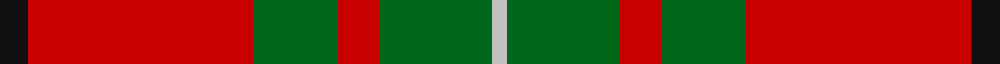
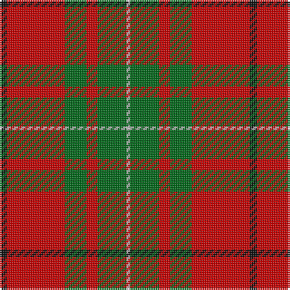

In pattern [KRGRGW](/stripes/krgrgw/).

This was sourced from register-of-tartans.  It is a [6 stripe tartan](/stripes/stripes6/).

Original link https://www.tartanregister.gov.uk/tartanDetails.aspx?ref=2285

## Register references

External register numbers recorded for this tartan.

- Scottish Register of Tartans: [2285](https://www.tartanregister.gov.uk/tartanDetails.aspx?ref=2285)
- Scottish Tartans Authority (ITI): 1164
- Scottish Tartans World Register: 1164

## Thread count
K/4 R32 G12 R6 G16 N/2

## Palette
Each colour and its ΔE from the base-6 reference it is a variant of.

| Colour | Shade | Base | ΔE (OKLab) |
|---|---|---|---|
| G | <code style="background-color:#006818;">#006818</code> `#006818` | G <code style="background-color:#006100;">#006100</code> | 0.02 |
| K | <code style="background-color:#101010;">#101010</code> `#101010` | K <code style="background-color:#000000;">#000000</code> | 0.17 |
| N | <code style="background-color:#C0C0C0;">#C0C0C0</code> `#C0C0C0` | W <code style="background-color:#F7F7F7;">#F7F7F7</code> | 0.17 |
| R | <code style="background-color:#C80000;">#C80000</code> `#C80000` | R <code style="background-color:#CC0000;">#CC0000</code> | 0.01 |

# Sample pattern

## Nearest tartans

The nearest existing variants by ΔTartan distance.

1. [MacAulay (Clan)](/setts/s6/k2r16g6r3g8w1~x4/) — ΔT 0.14
1. [Wilson's, No 5](/setts/s6/r32t5g17r4g5w2~x2/) — ΔT 0.63
1. [MacAulay](/setts/s6/k2r16dg6r3dg8lb1/) — ΔT 0.68
1. [MacAulay](/setts/s6/k2r16g6r3g8w1~x2/) — ΔT 0.72
1. [MacAulay](/setts/s6/k2r16dg6r3dg8lr1~x2/) — ΔT 0.78
1. [MacAulay](/setts/s6/k2r16dg6r3dg8lr1/) — ΔT 0.78
1. [MacGregor of Balquidder (Logan)](/setts/s6/g9r2g9r14k1w2~x2/) — ΔT 0.82
1. [McInally (Name)](/setts/s7/r3g16r4k6r28g2lo3~x2/) — ΔT 0.84
1. [Denny, hunting](/setts/s6/k1g6k1g6r16db1~x2/) — ΔT 0.87
1. [Cumming #2](/setts/s8/r3g9w1g9r3g6r18k2~x2/) — ΔT 0.89

## Neighbour map

Every grey dot is one of 14299 variants placed by the first two principal components of the ΔTartan feature space (44% of its variance). Red is this tartan; blue dots are its nearest — click one to open its page.

<svg viewBox="0 0 640 380" role="img" style="max-width:100%;height:auto;border:1px solid #e0e0e0;border-radius:4px;display:block" xmlns="http://www.w3.org/2000/svg"><image href="/nn/cloud.v1.png" width="640" height="380"/><a href="/setts/s6/k2r16g6r3g8w1~x4/"><circle cx="331.6" cy="187.7" r="4" fill="#3465a4"><title>MacAulay (Clan)</title></circle></a><a href="/setts/s6/r32t5g17r4g5w2~x2/"><circle cx="352.5" cy="177.7" r="4" fill="#3465a4"><title>Wilson's, No 5</title></circle></a><a href="/setts/s6/k2r16dg6r3dg8lb1/"><circle cx="322.2" cy="183.6" r="4" fill="#3465a4"><title>MacAulay</title></circle></a><a href="/setts/s6/k2r16g6r3g8w1~x2/"><circle cx="315.2" cy="181.0" r="4" fill="#3465a4"><title>MacAulay</title></circle></a><a href="/setts/s6/k2r16dg6r3dg8lr1~x2/"><circle cx="343.1" cy="197.6" r="4" fill="#3465a4"><title>MacAulay</title></circle></a><a href="/setts/s6/k2r16dg6r3dg8lr1/"><circle cx="343.1" cy="197.6" r="4" fill="#3465a4"><title>MacAulay</title></circle></a><a href="/setts/s6/g9r2g9r14k1w2~x2/"><circle cx="298.1" cy="198.9" r="4" fill="#3465a4"><title>MacGregor of Balquidder (Logan)</title></circle></a><a href="/setts/s7/r3g16r4k6r28g2lo3~x2/"><circle cx="345.5" cy="171.4" r="4" fill="#3465a4"><title>McInally (Name)</title></circle></a><a href="/setts/s6/k1g6k1g6r16db1~x2/"><circle cx="323.7" cy="169.3" r="4" fill="#3465a4"><title>Denny, hunting</title></circle></a><a href="/setts/s8/r3g9w1g9r3g6r18k2~x2/"><circle cx="313.4" cy="177.3" r="4" fill="#3465a4"><title>Cumming #2</title></circle></a><circle cx="335.7" cy="189.8" r="5" fill="#c00000"/></svg>

ID: /setts/s6/k2r16g6r3g8lb1~x2/
