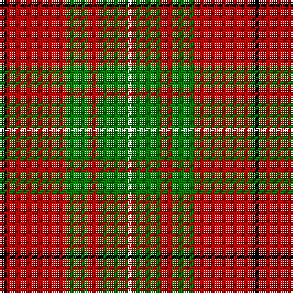

In pattern [KRGRGW](/stripes/krgrgw/).

This was sourced from weddslist.  It is a [6 stripe tartan](/stripes/stripes6/).

Original link http://www.weddslist.com/cgi-bin/tartans/pg.pl?source=sts

## Attestations

This cloth appears in 2 source records; the oldest owns this page.

- undated — MacAulay (weddslist, [record](http://www.weddslist.com/cgi-bin/tartans/pg.pl?source=sts))
- undated — MacAulay Tartan Tartan Number: 1164. Earliest known date: 1881 This shorter version tallies with the count published by M'Intyre North in 1881 as having been given him by Logan. There are two Clans of the name associated with districts as far apart as Dumbarton and Lewis and they have no family connection with each other. They are the MacAulays of Ardencaple associated with the MacGregors and the MacAulays of Lewis who are associated with the MacLeods. This sett in its shortened form begins to resemble the MacGregor tartan. See products available Copyright © Blair Urquhart, Comrie, 2015 (house-of-tartan, [record](http://www.house-of-tartan.scotland.net/house/TartanViewjs.asp?colr=Def&tnam=1164))

## Thread count
K/4 R32 G12 R6 G16 LN/2

## Palette
Each colour and the base-6 reference it is a variant of.

| Colour | Shade | Base |
|---|---|---|
| G | <code style="background-color:#008000;">#008000</code> `oklch(52.0% 0.177 142.5)` <small>#008000</small> | G <code style="background-color:#006100;">#006100</code> |
| K | <code style="background-color:#000000;">#000000</code> `oklch(0.0% 0.000 0.0)` <small>#000000</small> | K <code style="background-color:#000000;">#000000</code> |
| LN | <code style="background-color:#E0E0E0;">#E0E0E0</code> `oklch(90.7% 0.000 89.9)` <small>#E0E0E0</small> | W <code style="background-color:#F7F7F7;">#F7F7F7</code> |
| R | <code style="background-color:#C00000;">#C00000</code> `oklch(50.7% 0.208 29.2)` <small>#C00000</small> | R <code style="background-color:#CC0000;">#CC0000</code> |

# Sample pattern

## Nearest tartans

The nearest existing variants by ΔTartan distance.

1. [MacAulay (Clan)](/setts/s6/k2r16g6r3g8w1~x4/) — ΔT 0.60
1. [Denny, hunting](/setts/s6/k1g6k1g6r16db1~x2/) — ΔT 0.63
1. [MacAulay](/setts/s6/k2r16dg6r3dg8lb1/) — ΔT 0.67
1. [MacAulay](/setts/s6/k2r16g6r3g8lb1~x2/) — ΔT 0.72
1. [MacGregor of Balquidder (Logan)](/setts/s6/g9r2g9r14k1w2~x2/) — ΔT 0.73
1. [Starr (1978) (Name)](/setts/s7/k2r4w1r10g12r2w2~x4/) — ΔT 0.93
1. [Wilson's, No 5](/setts/s6/r32t5g17r4g5w2~x2/) — ΔT 0.97
1. [Cumming #2](/setts/s8/r3g9w1g9r3g6r18k2~x2/) — ΔT 0.98
1. [Cumming SM](/setts/s8/r3dg9lb1dg9r3dg6r18k2~x2/) — ΔT 0.99
1. [MacGregor of Balquidder - 1831 (Clan](/setts/s6/g9r2g9r14k1w2~x4/) — ΔT 1.00

## Neighbour map

Every grey dot is one of 14299 variants placed by the first two principal components of the ΔTartan feature space (44% of its variance). Red is this tartan; blue dots are its nearest — click one to open its page.

<svg viewBox="0 0 640 380" role="img" style="max-width:100%;height:auto;border:1px solid #e0e0e0;border-radius:4px;display:block" xmlns="http://www.w3.org/2000/svg"><image href="/nn/cloud.v1.png" width="640" height="380"/><a href="/setts/s6/k2r16g6r3g8w1~x4/"><circle cx="331.6" cy="187.7" r="4" fill="#3465a4"><title>MacAulay (Clan)</title></circle></a><a href="/setts/s6/k1g6k1g6r16db1~x2/"><circle cx="323.7" cy="169.3" r="4" fill="#3465a4"><title>Denny, hunting</title></circle></a><a href="/setts/s6/k2r16dg6r3dg8lb1/"><circle cx="322.2" cy="183.6" r="4" fill="#3465a4"><title>MacAulay</title></circle></a><a href="/setts/s6/k2r16g6r3g8lb1~x2/"><circle cx="335.7" cy="189.8" r="4" fill="#3465a4"><title>MacAulay</title></circle></a><a href="/setts/s6/g9r2g9r14k1w2~x2/"><circle cx="298.1" cy="198.9" r="4" fill="#3465a4"><title>MacGregor of Balquidder (Logan)</title></circle></a><a href="/setts/s7/k2r4w1r10g12r2w2~x4/"><circle cx="264.8" cy="177.1" r="4" fill="#3465a4"><title>Starr (1978) (Name)</title></circle></a><a href="/setts/s6/r32t5g17r4g5w2~x2/"><circle cx="352.5" cy="177.7" r="4" fill="#3465a4"><title>Wilson's, No 5</title></circle></a><a href="/setts/s8/r3g9w1g9r3g6r18k2~x2/"><circle cx="313.4" cy="177.3" r="4" fill="#3465a4"><title>Cumming #2</title></circle></a><a href="/setts/s8/r3dg9lb1dg9r3dg6r18k2~x2/"><circle cx="308.5" cy="175.5" r="4" fill="#3465a4"><title>Cumming SM</title></circle></a><a href="/setts/s6/g9r2g9r14k1w2~x4/"><circle cx="289.3" cy="194.3" r="4" fill="#3465a4"><title>MacGregor of Balquidder - 1831 (Clan</title></circle></a><circle cx="315.2" cy="181.0" r="5" fill="#c00000"/></svg>

ID: /setts/s6/k2r16g6r3g8w1~x2/
