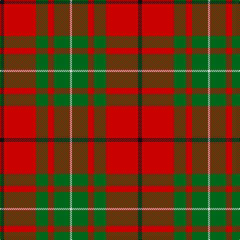

**Bands:** [KRGRGW](/stripes/krgrgw/) · **Stripes:** [K R G R G W](/stripes/stripes6/) K R G R G W

This was sourced from tartans-authority.  It is a [6 band tartan](/bands/bands6/).

Original link http://www.tartansauthority.com/tartan-ferret/display/1164/

## Variants

Other setts woven to the same stripe pattern.

- [MacAulay](/setts/s6/k2r16g6r3g8w1~x2/)

## Thread count
K/8 R64 G24 R12 G32 LN/4

## Palette
Each colour and its ΔE from the base-6 reference it is a variant of.

| Colour | Shade | Base | ΔE (OKLab) |
|---|---|---|---|
| G | <code style="background-color:#006818;">#006818</code> `#006818` | G <code style="background-color:#006100;">#006100</code> | 0.02 |
| K | <code style="background-color:#101010;">#101010</code> `#101010` | K <code style="background-color:#000000;">#000000</code> | 0.17 |
| LN | <code style="background-color:#E0E0E0;">#E0E0E0</code> `#E0E0E0` | W <code style="background-color:#F7F7F7;">#F7F7F7</code> | 0.07 |
| R | <code style="background-color:#C80000;">#C80000</code> `#C80000` | R <code style="background-color:#CC0000;">#CC0000</code> | 0.01 |

# Sample pattern

## Nearest tartans

The nearest existing variants by ΔTartan distance.

1. [MacAulay](/setts/s6/k2r16g6r3g8lb1~x2/) — ΔT 0.14
1. [MacAulay](/setts/s6/k2r16dg6r3dg8lb1/) — ΔT 0.59
1. [MacAulay](/setts/s6/k2r16g6r3g8w1~x2/) — ΔT 0.60
1. [Wilson's, No 5](/setts/s6/r32t5g17r4g5w2~x2/) — ΔT 0.65
1. [MacGregor of Balquidder (Logan)](/setts/s6/g9r2g9r14k1w2~x2/) — ΔT 0.79
1. [Denny, hunting](/setts/s6/db1r16g6k1g6k1~x2/) — ΔT 0.80
1. [MacAulay](/setts/s6/k2r16dg6r3dg8lr1~x2/) — ΔT 0.84
1. [MacAulay](/setts/s6/k2r16dg6r3dg8lr1/) — ΔT 0.84
1. [McInally (Name)](/setts/s7/lo3g2r28k6r4g16r3~x2/) — ΔT 0.85
1. [Cumming #2](/setts/s8/r3g9w1g9r3g6r18k2~x2/) — ΔT 0.88

## Neighbour map

Every grey dot is one of 14313 variants placed by the first two principal components of the ΔTartan feature space (44% of its variance). Red is this tartan; blue dots are its nearest — click one to open its page.

<svg viewBox="0 0 640 380" role="img" style="max-width:100%;height:auto;border:1px solid #e0e0e0;border-radius:4px;display:block" xmlns="http://www.w3.org/2000/svg"><image href="/nn/cloud.v1.png" width="640" height="380"/><a href="/setts/s6/k2r16g6r3g8lb1~x2/"><circle cx="336.0" cy="189.9" r="4" fill="#3465a4"><title>MacAulay</title></circle></a><a href="/setts/s6/k2r16dg6r3dg8lb1/"><circle cx="322.5" cy="183.8" r="4" fill="#3465a4"><title>MacAulay</title></circle></a><a href="/setts/s6/k2r16g6r3g8w1~x2/"><circle cx="315.5" cy="181.2" r="4" fill="#3465a4"><title>MacAulay</title></circle></a><a href="/setts/s6/r32t5g17r4g5w2~x2/"><circle cx="352.8" cy="177.9" r="4" fill="#3465a4"><title>Wilson's, No 5</title></circle></a><a href="/setts/s6/g9r2g9r14k1w2~x2/"><circle cx="298.3" cy="199.0" r="4" fill="#3465a4"><title>MacGregor of Balquidder (Logan)</title></circle></a><a href="/setts/s6/db1r16g6k1g6k1~x2/"><circle cx="324.0" cy="169.5" r="4" fill="#3465a4"><title>Denny, hunting</title></circle></a><a href="/setts/s6/k2r16dg6r3dg8lr1~x2/"><circle cx="343.3" cy="197.7" r="4" fill="#3465a4"><title>MacAulay</title></circle></a><a href="/setts/s6/k2r16dg6r3dg8lr1/"><circle cx="343.3" cy="197.7" r="4" fill="#3465a4"><title>MacAulay</title></circle></a><a href="/setts/s7/lo3g2r28k6r4g16r3~x2/"><circle cx="345.8" cy="171.5" r="4" fill="#3465a4"><title>McInally (Name)</title></circle></a><a href="/setts/s8/r3g9w1g9r3g6r18k2~x2/"><circle cx="313.7" cy="177.4" r="4" fill="#3465a4"><title>Cumming #2</title></circle></a><circle cx="331.9" cy="187.8" r="5" fill="#c00000"/></svg>

ID: /setts/s6/k2r16g6r3g8w1~x4/
