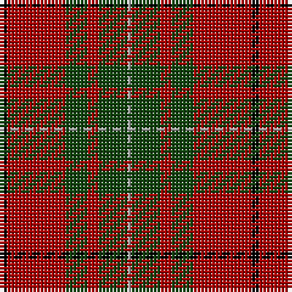

In pattern [KRGRGY](/patterns/krgrgy/).

This was sourced from weddslist.  It is a [6 stripes tartan](/stripes/stripes6/).

Original link http://www.weddslist.com/cgi-bin/tartans/pg.pl?source=x

## Thread count
K/2 DR16 DG6 DR3 DG8 N/1

## Palette
Each colour and its ΔE from the base-6 reference it is a variant of.

| Colour | Shade | Base | ΔE (OKLab) |
|---|---|---|---|
| DG | <code style="background-color:#11450D;">#11450D</code> `#11450D` | G <code style="background-color:#006100;">#006100</code> | 0.09 |
| DR | <code style="background-color:#AA0000;">#AA0000</code> `#AA0000` | R <code style="background-color:#CC0000;">#CC0000</code> | 0.07 |
| K | <code style="background-color:#000000;">#000000</code> `#000000` | K <code style="background-color:#000000;">#000000</code> | 0.00 |
| N | <code style="background-color:#AAAAAA;">#AAAAAA</code> `#AAAAAA` | Y <code style="background-color:#F2BF00;">#F2BF00</code> | 0.19 |

# Sample pattern

## Nearest tartans

The nearest existing variants by ΔTartan distance.

1. [MacAulay](/setts/s6/k2r16g6r3g8y1~g11450d-k000000-raa0000-yaaaaaa~x2/) — ΔT 0.00
1. [MacAulay](/setts/s6/k2r16g6r3g8w1~g006818-k101010-rc80000-wc0c0c0~x2/) — ΔT 0.78
1. [MacAulay](/setts/s6/k2r16g6r3g8w1~g004c00-k000000-rc80000-wd0d0d0/) — ΔT 0.82
1. [MacAulay (Clan)](/setts/s6/k2r16g6r3g8w1~g006818-k101010-rc80000-we0e0e0~x4/) — ΔT 0.84
1. [MacAulay Tartan Tartan Number: 1164. Earliest known date: 1881 This shorter version tallies with the count published by M'Intyre North in 1881 as having been given him by Logan. There are two Clans of the name associated with districts as far apart as Dumbarton and Lewis and they have no family connection with each other. They are the MacAulays of Ardencaple associated with the MacGregors and the MacAulays of Lewis who are associated with the MacLeods. This sett in its shortened form begins to resemble the MacGregor tartan. See products available Copyright © Blair Urquhart, Comrie, 2015](/setts/s6/k2r16g6r3g8w1~g006818-k101010-rc80000-we0e0e0~x2/) — ΔT 0.84
1. [Denny Hunting Clan Tartan Tartan Number: 518. Earliest known date: pre 2003 This tartan is remarkably similar to the Durham sett designed by Wilson's of Bannockburn around 1819. The variation in proportions may point to a deliberate modification suggested by the links between the names. See products available Copyright © Blair Urquhart, Comrie, 2015](/setts/s6/b1r16g6k1g6k1~b2c2c80-g006818-k101010-rc80000~x2/) — ΔT 0.85
1. [Cumming SM](/setts/s8/r3g9y1g9r3g6r18k2~g11450d-k000000-raa0000-yaaaaaa~x2/) — ΔT 0.88
1. [Finnlaggan](/setts/s6/g7w1g18b6r18g2~b304080-g003000-rc00000-we0e0e0~x2/) — ΔT 0.96
1. [Nisbet Family Tartan Tartan Number: 2115. Earliest known date: 1842 This is the sett that appears in the Vestiarium Scoticum as Mackintosh. There is no connection between the names, historically, to explain the position and it is interesting to note the similarity with the Dunbar tartan which also originates in the Vestiarium. The Nisbets came from the old barony of Nisbet in the parish of Edrom, Berwickshire, as early as 1160. See products available Copyright © Blair Urquhart, Comrie, 2015](/setts/s6/r5w2r28k12g16r3~g006818-k101010-rc80000-we0e0e0~x2/) — ΔT 1.03
1. [Cumming SM](/setts/s8/r3g9w1g9r3g6r18k2~g004c00-k000000-rc80000-wd0d0d0/) — ΔT 1.04

## Neighbour map

Every grey dot is one of 15726 variants placed by the first two principal components of the ΔTartan feature space (44% of its variance). Red is this tartan; blue dots are its nearest — click one to open its page.

<svg viewBox="0 0 640 380" role="img" style="max-width:100%;height:auto;border:1px solid #e0e0e0;border-radius:4px;display:block" xmlns="http://www.w3.org/2000/svg"><image href="/nn/cloud.v1.png" width="640" height="380"/><a href="/setts/s6/k2r16g6r3g8y1~g11450d-k000000-raa0000-yaaaaaa~x2/"><circle cx="342.6" cy="198.8" r="4" fill="#3465a4"><title>MacAulay</title></circle></a><a href="/setts/s6/k2r16g6r3g8w1~g006818-k101010-rc80000-wc0c0c0~x2/"><circle cx="335.5" cy="192.1" r="4" fill="#3465a4"><title>MacAulay</title></circle></a><a href="/setts/s6/k2r16g6r3g8w1~g004c00-k000000-rc80000-wd0d0d0/"><circle cx="321.8" cy="187.6" r="4" fill="#3465a4"><title>MacAulay</title></circle></a><a href="/setts/s6/k2r16g6r3g8w1~g006818-k101010-rc80000-we0e0e0~x4/"><circle cx="331.4" cy="190.4" r="4" fill="#3465a4"><title>MacAulay (Clan)</title></circle></a><a href="/setts/s6/k2r16g6r3g8w1~g006818-k101010-rc80000-we0e0e0~x2/"><circle cx="331.4" cy="190.4" r="4" fill="#3465a4"><title>MacAulay Tartan Tartan Number: 1164. Earliest known date: 1881 This shorter version tallies with the count published by M'Intyre North in 1881 as having been given him by Logan. There are two Clans of the name associated with districts as far apart as Dumbarton and Lewis and they have no family connection with each other. They are the MacAulays of Ardencaple associated with the MacGregors and the MacAulays of Lewis who are associated with the MacLeods. This sett in its shortened form begins to resemble the MacGregor tartan. See products available Copyright © Blair Urquhart, Comrie, 2015</title></circle></a><a href="/setts/s6/b1r16g6k1g6k1~b2c2c80-g006818-k101010-rc80000~x2/"><circle cx="342.8" cy="179.3" r="4" fill="#3465a4"><title>Denny Hunting Clan Tartan Tartan Number: 518. Earliest known date: pre 2003 This tartan is remarkably similar to the Durham sett designed by Wilson's of Bannockburn around 1819. The variation in proportions may point to a deliberate modification suggested by the links between the names. See products available Copyright © Blair Urquhart, Comrie, 2015</title></circle></a><a href="/setts/s8/r3g9y1g9r3g6r18k2~g11450d-k000000-raa0000-yaaaaaa~x2/"><circle cx="330.6" cy="189.3" r="4" fill="#3465a4"><title>Cumming SM</title></circle></a><a href="/setts/s6/g7w1g18b6r18g2~b304080-g003000-rc00000-we0e0e0~x2/"><circle cx="314.6" cy="198.4" r="4" fill="#3465a4"><title>Finnlaggan</title></circle></a><a href="/setts/s6/r5w2r28k12g16r3~g006818-k101010-rc80000-we0e0e0~x2/"><circle cx="305.3" cy="189.8" r="4" fill="#3465a4"><title>Nisbet Family Tartan Tartan Number: 2115. Earliest known date: 1842 This is the sett that appears in the Vestiarium Scoticum as Mackintosh. There is no connection between the names, historically, to explain the position and it is interesting to note the similarity with the Dunbar tartan which also originates in the Vestiarium. The Nisbets came from the old barony of Nisbet in the parish of Edrom, Berwickshire, as early as 1160. See products available Copyright © Blair Urquhart, Comrie, 2015</title></circle></a><a href="/setts/s8/r3g9w1g9r3g6r18k2~g004c00-k000000-rc80000-wd0d0d0/"><circle cx="307.7" cy="177.7" r="4" fill="#3465a4"><title>Cumming SM</title></circle></a><circle cx="342.6" cy="198.8" r="5" fill="#c00000"/></svg>

ID: /setts/s6/k2r16g6r3g8y1~g11450d-k000000-raa0000-yaaaaaa/
