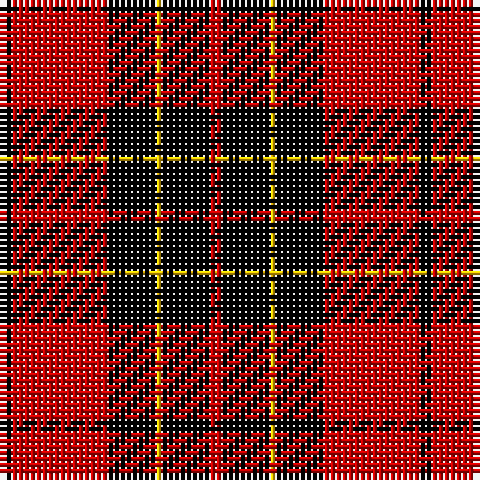

**Bands:** [KRKYKR](/stripes/krkykr/) · **Stripes:** [K R K LY K R](/stripes/stripes6/) K R K LY K R

This was sourced from weddslist.  It is a [6 band tartan](/bands/bands6/).

Original link http://www.weddslist.com/cgi-bin/tartans/pg.pl?source=rb

## Register references

External register numbers recorded for this tartan.

- Scottish Register of Tartans: [2540](https://www.tartanregister.gov.uk/tartanDetails.aspx?ref=2540)
- Scottish Register of Tartans: [2666](https://www.tartanregister.gov.uk/tartanDetails.aspx?ref=2666)
- Scottish Register of Tartans: [3808](https://www.tartanregister.gov.uk/tartanDetails.aspx?ref=3808)
- Scottish Tartans Authority (ITI): 218
- Scottish Tartans World Register: 1010
- Scottish Tartans World Register: 1585
- Scottish Tartans World Register: 218

## Variants

Other setts woven to the same stripe pattern.

- [Brodie](/setts/s6/k2r16k8ly1k8r2~x2/)
- [Brodie (Clan)](/setts/s6/k3r15k11ly2k4r3~x2/)
- [Brodie (Clan)](/setts/s6/k2r16k8ly1k8r2~x4/)

## Thread count
K/2 R16 K8 Y1 K8 R/2

## Palette
Each colour and its ΔE from the base-6 reference it is a variant of.

| Colour | Shade | Base | ΔE (OKLab) |
|---|---|---|---|
| K | <code style="background-color:#000000;">#000000</code> `#000000` | K <code style="background-color:#000000;">#000000</code> | 0.00 |
| R | <code style="background-color:#C80000;">#C80000</code> `#C80000` | R <code style="background-color:#CC0000;">#CC0000</code> | 0.01 |
| Y | <code style="background-color:#FFC800;">#FFC800</code> `#FFC800` | Y <code style="background-color:#F2BF00;">#F2BF00</code> | 0.03 |

# Sample pattern

## Nearest tartans

The nearest existing variants by ΔTartan distance.

1. [Brodie](/setts/s6/k2r16k8ly1k8r2~x2/) — ΔT 0.12
1. [MacQueen](/setts/s6/k2r6k2r6k12ly1~x2/) — ΔT 0.85
1. [Munro VS](/setts/s5/k18r4k18r32lb3/) — ΔT 0.89
1. [Munro VS](/setts/s5/k18r4k18r32lr3~x2/) — ΔT 0.99
1. [Munro VS](/setts/s5/k18r4k18r32lr3/) — ΔT 0.99
1. [MacIain](/setts/s7/r4k8r4k8r12k1ly2~x2/) — ΔT 1.02
1. [MacIver](/setts/s5/k16r2k2r12w1~x2/) — ΔT 1.09
1. [Brodie (Clan)](/setts/s6/k2r16k8ly1k8r2~x4/) — ΔT 1.09
1. [Swanstrom (Personal)](/setts/s6/k8r1k8r11ly1r1~x4/) — ΔT 1.19
1. [MacQueen](/setts/s6/k2r6k2r6k12ly1~x4/) — ΔT 1.21

## Neighbour map

Every grey dot is one of 14313 variants placed by the first two principal components of the ΔTartan feature space (44% of its variance). Red is this tartan; blue dots are its nearest — click one to open its page.

<svg viewBox="0 0 640 380" role="img" style="max-width:100%;height:auto;border:1px solid #e0e0e0;border-radius:4px;display:block" xmlns="http://www.w3.org/2000/svg"><image href="/nn/cloud.v1.png" width="640" height="380"/><a href="/setts/s6/k2r16k8ly1k8r2~x2/"><circle cx="322.2" cy="194.3" r="4" fill="#3465a4"><title>Brodie</title></circle></a><a href="/setts/s6/k2r6k2r6k12ly1~x2/"><circle cx="324.5" cy="213.0" r="4" fill="#3465a4"><title>MacQueen</title></circle></a><a href="/setts/s5/k18r4k18r32lb3/"><circle cx="289.3" cy="225.4" r="4" fill="#3465a4"><title>Munro VS</title></circle></a><a href="/setts/s5/k18r4k18r32lr3~x2/"><circle cx="296.9" cy="232.6" r="4" fill="#3465a4"><title>Munro VS</title></circle></a><a href="/setts/s5/k18r4k18r32lr3/"><circle cx="296.9" cy="232.6" r="4" fill="#3465a4"><title>Munro VS</title></circle></a><a href="/setts/s7/r4k8r4k8r12k1ly2~x2/"><circle cx="288.0" cy="210.1" r="4" fill="#3465a4"><title>MacIain</title></circle></a><a href="/setts/s5/k16r2k2r12w1~x2/"><circle cx="360.5" cy="195.4" r="4" fill="#3465a4"><title>MacIver</title></circle></a><a href="/setts/s6/k2r16k8ly1k8r2~x4/"><circle cx="341.4" cy="198.8" r="4" fill="#3465a4"><title>Brodie (Clan)</title></circle></a><a href="/setts/s6/k8r1k8r11ly1r1~x4/"><circle cx="336.6" cy="214.9" r="4" fill="#3465a4"><title>Swanstrom (Personal)</title></circle></a><a href="/setts/s6/k2r6k2r6k12ly1~x4/"><circle cx="342.6" cy="216.9" r="4" fill="#3465a4"><title>MacQueen</title></circle></a><circle cx="320.6" cy="192.5" r="5" fill="#c00000"/></svg>

ID: /setts/s6/k2r16k8ly1k8r2/
