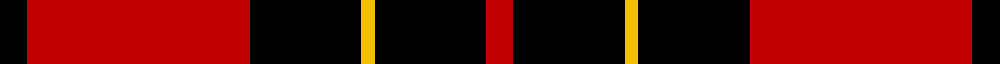
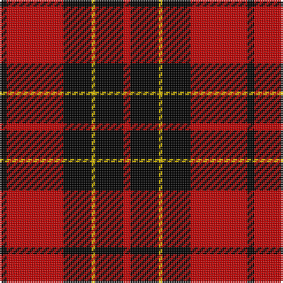

In pattern [KRKYKR](/stripes/krkykr/).

This was sourced from weddslist.  It is a [6 stripe tartan](/stripes/stripes6/).

Original link http://www.weddslist.com/cgi-bin/tartans/pg.pl?source=sts

## Also known as

This cloth is also recorded under:

- Brodie

## Attestations

This cloth appears in 2 source records; the oldest owns this page.

- undated — Brodie (weddslist, [record](http://www.weddslist.com/cgi-bin/tartans/pg.pl?source=sts))
- undated — Brodie Dress (weddslist, [record](http://www.weddslist.com/cgi-bin/tartans/pg.pl?source=tinsel))

## Thread count
K/4 R32 K16 Y2 K16 R/4

## Palette
Each colour and the base-6 reference it is a variant of.

| Colour | Shade | Base |
|---|---|---|
| K | <code style="background-color:#000000;">#000000</code> `oklch(0.0% 0.000 0.0)` <small>#000000</small> | K <code style="background-color:#000000;">#000000</code> |
| R | <code style="background-color:#C00000;">#C00000</code> `oklch(50.7% 0.208 29.2)` <small>#C00000</small> | R <code style="background-color:#CC0000;">#CC0000</code> |
| Y | <code style="background-color:#F0C000;">#F0C000</code> `oklch(82.7% 0.169 90.5)` <small>#F0C000</small> | Y <code style="background-color:#F2BF00;">#F2BF00</code> |

# Sample pattern

## Nearest tartans

The nearest existing variants by ΔTartan distance.

1. [Brodie Dress](/setts/s6/k2r16k8ly1k8r2/) — ΔT 0.12
1. [MacQueen](/setts/s6/k2r6k2r6k12ly1~x2/) — ΔT 0.80
1. [Munro VS](/setts/s5/k18r4k18r32lb3/) — ΔT 0.90
1. [Munro VS](/setts/s5/k18r4k18r32lr3~x2/) — ΔT 0.94
1. [Munro VS](/setts/s5/k18r4k18r32lr3/) — ΔT 0.94
1. [MacIain](/setts/s7/r4k8r4k8r12k1ly2~x2/) — ΔT 1.06
1. [Brodie (Clan)](/setts/s6/k2r16k8ly1k8r2~x4/) — ΔT 1.09
1. [MacIver](/setts/s5/k16r2k2r12w1~x2/) — ΔT 1.10
1. [Swanstrom (Personal)](/setts/s6/k8r1k8r11ly1r1~x4/) — ΔT 1.18
1. [MacQueen](/setts/s6/k2r6k2r6k12ly1~x4/) — ΔT 1.19

## Neighbour map

Every grey dot is one of 14299 variants placed by the first two principal components of the ΔTartan feature space (44% of its variance). Red is this tartan; blue dots are its nearest — click one to open its page.

<svg viewBox="0 0 640 380" role="img" style="max-width:100%;height:auto;border:1px solid #e0e0e0;border-radius:4px;display:block" xmlns="http://www.w3.org/2000/svg"><image href="/nn/cloud.v1.png" width="640" height="380"/><a href="/setts/s6/k2r16k8ly1k8r2/"><circle cx="320.5" cy="192.3" r="4" fill="#3465a4"><title>Brodie Dress</title></circle></a><a href="/setts/s6/k2r6k2r6k12ly1~x2/"><circle cx="324.5" cy="212.7" r="4" fill="#3465a4"><title>MacQueen</title></circle></a><a href="/setts/s5/k18r4k18r32lb3/"><circle cx="289.3" cy="225.1" r="4" fill="#3465a4"><title>Munro VS</title></circle></a><a href="/setts/s5/k18r4k18r32lr3~x2/"><circle cx="296.9" cy="232.4" r="4" fill="#3465a4"><title>Munro VS</title></circle></a><a href="/setts/s5/k18r4k18r32lr3/"><circle cx="296.9" cy="232.4" r="4" fill="#3465a4"><title>Munro VS</title></circle></a><a href="/setts/s7/r4k8r4k8r12k1ly2~x2/"><circle cx="287.9" cy="209.9" r="4" fill="#3465a4"><title>MacIain</title></circle></a><a href="/setts/s6/k2r16k8ly1k8r2~x4/"><circle cx="341.2" cy="198.6" r="4" fill="#3465a4"><title>Brodie (Clan)</title></circle></a><a href="/setts/s5/k16r2k2r12w1~x2/"><circle cx="360.3" cy="195.2" r="4" fill="#3465a4"><title>MacIver</title></circle></a><a href="/setts/s6/k8r1k8r11ly1r1~x4/"><circle cx="336.5" cy="214.7" r="4" fill="#3465a4"><title>Swanstrom (Personal)</title></circle></a><a href="/setts/s6/k2r6k2r6k12ly1~x4/"><circle cx="342.4" cy="216.7" r="4" fill="#3465a4"><title>MacQueen</title></circle></a><circle cx="322.2" cy="194.0" r="5" fill="#c00000"/></svg>

ID: /setts/s6/k2r16k8ly1k8r2~x2/
