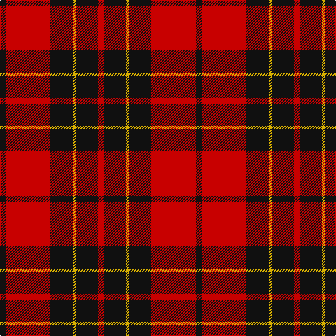

**Bands:** [KRKYKR](/stripes/krkykr/) · **Stripes:** [K R K LY K R](/stripes/stripes6/) K R K LY K R

This was sourced from tartans-authority.  It is a [6 band tartan](/bands/bands6/).

Original link http://www.tartansauthority.com/tartan-ferret/display/1193/

## Variants

Other setts woven to the same stripe pattern.

- [Brodie](/setts/s6/k2r16k8ly1k8r2~x2/)
- [Brodie (Clan)](/setts/s6/k3r15k11ly2k4r3~x2/)
- [Brodie Dress](/setts/s6/k2r16k8ly1k8r2/)

## Thread count
K/8 R64 K32 Y4 K32 R/8

## Palette
Each colour and its ΔE from the base-6 reference it is a variant of.

| Colour | Shade | Base | ΔE (OKLab) |
|---|---|---|---|
| K | <code style="background-color:#101010;">#101010</code> `#101010` | K <code style="background-color:#000000;">#000000</code> | 0.17 |
| R | <code style="background-color:#C80000;">#C80000</code> `#C80000` | R <code style="background-color:#CC0000;">#CC0000</code> | 0.01 |
| Y | <code style="background-color:#D8B000;">#D8B000</code> `#D8B000` | Y <code style="background-color:#F2BF00;">#F2BF00</code> | 0.06 |

# Sample pattern

## Nearest tartans

The nearest existing variants by ΔTartan distance.

1. [Swanstrom (Personal)](/setts/s6/k8r1k8r11ly1r1~x4/) — ΔT 0.73
1. [MacIver](/setts/s5/k16r2k2r12w1~x2/) — ΔT 0.77
1. [MacQueen](/setts/s6/k2r6k2r6k12ly1~x4/) — ΔT 0.80
1. [Monmouth College](/setts/s6/k4r33k24w3k4r3~x2/) — ΔT 0.85
1. [MacKeane (Clan?)](/setts/s7/r4k8r4k8r12k1ly1~x2/) — ΔT 0.87
1. [Masai Shuka 15 (Artefact)](/setts/s5/r20k2r2k15w1~x2/) — ΔT 0.90
1. [Munro (Black and Red)](/setts/s5/k18r4k18r32w3~x2/) — ΔT 0.94
1. [MacDonald of Ardnamurchan (Clan?)](/setts/s7/r4k8r4k8r12k1ly2~x4/) — ΔT 1.01
1. [Ramsay Red Clan Tartan Tartan Number: 1238. Earliest known date: 1842 Ramsay was one of the names adopted by members of the Clan MacGregor when their own was proscribed. It is not surprising then that an early MacGregor sett was used as a basis for the Ramsay tartan. It is possible that the tartan was in existance long before the earliest recorded date given. See products available Copyright © Blair Urquhart, Comrie, 2015](/setts/s6/r5m2r30k28w2k4~x2/) — ΔT 1.07
1. [Brodie Dress](/setts/s6/k2r16k8ly1k8r2/) — ΔT 1.09

## Neighbour map

Every grey dot is one of 14313 variants placed by the first two principal components of the ΔTartan feature space (44% of its variance). Red is this tartan; blue dots are its nearest — click one to open its page.

<svg viewBox="0 0 640 380" role="img" style="max-width:100%;height:auto;border:1px solid #e0e0e0;border-radius:4px;display:block" xmlns="http://www.w3.org/2000/svg"><image href="/nn/cloud.v1.png" width="640" height="380"/><a href="/setts/s6/k8r1k8r11ly1r1~x4/"><circle cx="336.6" cy="214.9" r="4" fill="#3465a4"><title>Swanstrom (Personal)</title></circle></a><a href="/setts/s5/k16r2k2r12w1~x2/"><circle cx="360.5" cy="195.4" r="4" fill="#3465a4"><title>MacIver</title></circle></a><a href="/setts/s6/k2r6k2r6k12ly1~x4/"><circle cx="342.6" cy="216.9" r="4" fill="#3465a4"><title>MacQueen</title></circle></a><a href="/setts/s6/k4r33k24w3k4r3~x2/"><circle cx="335.6" cy="193.8" r="4" fill="#3465a4"><title>Monmouth College</title></circle></a><a href="/setts/s7/r4k8r4k8r12k1ly1~x2/"><circle cx="328.0" cy="214.1" r="4" fill="#3465a4"><title>MacKeane (Clan?)</title></circle></a><a href="/setts/s5/r20k2r2k15w1~x2/"><circle cx="386.6" cy="184.1" r="4" fill="#3465a4"><title>Masai Shuka 15 (Artefact)</title></circle></a><a href="/setts/s5/k18r4k18r32w3~x2/"><circle cx="301.8" cy="227.4" r="4" fill="#3465a4"><title>Munro (Black and Red)</title></circle></a><a href="/setts/s7/r4k8r4k8r12k1ly2~x4/"><circle cx="306.1" cy="215.6" r="4" fill="#3465a4"><title>MacDonald of Ardnamurchan (Clan?)</title></circle></a><a href="/setts/s6/r5m2r30k28w2k4~x2/"><circle cx="325.8" cy="168.9" r="4" fill="#3465a4"><title>Ramsay Red Clan Tartan Tartan Number: 1238. Earliest known date: 1842 Ramsay was one of the names adopted by members of the Clan MacGregor when their own was proscribed. It is not surprising then that an early MacGregor sett was used as a basis for the Ramsay tartan. It is possible that the tartan was in existance long before the earliest recorded date given. See products available Copyright © Blair Urquhart, Comrie, 2015</title></circle></a><a href="/setts/s6/k2r16k8ly1k8r2/"><circle cx="320.6" cy="192.5" r="4" fill="#3465a4"><title>Brodie Dress</title></circle></a><circle cx="341.4" cy="198.8" r="5" fill="#c00000"/></svg>

ID: /setts/s6/k2r16k8ly1k8r2~x4/
