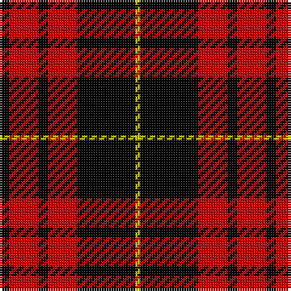

This page is one **sett** — a single exact thread-count. It belongs to the [tartan](/tartans/k2r6k2r6k12y1/)
(the same proportion at any scale), whose colour order is pattern [KRKRKY](/stripes/krkrky/).

Sourced from weddslist.  It is a [6 stripe tartan](/stripes/stripes6/).

Original link http://www.weddslist.com/cgi-bin/tartans/pg.pl?source=rb

5 attestations — the source records this cloth was collapsed from (oldest owns this page)

<ul>
<li>undated — MacQueen (weddslist, <a href="http://www.weddslist.com/cgi-bin/tartans/pg.pl?source=rb">record</a>)</li>
<li>undated — MacQueen (weddslist, <a href="http://www.weddslist.com/cgi-bin/tartans/pg.pl?source=sts">record</a>)</li>
<li>undated — MacQueen (weddslist, <a href="http://www.weddslist.com/cgi-bin/tartans/pg.pl?source=tinsel">record</a>)</li>
<li>undated — MacQueen (weddslist, <a href="http://www.weddslist.com/cgi-bin/tartans/pg.pl?source=x">record</a>)</li>
<li>undated — MacQueen Clan Tartan Tartan Number: 1209. Earliest known date: 1842 The tartan of the Clan Revan, so called after Revan MacMulmor MacAngus MacQueen, who led kinsmen of the MacDonald bride for the 10th Chief of the Mackintoshes, to take protection from Clan Chattan. The sett was unnamed, as far as we know, before publication in the Vestiarium Scoticum (1842), but this source is unreliable. It has much in common with the Fraser and the Gunn tartans, both of which have four bold stripes, but the origin is more likely to have come from a combination of the MacDonald and the Mackintosh. Many MacQueens stayed in Skye, and the name there, is often spelt MacSween or MacSwan. The Skye stronghold was known as Garafadon. See products available Copyright © Blair Urquhart, Comrie, 2015 (house-of-tartan, <a href="http://www.house-of-tartan.scotland.net/house/TartanViewjs.asp?colr=Def&tnam=1209">record</a>)</li>
</ul>

## Thread count
K/4 R12 K4 R12 K24 Y/2

## Palette
Each colour and the base-6 reference it is a variant of.

| Colour | Shade | Base |
|---|---|---|
| K | <code style="background-color:#000000;">#000000</code> `oklch(0.0% 0.000 0.0)` <small>#000000</small> | K <code style="background-color:#000000;">#000000</code> |
| R | <code style="background-color:#C80000;">#C80000</code> `oklch(52.3% 0.215 29.2)` <small>#C80000</small> | R <code style="background-color:#CC0000;">#CC0000</code> |
| Y | <code style="background-color:#C8C800;">#C8C800</code> `oklch(80.6% 0.176 109.8)` <small>#C8C800</small> | Y <code style="background-color:#F2BF00;">#F2BF00</code> |

# Sample pattern

## Nearest tartans

The nearest existing variants by ΔTartan distance, with this tartan at the top so the swatches line up against it.

ΔTartan

Tartan

Sett

—

<a href="/ttd/edit/#slug=k2r6k2r6k12ly1~x2">MacQueen</a> <a class="nn-out" href="/setts/s6/k2r6k2r6k12ly1~x2/" title="open its dictionary page">↗</a>

0.80

<a href="/ttd/edit/#slug=k18r4k18r32lr3~x2">Munro VS</a> <a class="nn-out" href="/setts/s5/k18r4k18r32lr3~x2/" title="open its dictionary page">↗</a>

0.80

<a href="/ttd/edit/#slug=k18r4k18r32lr3">Munro VS</a> <a class="nn-out" href="/setts/s5/k18r4k18r32lr3/" title="open its dictionary page">↗</a>

0.80

<a href="/ttd/edit/#slug=k2r16k8ly1k8r2~x2">Brodie</a> <a class="nn-out" href="/setts/s6/k2r16k8ly1k8r2~x2/" title="open its dictionary page">↗</a>

0.85

<a href="/ttd/edit/#slug=k2r16k8ly1k8r2">Brodie Dress</a> <a class="nn-out" href="/setts/s6/k2r16k8ly1k8r2/" title="open its dictionary page">↗</a>

0.88

<a href="/ttd/edit/#slug=k18r4k18r32lb3">Munro VS</a> <a class="nn-out" href="/setts/s5/k18r4k18r32lb3/" title="open its dictionary page">↗</a>

1.05

<a href="/ttd/edit/#slug=r4k8r4k8r12k1ly2~x2">MacIain</a> <a class="nn-out" href="/setts/s7/r4k8r4k8r12k1ly2~x2/" title="open its dictionary page">↗</a>

1.11

<a href="/ttd/edit/#slug=k2r6k2r6k12ly1~x4">MacQueen</a> <a class="nn-out" href="/setts/s6/k2r6k2r6k12ly1~x4/" title="open its dictionary page">↗</a>

1.15

<a href="/ttd/edit/#slug=k1r8k8ly1~x2">Wallace</a> <a class="nn-out" href="/setts/s4/k1r8k8ly1~x2/" title="open its dictionary page">↗</a>

1.16

<a href="/ttd/edit/#slug=k6r1k6r9k1~x4">MacLeod of Raasay</a> <a class="nn-out" href="/setts/s5/k6r1k6r9k1~x4/" title="open its dictionary page">↗</a>

1.17

<a href="/ttd/edit/#slug=k1r8k8ly1">Wallace</a> <a class="nn-out" href="/setts/s4/k1r8k8ly1/" title="open its dictionary page">↗</a>

## Neighbour map

Every grey dot is one of 14299 variants placed by the first two principal components of the ΔTartan feature space (44% of its variance). Red is this tartan; blue dots are its nearest — click one to open its page.

<svg viewBox="0 0 640 380" role="img" style="max-width:100%;height:auto;border:1px solid #e0e0e0;border-radius:4px;display:block" xmlns="http://www.w3.org/2000/svg"><image href="/nn/cloud.v1.png" width="640" height="380"/><a href="/setts/s5/k18r4k18r32lr3~x2/"><circle cx="296.9" cy="232.4" r="4" fill="#3465a4"><title>Munro VS</title></circle></a><a href="/setts/s5/k18r4k18r32lr3/"><circle cx="296.9" cy="232.4" r="4" fill="#3465a4"><title>Munro VS</title></circle></a><a href="/setts/s6/k2r16k8ly1k8r2~x2/"><circle cx="322.2" cy="194.0" r="4" fill="#3465a4"><title>Brodie</title></circle></a><a href="/setts/s6/k2r16k8ly1k8r2/"><circle cx="320.5" cy="192.3" r="4" fill="#3465a4"><title>Brodie Dress</title></circle></a><a href="/setts/s5/k18r4k18r32lb3/"><circle cx="289.3" cy="225.1" r="4" fill="#3465a4"><title>Munro VS</title></circle></a><a href="/setts/s7/r4k8r4k8r12k1ly2~x2/"><circle cx="287.9" cy="209.9" r="4" fill="#3465a4"><title>MacIain</title></circle></a><a href="/setts/s6/k2r6k2r6k12ly1~x4/"><circle cx="342.4" cy="216.7" r="4" fill="#3465a4"><title>MacQueen</title></circle></a><a href="/setts/s4/k1r8k8ly1~x2/"><circle cx="296.4" cy="245.8" r="4" fill="#3465a4"><title>Wallace</title></circle></a><a href="/setts/s5/k6r1k6r9k1~x4/"><circle cx="348.3" cy="259.3" r="4" fill="#3465a4"><title>MacLeod of Raasay</title></circle></a><a href="/setts/s4/k1r8k8ly1/"><circle cx="289.3" cy="239.1" r="4" fill="#3465a4"><title>Wallace</title></circle></a><circle cx="324.5" cy="212.7" r="5" fill="#c00000"/></svg>

ID: /setts/s6/k2r6k2r6k12ly1~x2/
