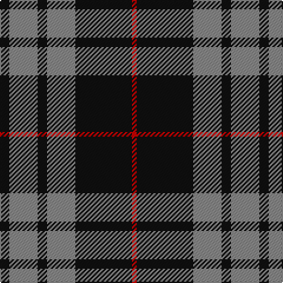

In pattern [KRKRKR](/patterns/krkrkr/).

This was sourced from tartans-authority.  It is a [6 stripes tartan](/stripes/stripes6/).

Original link http://www.tartansauthority.com/tartan-ferret/display/7903/

## Thread count
K/8 N24 K8 N24 K48 R/4

## Palette
Each colour and its ΔE from the base-6 reference it is a variant of.

| Colour | Shade | Base | ΔE (OKLab) |
|---|---|---|---|
| K | <code style="background-color:#101010;">#101010</code> `#101010` | K <code style="background-color:#000000;">#000000</code> | 0.17 |
| N | <code style="background-color:#888888;">#888888</code> `#888888` | R <code style="background-color:#CC0000;">#CC0000</code> | 0.24 |
| R | <code style="background-color:#C80000;">#C80000</code> `#C80000` | R <code style="background-color:#CC0000;">#CC0000</code> | 0.01 |

# Sample pattern

## Nearest tartans

The nearest existing variants by ΔTartan distance.

1. [Flynn](/setts/s6/r58k22r8k17ra5k14x2~k101010-r888888-rac8002c/) — ΔT 0.57
1. [West Point Military Academy (Mil.)](/setts/s8/k10r1k2r1k4r10y1r2x4~k101010-r888888-yccc018/) — ΔT 0.94
1. [Moffat (1984)](/setts/s7/k39r3k3r3k14r28ra3x2~k101010-r888888-rac80000/) — ΔT 0.98
1. [Korner-Macpherson (Personal)](/setts/s7/g5r3g35k28g4k11g2x2~g808080-k101010-rc80000/) — ΔT 1.03
1. [Callaway (Corporate)](/setts/s6/r1k10b2w5k5r1x4~b5c5c5c-k101010-r880000-wc0c0c0/) — ΔT 1.17
1. [Bannockbane Grey #3](/setts/s8/g4y2g13g8y1k13y2k4x2~g808080-k101010-ye8c000/) — ΔT 1.18
1. [Martin's Own](/setts/s8/k10b1k2b1k4b10g1b2x4~b5c8ca8-g289c18-k101010/) — ΔT 1.20
1. [West Point Regimental Tartan Tartan Number: 1130. Earliest known date: 1986 Wemyss means cave and probably originates from the caves beneath MacDuff castle. There is a long and interesting article on the family of Wemyss in William Anderson's 'The Scottish Nation' published by A Fullarton in 1874. See products available Copyright © Blair Urquhart, Comrie, 2015](/setts/s8/k13r1k1r1k4r10y1r1x6~k101010-r888888-ye8c000/) — ΔT 1.23
1. [West Point](/setts/s8/k13r1k1r1k4r10y1r1x6~k101010-r888888-yccc018/) — ΔT 1.23
1. [Douglas, Grey (Vestiarium Scoticum)](/setts/s8/k10r1k2r1k4r10k1r2x4~k101010-r888888/) — ΔT 1.23

## Neighbour map

Every grey dot is one of 15726 variants placed by the first two principal components of the ΔTartan feature space (44% of its variance). Red is this tartan; blue dots are its nearest — click one to open its page.

<svg viewBox="0 0 640 380" role="img" style="max-width:100%;height:auto;border:1px solid #e0e0e0;border-radius:4px;display:block" xmlns="http://www.w3.org/2000/svg"><image href="/nn/cloud.v1.png" width="640" height="380"/><a href="/setts/s6/r58k22r8k17ra5k14x2~k101010-r888888-rac8002c/"><circle cx="319.2" cy="219.0" r="4" fill="#3465a4"><title>Flynn</title></circle></a><a href="/setts/s8/k10r1k2r1k4r10y1r2x4~k101010-r888888-yccc018/"><circle cx="307.1" cy="206.0" r="4" fill="#3465a4"><title>West Point Military Academy (Mil.)</title></circle></a><a href="/setts/s7/k39r3k3r3k14r28ra3x2~k101010-r888888-rac80000/"><circle cx="370.6" cy="202.2" r="4" fill="#3465a4"><title>Moffat (1984)</title></circle></a><a href="/setts/s7/g5r3g35k28g4k11g2x2~g808080-k101010-rc80000/"><circle cx="345.4" cy="191.1" r="4" fill="#3465a4"><title>Korner-Macpherson (Personal)</title></circle></a><a href="/setts/s6/r1k10b2w5k5r1x4~b5c5c5c-k101010-r880000-wc0c0c0/"><circle cx="307.2" cy="213.5" r="4" fill="#3465a4"><title>Callaway (Corporate)</title></circle></a><a href="/setts/s8/g4y2g13g8y1k13y2k4x2~g808080-k101010-ye8c000/"><circle cx="288.7" cy="203.8" r="4" fill="#3465a4"><title>Bannockbane Grey #3</title></circle></a><a href="/setts/s8/k10b1k2b1k4b10g1b2x4~b5c8ca8-g289c18-k101010/"><circle cx="307.0" cy="210.7" r="4" fill="#3465a4"><title>Martin's Own</title></circle></a><a href="/setts/s8/k13r1k1r1k4r10y1r1x6~k101010-r888888-ye8c000/"><circle cx="348.6" cy="186.1" r="4" fill="#3465a4"><title>West Point Regimental Tartan Tartan Number: 1130. Earliest known date: 1986 Wemyss means cave and probably originates from the caves beneath MacDuff castle. There is a long and interesting article on the family of Wemyss in William Anderson's 'The Scottish Nation' published by A Fullarton in 1874. See products available Copyright © Blair Urquhart, Comrie, 2015</title></circle></a><a href="/setts/s8/k13r1k1r1k4r10y1r1x6~k101010-r888888-yccc018/"><circle cx="349.1" cy="186.5" r="4" fill="#3465a4"><title>West Point</title></circle></a><a href="/setts/s8/k10r1k2r1k4r10k1r2x4~k101010-r888888/"><circle cx="351.1" cy="225.9" r="4" fill="#3465a4"><title>Douglas, Grey (Vestiarium Scoticum)</title></circle></a><circle cx="325.8" cy="228.0" r="5" fill="#c00000"/></svg>

ID: /setts/s6/k2r6k2r6k12ra1x4~k101010-r888888-rac80000/
